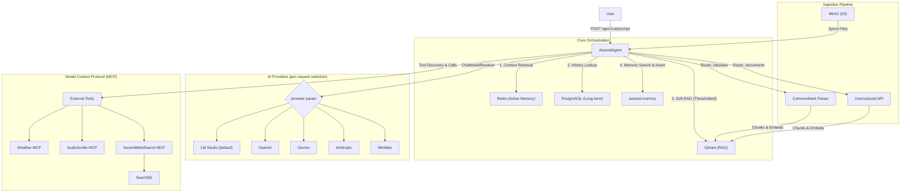

# AscendAgent

The central hub of the AscendAI platform. A Spring Boot REST API that connects user prompts to a Large Language
Model, extends the LLM with external tools via the Model Context Protocol (MCP), runs a retrieval-gated RAG pipeline
backed by Qdrant, and integrates with the dedicated [ascend-memory](../AscendMemory/) service for long-term semantic
memory.

---

### Table of Contents

- [Architecture Overview](#architecture-overview)
- [Operational Workflow](#operational-workflow)
- [Multi-Provider AI & Model Selection](#multi-provider-ai--model-selection)
- [Prerequisites](#prerequisites)
- [RAG Pipeline & Document Ingestion](#rag-pipeline--document-ingestion)
- [How to Run and Test](#how-to-run-and-test)
- [Configuration](#configuration)
- [Docs map](#docs-map)

---

### Architecture Overview

The agent manages the flow of information between the user, the LLM, persistent storage, and external tools.



Full arc42 documentation, ADRs, and C4 diagrams live in [docs/architecture/](docs/architecture/). Entry point:
[arc42/01-introduction-and-goals.md](docs/architecture/arc42/01-introduction-and-goals.md).

#### Core components

1. **Redis.** High-performance caching and "Active Memory". Stores short-term conversation context, user
   instructions, and cached embedding results to reduce latency.
2. **PostgreSQL.** Persistent storage. Archival of chat history and structured user metadata (preferences, profile
   data).
3. **Qdrant.** Vector database for RAG. Stores semantic embeddings of ingested documents (Markdown, PDF, etc.) for
   similarity search.
4. **ascend-memory.** Semantic memory service separate from chat history. The agent retrieves user-scoped facts over
   REST to inject as optional context before generation. Afterward, a background Virtual Thread asynchronously
   extracts new facts from the conversation and `POST`s them back for long-term semantic storage. Provider routing:
   the agent forwards the active `embeddingProvider` to ascend-memory. Each provider maps to a dedicated Qdrant
   collection (`ascend_memory_768` for lmstudio / gemini, `ascend_memory_1536` for openai), ensuring dimension-safe
   storage.
5. **Thinking model response resolution.** Providers using `type: anthropic` (LM Studio, Anthropic, MiniMax) may
   return multi-block responses where the first block is internal chain-of-thought and the last block is the
   answer. Standard `getResult()` returns the first block (thinking text), not the answer. Solution:
   [ChatResponseContentResolver](src/main/java/com/lukk/ascend/ai/agent/service/ChatResponseContentResolver.java)
   resolves the last non-blank `Generation` text from any `ChatResponse`. Works transparently for both
   single-generation (OpenAI-type) and multi-generation (Anthropic-type) responses. Affects both the user-facing
   chat response ([ChatExecutor](src/main/java/com/lukk/ascend/ai/agent/service/ChatExecutor.java)) and the
   asynchronous memory extraction
   ([SemanticMemoryExtractor](src/main/java/com/lukk/ascend/ai/agent/service/memory/SemanticMemoryExtractor.java)).

---

### Operational Workflow

#### 1. Memory vs. tools

The AscendAgent uses a retrieval-gated approach.

- **Soft-RAG (thresholded).** Qdrant is always queried, but RAG context is injected only if the top similarity score
  is above a configured threshold. This prevents context-only refusals and avoids suppressing tool usage.
- **Tools (MCP).** Tools remain available for dynamic or external information (weather, web search, transcription).
- **Semantic memory (REST).** Retrieval: user-scoped memories are pulled from
  [ascend-memory](../AscendMemory/) and injected as optional context. Storage: after generating a response, the agent
  spawns an asynchronous Virtual Thread that uses a low-cost LLM configuration to deterministically extract facts
  from the conversation and POSTs them to ascend-memory. Extraction adds zero latency to the user's request.
  Embedding provider: ascend-memory uses the same `embeddingProvider` as the agent request. The default (`lmstudio`)
  requires LM Studio running locally on port `1234`. Switching to `openai` or `gemini` eliminates this local
  dependency.

##### Optional upgrade: model router (1 extra LLM call)

For a larger tool set and ambiguous prompts, add a model-router step that returns JSON like
`{"route": "RAG | TOOL | BOTH"}` and drives retrieval / tooling explicitly.

#### 2. Document & image ingestion

- **Direct ingestion.** Users can upload images or documents in the `/prompt` request (`multipart/form-data`).
  These are processed on the fly and added to the temporary context window for the current reply.
- **Background ingestion (S3).** The system monitors a MinIO S3 bucket (`knowledge-base`). Ingestion is disabled by
  default to avoid startup latency and unexpected cloud embedding costs. Trigger ingestion explicitly via the REST
  endpoint.

---

### Multi-Provider AI & Model Selection

The agent supports multiple AI providers with **per-request selection** via the `provider` and `model` form fields.
Defaults below come directly from
[src/main/resources/application.yaml](src/main/resources/application.yaml) and can be overridden via env vars.

| Provider             | Type              | Default model                 | API key env var      | Enabled env var (default `true`)  |
| :------------------- | :---------------- | :---------------------------- | :------------------- | :-------------------------------- |
| `lmstudio` (default) | OpenAI-compatible | `meta-llama-3.1-8b-instruct`  | Not needed           | `LMSTUDIO_ENABLED`                |
| `openai`             | OpenAI            | `gpt-4o`                      | `OPENAI_API_KEY`     | `OPENAI_ENABLED`                  |
| `gemini`             | OpenAI-compatible | `gemini-flash-latest`         | `GEMINI_API_KEY`     | `GEMINI_ENABLED`                  |
| `anthropic`          | Anthropic native  | `claude-sonnet-4-5`           | `ASCEND_ANTHROPIC_API_KEY` | `ANTHROPIC_ENABLED`         |
| `minimax`            | Anthropic-compat  | `MiniMax-M2.7`                | `MINIMAX_API_KEY`    | `MINIMAX_ENABLED`                 |

The Anthropic key is namespaced `ASCEND_ANTHROPIC_API_KEY` so the agent's Anthropic credentials don't collide with
Claude Code's own auth (which claims `ANTHROPIC_API_KEY` on the host). Other providers use the standard names.

#### Models wired in application.yaml

These are the model IDs actually referenced in [application.yaml](src/main/resources/application.yaml) for chat
defaults, asynchronous memory extraction, and chat-history compaction. Any other model the provider accepts works at
request time via the `model` form field; these are what ships out of the box.

| Provider    | Chat default                  | Memory extraction               | History compaction default      |
| :---------- | :---------------------------- | :------------------------------ | :------------------------------ |
| OpenAI      | `gpt-4o`                      | `gpt-4o-mini`                   | `gpt-4o-mini`                   |
| Anthropic   | `claude-sonnet-4-5`           | `claude-3-5-haiku-20241022`     | `claude-haiku-4-5`              |
| Gemini      | `gemini-flash-latest`         | `gemini-flash-lite-latest`      | `gemini-flash-lite-latest`      |
| MiniMax     | `MiniMax-M2.7`                | `MiniMax-M2.7`                  | `MiniMax-M2.7`                  |
| LM Studio   | `meta-llama-3.1-8b-instruct`  | `meta-llama-3.1-8b-instruct`    | `meta-llama-3.1-8b-instruct`    |

#### Environment variables

| Variable             | Required           | Description                                                                                  |
| :------------------- | :----------------- | :------------------------------------------------------------------------------------------- |
| `LMSTUDIO_ENABLED`   | No                 | Enable LM Studio provider (default `true`).                                                  |
| `OPENAI_ENABLED`     | No                 | Enable OpenAI provider (default `true`).                                                     |
| `OPENAI_API_KEY`     | If OpenAI enabled  | OpenAI API key from [platform.openai.com](https://platform.openai.com).                      |
| `GEMINI_ENABLED`     | No                 | Enable Gemini provider (default `true`).                                                     |
| `GEMINI_API_KEY`     | If Gemini enabled  | Gemini key from [aistudio.google.com](https://aistudio.google.com).                          |
| `ANTHROPIC_ENABLED`  | No                 | Enable Anthropic provider (default `true`).                                                  |
| `ASCEND_ANTHROPIC_API_KEY` | If Anthropic enabled | Anthropic key from [platform.claude.com](https://platform.claude.com/settings/keys). |
| `MINIMAX_ENABLED`    | No                 | Enable MiniMax provider (default `true`).                                                    |
| `MINIMAX_API_KEY`    | If MiniMax enabled | MiniMax API key.                                                                             |
| `OPENAI_MODEL`       | No                 | Override default OpenAI model (default `gpt-4o`).                                            |
| `GEMINI_MODEL`       | No                 | Override default Gemini model (default `gemini-flash-latest`).                               |
| `ANTHROPIC_MODEL`    | No                 | Override default Anthropic model (default `claude-sonnet-4-5`).                              |
| `MINIMAX_MODEL`      | No                 | Override default MiniMax model (default `MiniMax-M2.7`).                                     |
| `LMSTUDIO_MODEL`     | No                 | Override default LM Studio model (default `meta-llama-3.1-8b-instruct`).                     |
| `EMBEDDING_PROVIDER` | No                 | Embedding provider: `lmstudio` (default), `openai`, or `gemini`.                             |

#### Embedding provider configuration

The embedding provider controls which service generates vector embeddings for RAG and which Qdrant collection is
used. Set per request via the `embeddingProvider` form field, falling back to the `EMBEDDING_PROVIDER` env var
(default `lmstudio`).

| Embedding provider     | Model                                       | Dimensions | Requires                          |
| :--------------------- | :------------------------------------------ | :--------- | :-------------------------------- |
| `lmstudio` (default)   | `text-embedding-nomic-embed-text-v2-moe`    | 768        | LM Studio running locally         |
| `openai`               | `text-embedding-3-small`                    | 1536       | `OPENAI_API_KEY`                  |
| `gemini`               | `gemini-embedding-001`                      | 768        | `GEMINI_API_KEY`                  |

#### Per-request usage

```text
POST /api/v1/ai/prompt
  prompt=...
  provider=anthropic           # chat provider
  embeddingProvider=lmstudio   # embedding provider (optional)
```

```text
POST /api/v1/ingestion/run
  embeddingProvider=openai     # ingest into 1536-dim collection
```

#### Compatibility matrix

Incompatible combinations return **400 Bad Request**.

| Embedding →       | `lmstudio` (768) | `gemini` (768) | `openai` (1536) |
| :---------------- | :--------------- | :------------- | :-------------- |
| Chat: `lmstudio`  | ✅                | ✅              | ❌               |
| Chat: `gemini`    | ✅                | ✅              | ✅               |
| Chat: `anthropic` | ✅                | ✅              | ✅               |
| Chat: `minimax`   | ✅                | ✅              | ✅               |
| Chat: `openai`    | ❌                | ❌              | ✅               |

> **Note.** Switching between dimension groups (768 ↔ 1536) requires re-ingesting documents into the target
> collection.

---

### Prerequisites

Before running the application, ensure the support services are reachable.

#### Docker environment

The monorepo's [docker-compose.yaml](../docker-compose.yaml) brings up the in-stack services. External prerequisites
(PostgreSQL, Redis, Qdrant, MinIO) are run on the host or in cloud.

- **MinIO.** S3-compatible storage for file ingestion. Ports `9070` (API), `9071` (Console).
- **Qdrant.** Vector database for embeddings.
- **Unstructured API.** Document parsing for PDFs / PPTX / etc.
- **PostgreSQL.** Metadata store (schema `ascend_ai`).
- **Redis.** Cache and active memory.
- **SearXNG.** Self-hosted meta-search engine, backend for ascend-web-search.
- **ascend-web-search.** MCP server providing `web_search` and `read_url` tools.
- **ascend-memory.** Semantic memory service used by the agent over REST.

#### LLM provider

LM Studio (or similar OpenAI-compatible server) running locally on port `1234`. Load an embedding model if you use a
separate embedding service. The default config points at LM Studio for both chat and embeddings.

---

### RAG Pipeline & Document Ingestion

The agent includes an ingestion pipeline for processing S3 bucket files on demand. Full lifecycle in
[docs/INGESTION.md](../docs/INGESTION.md).

#### 1. S3 Storage (MinIO)

- **Bucket name.** `knowledge-base`. Created automatically on startup if missing.
- **Console.** [http://localhost:9071](http://localhost:9071).
- **User / password.** `admin` / `password`.
- **Uploads.** Via the MinIO Console, or AWS CLI / MinIO Client (`mc`).

#### 2. File routing and supported types

The pipeline routes files based on folder name in the S3 bucket.

| Folder path in S3 | Processor          | Supported formats                          | Description                                                                                                  |
| :---------------- | :----------------- | :----------------------------------------- | :----------------------------------------------------------------------------------------------------------- |
| `markdown/`       | Markdown flow      | `.md`                                      | Local CommonMark parser. Optimised for Obsidian vaults and similar markdown notes. Extracts headers as metadata. |
| `documents/`      | Unstructured flow  | `.pdf`, `.docx`, `.pptx`, `.html`, `.txt`  | Sends files to the Unstructured API container. Handles OCR and complex layouts.                              |

#### 3. How it works

1. **Trigger.** Call `POST /api/v1/ingestion/run` to scan the `knowledge-base` bucket.
2. **Routing.** Files containing `obsidian` in their path go to the Markdown processor. Files containing `documents`
   go to the Unstructured processor.
3. **Processing.** Markdown is parsed into text and chunked. Unstructured files are sent to the Unstructured API,
   which returns extracted text, then chunked.
4. **Embedding and storage.** Text chunks are vectorised and stored in Qdrant.

Ingestion is two-step by default. Upload writes to MinIO, then `POST /api/v1/ingestion/run` scans and embeds.
Auto-polling exists (`app.ingestion.auto.enabled=true`) but ships off so the agent doesn't spend embedding tokens on
every restart.

---

### How to Run and Test

#### 1. Start support services

From the monorepo root.

Bash:

```bash
docker compose up -d --build
```

PowerShell:

```powershell
docker compose up -d --build
```

External prerequisites (PostgreSQL, Redis, Qdrant, MinIO) must already be running on the host. They aren't part of
compose. Compose itself brings up the application services (ascend-memory, ascend-web-search, audio-scribe, etc.)
plus the support stack (SearXNG, FlareSolverr, Docling, Unstructured).

#### 2. Run the AscendAgent

The default `docker compose up -d --build` already builds and starts AscendAgent as the `ascend-agent` container on
port `9917` using the `docker` Spring profile. See the root [README, Quick Start](../README.md#quick-start) for the
`.env.example` to `.env` bootstrap.

For active development (hot reload, attached debugger), stop the container and run on the host instead.

Bash:

```bash
docker compose stop ascend-agent
```

```bash
./gradlew bootRun
```

PowerShell:

```powershell
docker compose stop ascend-agent
```

```powershell
.\gradlew.bat bootRun
```

Watch the startup readiness banner ([config/StartupLogConfig.java](src/main/java/com/lukk/ascend/ai/agent/config/StartupLogConfig.java))
for the running port, active profile, dependency probe results (`<url> [Connected | Warning | FAILED]`), observability
URLs, and the registered MCP tools.

#### 3. End-to-end tests

Capability tests live under [e2e/](e2e/). Five numbered specs (`1-weather-mcp` through `5-rag`) exercise the agent
end-to-end via the Bruno collection at `../docs/api/request/AscendAI/`. Each spec has a paired tasks template; the
runner copies it into `e2e/testing/runs/<UTC-timestamp>_<N>-<feature>-tasks.md`, ticks the checkbox list as it
executes, and records token usage plus wall-clock time. Assertions are observable behaviour only: HTTP status,
response body, persisted state in MinIO / Qdrant / Postgres. See [e2e/README.md](e2e/README.md) for the full contract,
fixture inventory, and capability matrix.

Install the Bruno CLI once:

Bash:

```bash
npm install -g @usebruno/cli
```

PowerShell:

```powershell
npm install -g @usebruno/cli
```

Run a single test.

Bash:

```bash
cd docs/api/request/AscendAI && bru run "ascend-agent/testing/weather-mcp-prompt.yml" --env ascend-local
```

PowerShell:

```powershell
cd docs/api/request/AscendAI
```

```powershell
bru run "ascend-agent/testing/weather-mcp-prompt.yml" --env ascend-local
```

Run the whole suite.

Bash:

```bash
cd docs/api/request/AscendAI && bru run "ascend-agent/testing" --env ascend-local
```

PowerShell:

```powershell
cd docs/api/request/AscendAI
```

```powershell
bru run "ascend-agent/testing" --env ascend-local
```

#### 4. Verify persistence and memory

**Redis (chat history and instructions).**

Connect.

Bash:

```bash
docker exec -it redis redis-cli
```

PowerShell:

```powershell
docker exec -it redis redis-cli
```

List keys.

```text
KEYS *
```

```text
KEYS "user:user1:*"
```

View history.

```text
LRANGE user:user1:history 0 -1
```

View instructions.

```text
GET user:user1:instructions
```

**PostgreSQL (long-term storage).**

Connect.

Bash:

```bash
docker exec -it postgres psql -U postgres -d ascend_ai
```

PowerShell:

```powershell
docker exec -it postgres psql -U postgres -d ascend_ai
```

Check history.

```sql
SELECT * FROM chat_history WHERE user_id = 'user1' ORDER BY created_at DESC LIMIT 5;
```

Check instructions.

```sql
SELECT * FROM user_instructions WHERE user_id = 'user1';
```

---

### Configuration

Key application properties live in
[src/main/resources/application.yaml](src/main/resources/application.yaml).

- **Server port.** `9917`.
- **Embedding provider.** `app.embedding.provider`. Active backend (`lmstudio`, `openai`, `gemini`).
- **Vector store (Qdrant).** Collections `ascendai-768` and `ascendai-1536` auto-created. Active collection derived
  from the embedding provider's dimensions.
- **S3 configuration.** `app.s3.endpoint`: `http://localhost:9070`. `app.s3.bucket`: `knowledge-base`.
- **Datasource.** Postgres connection for the metadata store.
- **Unstructured API.** Base URL for the document parsing service.
- **RAG.** `app.rag.enabled` toggles retrieval-gated soft-RAG. `app.rag.similarity-threshold` controls when retrieved
  context is injected.
- **Ingestion.** `app.ingestion.auto.enabled` is off by default to avoid startup latency and embedding costs. Use
  the manual ingestion endpoint instead.
- **MCP client.** `spring.ai.mcp.client` connections (Weather, AudioScribe, AscendWebSearch).

---

### Docs map

| File                                                                                                                          | What's in it                                                  |
| :---------------------------------------------------------------------------------------------------------------------------- | :------------------------------------------------------------ |
| [AGENTS.md](AGENTS.md)                                                                                                        | Module-level instructions for AI coding agents.               |
| [build.gradle.kts](build.gradle.kts)                                                                                          | Gradle build, dependency versions.                            |
| [src/main/resources/application.yaml](src/main/resources/application.yaml)                                                    | Server port, provider config, RAG, ingestion, MCP client.     |
| [src/main/resources/db/changelog/](src/main/resources/db/changelog/)                                                          | Liquibase changelog files.                                    |
| [src/main/java/com/lukk/ascend/ai/agent/](src/main/java/com/lukk/ascend/ai/agent/)                                            | Source root (controllers, services, config, ingestion).       |
| [src/main/java/com/lukk/ascend/ai/agent/config/StartupLogConfig.java](src/main/java/com/lukk/ascend/ai/agent/config/StartupLogConfig.java) | Startup readiness banner.                                |
| [docs/architecture/](docs/architecture/)                                                                                      | Arc42 documentation, ADRs, C4 diagrams for the agent.         |
| [e2e/README.md](e2e/README.md)                                                                                                | E2E test contract, capability matrix, fixtures.               |
| [../README.md](../README.md)                                                                                                  | Monorepo overview, architecture, ports.                       |
| [../docs/INGESTION.md](../docs/INGESTION.md)                                                                                  | RAG ingestion lifecycle.                                      |
| [../docs/DEPLOYMENT.md](../docs/DEPLOYMENT.md)                                                                                | Docker Compose recipes, image publishing.                     |
| [../docs/TROUBLESHOOTING.md](../docs/TROUBLESHOOTING.md)                                                                      | Reset recipes for Qdrant / MinIO / Postgres / Redis.          |
