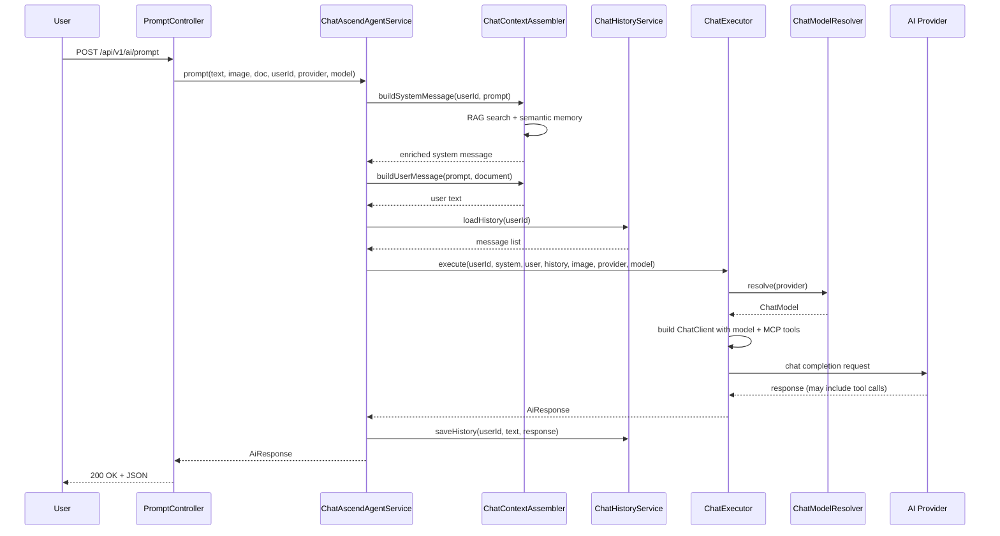
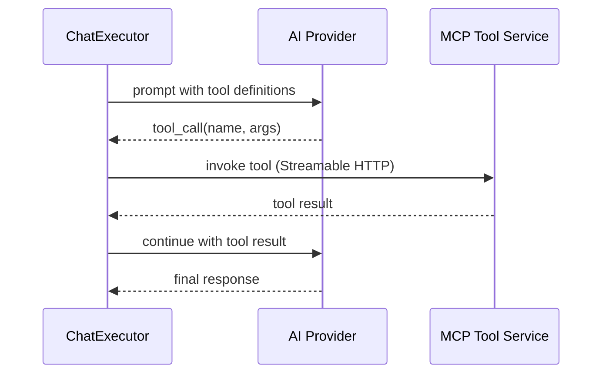

# 6. Runtime View

## Prompt Processing Flow



## MCP Tool Call Flow



## REST API: Request / Response Examples

### Prompt Request

```
POST /api/v1/ai/prompt
Content-Type: multipart/form-data
X-User-Id: user1

prompt=What is the weather in Warsaw?
provider=lmstudio
model=meta-llama-3.1-8b-instruct
```

### Prompt Response

```json
{
  "content": "The current weather in Warsaw is 15°C with partly cloudy skies.",
  "metadata": {
    "model": "meta-llama-3.1-8b-instruct",
    "usage": {
      "promptTokens": 245,
      "completionTokens": 32,
      "totalTokens": 277
    },
    "toolsUsed": ["weather_get_current"]
  }
}
```

### Provider Selection Examples

```
# Use default provider (lmstudio)
prompt=Hello

# Use Gemini with specific model
prompt=Summarize this&provider=gemini&model=gemini-2.5-pro

# Use Anthropic with default model
prompt=Explain quantum computing&provider=anthropic
```
