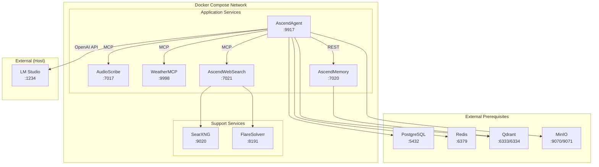

# 7. Deployment View

## Docker Compose Topology

## Service Port Map

| Service | Port(s) | Protocol | Notes |
|---|---|---|---|
| AscendAgent | 9917 | HTTP | Main API gateway |
| LM Studio | 1234 | HTTP | Local LLM (runs on host, not in Docker) |
| AudioScribe | 7017 | HTTP | MCP server for audio transcription |
| WeatherMCP | 9998 | HTTP | MCP server for weather data |
| AscendWebSearch | 7021 | HTTP | MCP server for web search |
| AscendMemory | 7020 | HTTP | REST API for semantic memory |
| PostgreSQL | 5432 | TCP | Relational database (external prerequisite) |
| Redis | 6379 | TCP | Cache (external prerequisite) |
| Qdrant | 6333 (HTTP), 6334 (gRPC) | HTTP/gRPC | Vector database (external prerequisite) |
| MinIO | 9070 (API), 9071 (Console) | HTTP | S3-compatible object storage (external prerequisite) |
| SearXNG | 9020 | HTTP | Meta search engine |
| FlareSolverr | 8191 | HTTP | Cloudflare bypass proxy |

## Infrastructure Requirements

- **Docker Engine** 24+ with Compose V2
- **Java 21+** for AscendAgent and WeatherMCP (run outside Docker during dev)
- **Python 3.11+** for AudioScribe, AscendWebSearch, AscendMemory
- **LM Studio** installed on host for local LLM inference
- **External prerequisites**: PostgreSQL, Redis, Qdrant, MinIO must be running before starting docker-compose (in production these map to managed cloud services)
