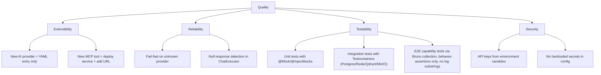

# 10. Quality Requirements

---

### Quality tree

---

### Quality scenarios

| Quality        | Scenario                                                      | Expected behaviour                                                                                                              |
| :------------- | :------------------------------------------------------------ | :------------------------------------------------------------------------------------------------------------------------------ |
| Extensibility  | Developer adds a new OpenAI-compatible provider.              | Add YAML block under `app.ai.providers`, set `enabled: true`. No Java code changes.                                             |
| Extensibility  | Developer adds a new MCP tool service.                        | Deploy the service, add its URL to `spring.ai.mcp.client.streamable-http.connections`.                                          |
| Reliability    | User requests an unknown provider.                            | `IllegalArgumentException` with list of enabled providers returned as HTTP 400.                                                 |
| Reliability    | LLM returns null response.                                    | `AiGenerationException` thrown, caught by global handler.                                                                       |
| Testability    | Running tests without LLM access.                             | All external dependencies mocked via `@MockitoBean` in `BaseIntegrationTest`.                                                   |
| Testability    | Running integration tests against real backing services.      | `./gradlew integrationTest` boots Postgres / Redis / Qdrant / MinIO via Testcontainers; specs live under [src/test/java/.../integration/](../../../src/test/java/com/lukk/ascend/ai/agent/integration/). |
| Testability    | Running capability tests against a live stack.                | Five numbered specs in [AscendAgent/e2e/testing/](../../../e2e/README.md). Each runnable by Bruno CLI, asserts only observable behaviour (HTTP / response body / persisted state), never log substrings. |
| Security       | API key not set for a provider.                               | Provider remains disabled (`enabled: false`), key defaults to `not-set`.                                                        |
