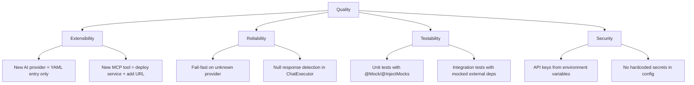

# 10. Quality Requirements

## Quality Tree

## Quality Scenarios

| Quality | Scenario | Expected Behavior |
|---|---|---|
| Extensibility | Developer adds a new OpenAI-compatible provider | Add YAML block under `app.ai.providers`, set `enabled: true` — no Java code changes |
| Extensibility | Developer adds a new MCP tool service | Deploy the service, add its URL to `spring.ai.mcp.client.streamable-http.connections` |
| Reliability | User requests an unknown provider | `IllegalArgumentException` with list of enabled providers returned as HTTP 400 |
| Reliability | LLM returns null response | `AiGenerationException` thrown, caught by global handler |
| Testability | Running tests without LLM access | All external dependencies mocked via `@MockitoBean` in `BaseIntegrationTest` |
| Security | API key not set for a provider | Provider remains disabled (`enabled: false`), key defaults to `not-set` |
