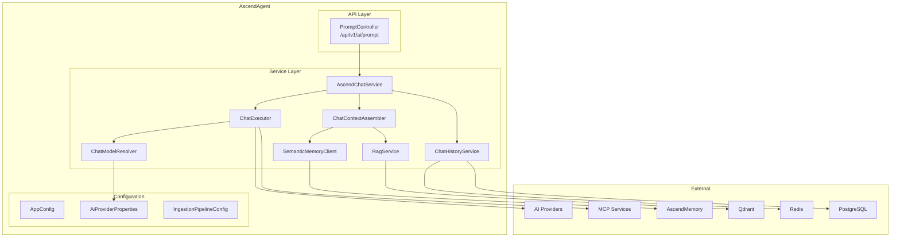

# C4 Component Diagram (Level 3) — AscendAgent

The component diagram shows the internal structure of the AscendAgent. The flow starts at `PromptController`, moves through `AscendChatService` for coordination, `ChatContextAssembler` for RAG/memory enrichment, and `ChatExecutor` for LLM invocation with dynamic provider resolution.
