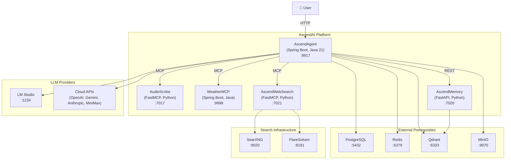

# C4 Container Diagram (Level 2)

Each container represents a separately deployable unit. The AscendAgent communicates with MCP services via Streamable HTTP, with data stores via their native protocols, and with LLM providers via HTTP APIs. PostgreSQL, Redis, Qdrant, and MinIO are external prerequisites (in production these map to managed cloud services).
