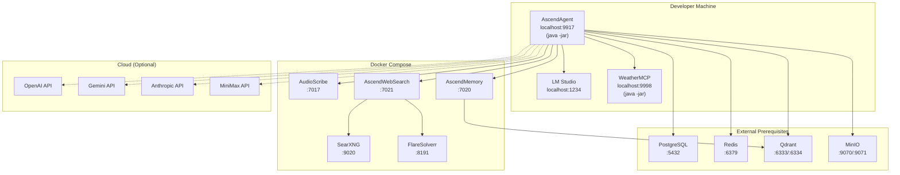

# Deployment Diagram

In development, the AscendAgent and WeatherMCP run directly on the host JVM. PostgreSQL, Redis, Qdrant, and MinIO are external prerequisites that must be running before starting docker-compose (in production these map to managed cloud services). Application and support services (AudioScribe, AscendWebSearch, AscendMemory, SearXNG, FlareSolverr) run in Docker Compose. Cloud AI providers are optional (dashed lines) — only accessed when their provider is enabled and selected.
