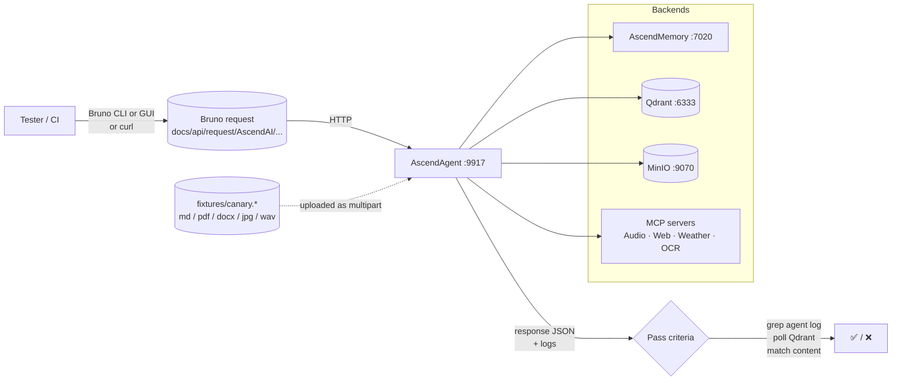

### AscendAgent — End-to-End Tests

---

This directory holds the manual / automated end-to-end suite for AscendAgent: capability test docs, fixture files, and a pointer to the Bruno API collection that lives at the repo root.

### What's here

---

```
AscendAgent/e2e/
├── README.md         # this file
├── fixtures/         # canary inputs (.md, .pdf, .docx, .jpg, .wav)
└── testing/          # capability test docs (one per capability)
    ├── README.md
    ├── semantic-memory.md
    ├── rag.md
    ├── pdf-read.md
    ├── image-description.md
    └── weather-mcp.md
```

The Bruno collection isn't here. It lives at the **repo root** under `docs/api/request/AscendAI/` (collection root) so it stays a portable API client artifact, not an AscendAgent-only one. Each test doc in `testing/` references the relevant Bruno requests under `docs/api/request/AscendAI/ascend-agent/testing/`.

### How a test runs (flow)

---



Every capability test follows the same shape:

1. Pre-flight — ping the services involved.
2. Send the request via Bruno (CLI, GUI) or the equivalent curl shown in the doc.
3. Verify the response payload, the AscendAgent log, and (where relevant) the side effects in Qdrant or PostgreSQL.

### Prerequisites before any test

---

1. External infra is up: PostgreSQL `:5432`, Redis `:6379`, Qdrant `:6333`, MinIO `:9070`.
2. Compose stack is up: `docker compose up -d --build` (brings up AscendMemory, AscendWebSearch, AudioScribe, PaddleOCR, WeatherMCP, support services).
3. AscendAgent itself is running locally: `cd AscendAgent && ./gradlew bootRun`.

If the AscendAgent startup banner shows any `[FAILED]` rows under `Infrastructure`, fix that first.

### Running tests

---

**Bruno CLI** (preferred for repeatable runs):

Bash:

```bash
npm install -g @usebruno/cli
```

```bash
bru run docs/api/request/AscendAI/ascend-agent/testing --env ascend-local
```

PowerShell:

```powershell
npm install -g @usebruno/cli
```

```powershell
bru run docs/api/request/AscendAI/ascend-agent/testing --env ascend-local
```

**Bruno GUI**: open the desktop app, point it at `docs/api/request/AscendAI/`, pick the `ascend-local` environment, click into `ascend-agent/testing/` and run requests one at a time.

**Plain curl**: every capability doc under `testing/` includes a Bash and PowerShell curl equivalent of the Bruno request, so you can run a test with no extra tools.

### Fixtures

---

`fixtures/` holds tiny sample files used by the upload-style tests. Each fixture holds different domain content (Java code review, recent commodity price, family recipe, distinctive image, short meeting clip) so a passing test proves the answer came from retrieval rather than training. Expected files:

- `markdown-canary.md` — RAG markdown ingest. One-line canary phrase the model can't possibly know from training, used to prove real retrieval.
- `banana-price-poland.pdf` — RAG PDF ingest + per-prompt PDF read. Contains a recent retail price.
- `pierogi-recipe.docx` — RAG DOCX ingest. Contains a recipe with a distinctive rest time.
- `image.png` — image description. Recognisable subject the model can identify.
- `meeting-clip.wav` — audio transcription. Short meeting recording with one distinctive sentence.

If a fixture is missing, the test doc says so and gives you the curl needed to skip it.

### Capability tests

---

| Capability | Doc | What it proves |
|---|---|---|
| Semantic memory | [testing/semantic-memory.md](testing/semantic-memory.md) | A fact stated in turn 1 is recalled in turn 2 from Qdrant via AscendMemory |
| RAG | [testing/rag.md](testing/rag.md) | Uploaded `.md`, `.pdf`, `.docx` ingest into Qdrant and surface in a later prompt |
| PDF read | [testing/pdf-read.md](testing/pdf-read.md) | A PDF attached to a single prompt is parsed and used as context |
| Image description | [testing/image-description.md](testing/image-description.md) | An attached image is sent to a vision-capable model and described |
| Weather MCP | [testing/weather-mcp.md](testing/weather-mcp.md) | AscendAgent discovers and calls the WeatherMCP tool |

### Adding a new capability test

---

1. Add the request(s) under `docs/api/request/AscendAI/ascend-agent/testing/<capability>.yml`.
2. If the test needs a fixture, drop the canary file in `fixtures/` (keep it small and uniquely identifiable).
3. Write `AscendAgent/e2e/testing/<capability>.md` with: pre-flight, the Bruno request name, equivalent curl (Bash + PowerShell), pass criteria.
4. Add a row to the capability table above and to `testing/README.md`.
