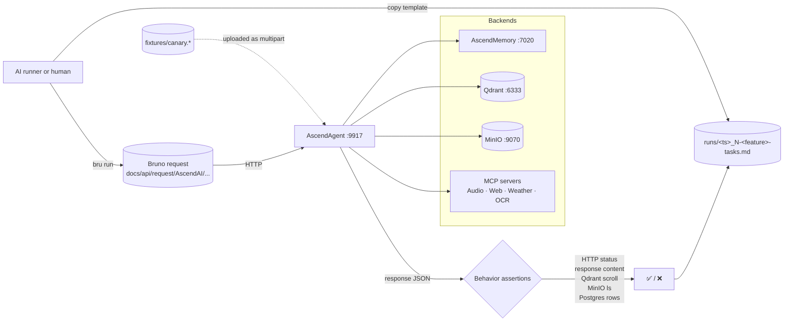

# AscendAgent: end-to-end test suite

The manual / AI-runnable e2e suite for AscendAgent. Each test exercises one capability end-to-end against a live
stack and asserts only **observable behaviour**. HTTP status codes, response-body content, persisted state in MinIO,
Qdrant, and Postgres. Logs are diagnostic, not pass criteria.

---

### What's here

```text
AscendAgent/e2e/
├── README.md                            # this file
├── fixtures/                            # canary inputs (.md, .pdf, .docx, .png, .wav)
└── testing/                             # numbered specs + sidecar templates + run records
    ├── README.md
    ├── 1-weather-mcp-test.md            # spec (immutable)
    ├── 1-weather-mcp-tasks.template.md  # run-record template (immutable)
    ├── 2-image-description-test.md
    ├── 2-image-description-tasks.template.md
    ├── 3-summarization-test.md
    ├── 3-summarization-tasks.template.md
    ├── 4-semantic-memory-test.md
    ├── 4-semantic-memory-tasks.template.md
    ├── 5-rag-test.md
    ├── 5-rag-tasks.template.md
    ├── 6-attach-sources-test.md
    ├── 6-attach-sources-tasks.template.md
    ├── 7-rag-dedup-test.md
    ├── 7-rag-dedup-tasks.template.md
    ├── 8-prompt-cache-openai-test.md
    ├── 8-prompt-cache-openai-tasks.template.md
    ├── 9-prompt-cache-anthropic-test.md
    ├── 9-prompt-cache-anthropic-tasks.template.md
    ├── 10-compaction-fires-test.md
    ├── 10-compaction-fires-tasks.template.md
    ├── 11-compaction-idempotency-test.md
    ├── 11-compaction-idempotency-tasks.template.md
    └── runs/
        ├── README.md
        └── <UTC-timestamp>_<N>-<feature>-tasks.md   # one per executed test (gitignored)
```

Tests are number-prefixed by setup cost. `1` needs the least, `11` the most. Each spec has a paired tasks template
that the runner copies into [testing/runs/](testing/runs/) with a sweep timestamp, ticks off checkbox by checkbox as
it executes, and fills with results, token usage, and wall-clock time.

The Bruno collection isn't here. It lives at the **repo root** under `docs/api/request/AscendAI/` (collection root)
so it stays a portable API client artifact. Each spec references the matching Bruno request file under
`docs/api/request/AscendAI/ascend-agent/testing/`.

---

### How a test runs (flow)



Every spec follows the same template:

1. **What this verifies.** Bullet list of behaviours.
2. **Prerequisites.** Concrete check commands (`curl`, `docker exec redis redis-cli ping`, etc.), each in its own
   code block with prose stating the success criterion.
3. **Reset state.** One command per code block, in order, to wipe state so the run is reproducible.
4. **Run.** One or more numbered Bruno CLI invocations. Multi-step tests tell the runner to wait for HTTP 200 before
   continuing.
5. **Expected.** Observable behaviour only: HTTP status, response content, MinIO listings, Qdrant scrolls, Postgres
   rows. No log substrings.
6. **Fixtures.** Paths to local files the test reads.

The paired `<N>-<feature>-tasks.template.md` is the runner's checklist for one execution: prerequisites, reset
state, run steps, expected, verdict, plus **Result summary** (with **Input tokens**, **Output tokens**, **Time**
fields) and **Additional tasks I did** (anything done outside the spec). The runner copies the template into
[testing/runs/](testing/runs/) as `<UTC-timestamp>_<N>-<feature>-tasks.md` and fills it in.

---

### Parallelism and execution order

Each test pins its own per-test `X-User-Id` (`frosty<TestName>Test`), so per-user state in Redis, Postgres
`chat_history`, and Qdrant memory points is naturally isolated. The only state still shared across tests is the
RAG layer: MinIO bucket `knowledge-base` and Qdrant collection `ascendai-1536`. That gives three execution groups.

| Group | Tests | Why this grouping | Parallelism within group |
| :---- | :---- | :---------------- | :----------------------- |
| **A — RAG suite** | 5, 6, 7 | Share the MinIO bucket and the `ascendai-1536` Qdrant collection. `POST /api/v1/ingestion/run` scans the whole bucket and writes to `int_metadata_store` with idempotency-by-ETag; two concurrent runs race on the unique constraint. | **Strict serial: 5 → 6 → 7.** |
| **B — fast tests** | 1, 2, 3, 4 | Unique user-ids; no RAG / MinIO writes. Single-prompt or two-prompt flows. | Sequential within one agent, or parallel across multiple agents — either works. |
| **C — cache + compaction** | 8, 9, 10, 11 | Unique user-ids; isolated chat-history slots. Tests 10 / 11 apply their own seed scripts before running. | Sequential within one agent, or parallel — either works. |

The three groups themselves are fully independent: no user-id overlap, no MinIO / Qdrant collision (groups B and C
don't touch the RAG layer at all). So the suggested execution layout is **three agents running in parallel**, one per
group:

- **Agent A**: tests 5 → 6 → 7 (sequential within agent).
- **Agent B**: tests 1, 2, 3, 4 (sequential within agent, can be reordered).
- **Agent C**: tests 8, 9, 10, 11 (sequential within agent, can be reordered).

Total wall-clock ≈ max of the three group durations. In recent sweeps that bottomed out around the RAG group at
~13 minutes; the other two groups finish in 3-5 minutes.

A single-process sequential run is also valid for debugging — just run tests 1 through 11 in numeric order. The
parallel layout only matters when you care about wall-clock.

#### Do not, under any circumstances

- Share `X-User-Id: frosty` (or any other id) across two specs. The old "all default to frosty" convention is
  removed; cross-test pollution will surface as flaky memory / chat-history assertions.
- Run two ingestion-runs concurrently. Group A's strict sequential ordering exists to avoid this.

---

### Prerequisites before any test

1. External infra running: PostgreSQL `:5432`, Redis `:6379`, Qdrant `:6333`, MinIO `:9070`.
2. Compose stack up: `docker compose up -d --build` (brings up AscendMemory, AscendWebSearch, AudioScribe, PaddleOCR,
   WeatherMCP, support services).
3. AscendAgent running on the host: `cd AscendAgent && ./gradlew bootRun`.

If the AscendAgent startup banner shows any `[FAILED]` rows under `External dependencies`, fix that first. Each
individual spec also has explicit prereq checks the runner executes before starting.

---

### Claude Code permission allowlist (local-only setup)

If you drive the suite via Claude Code's `e2e-runner` subagent, the sandbox classifier will block the spec-prescribed
reset commands (`docker exec ... mc rm`, `docker exec postgres psql -c "DELETE ..."`, `curl -X POST
http://localhost:6333/.../points/delete`) unless you allowlist them in your per-project local settings. Without the
allowlist, the runner finishes but the test verdicts are environmental noise: leaked state from the previous wave
contaminates the result, not the product behaviour.

The allowlist lives in [.claude/settings.local.json](../../.claude/settings.local.json), which is gitignored, so the
list is *not* shared via the repo. Each developer adds the same shapes to their own local copy. The shapes the e2e
specs need:

```json
{
  "permissions": {
    "allow": [
      "Bash(docker exec minio mc *)",
      "Bash(docker exec minio sh -c *)",
      "Bash(docker exec -i minio *)",
      "Bash(docker exec postgres psql *)",
      "Bash(docker exec -i postgres psql *)",
      "Bash(docker exec redis redis-cli *)",
      "Bash(docker exec -i redis redis-cli *)",
      "Bash(docker exec ascend-agent printenv *)",
      "Bash(docker exec ascend-agent ls *)",
      "Bash(curl -fsS http://localhost:6333/*)",
      "Bash(curl -X POST http://localhost:6333/*)",
      "Bash(curl -fsS http://localhost:9070/*)",
      "Bash(curl -fsS http://localhost:9917/*)",
      "Bash(curl -X POST http://localhost:9917/*)",
      "Bash(curl -s -X POST http://localhost:9917/*)",
      "Bash(curl -fsS http://localhost:9998/*)",
      "Bash(curl -fsS http://localhost:7020/*)",
      "Bash(bru --version)",
      "Bash(bru run *)",
      "Bash(cd docs/api/request/AscendAI && bru run *)"
    ]
  }
}
```

Each entry is narrowed to a specific container (`minio`, `postgres`, `redis`, `ascend-agent`) or a specific localhost
port (`:6333` Qdrant, `:9070` MinIO, `:9917` AscendAgent, `:9998` WeatherMCP, `:7020` AscendMemory). No blanket
`docker exec *` or `curl *`. If you only run a subset of tests, you can prune.

If you skip this setup, the suite still runs but environmental failures (leaked fixtures re-indexed as extra
sources, partially-completed resets etc.) will look like product regressions in the runner reports. Always check the
runner's `notes:` block for classifier-blocked commands before treating a FAIL as a real bug.

---

### Running tests

Install the Bruno CLI once.

Bash:

```bash
npm install -g @usebruno/cli
```

PowerShell:

```powershell
npm install -g @usebruno/cli
```

Run one capability.

Bash:

```bash
cd docs/api/request/AscendAI && bru run "ascend-agent/testing/weather-mcp-prompt.yml" --env ascend-local
```

PowerShell:

```powershell
cd docs/api/request/AscendAI
```

```powershell
bru run "ascend-agent/testing/weather-mcp-prompt.yml" --env ascend-local
```

Run the whole suite (Bruno's directory mode).

Bash:

```bash
cd docs/api/request/AscendAI && bru run "ascend-agent/testing" --env ascend-local
```

PowerShell:

```powershell
cd docs/api/request/AscendAI
```

```powershell
bru run "ascend-agent/testing" --env ascend-local
```

Or follow a spec end-to-end manually: read `<N>-<feature>-test.md`, copy its template to
`runs/<UTC-timestamp>_<N>-<feature>-tasks.md`, work through the checkboxes.

---

### Fixtures

[fixtures/](fixtures/) holds small canary files used by the upload-style tests. Each fixture holds distinctive
content (no overlap with model training) so a passing test proves the answer came from retrieval or the attached
document rather than memorised knowledge.

| File                                                       | Used by                                | Distinctive content                                                       |
| :--------------------------------------------------------- | :------------------------------------- | :------------------------------------------------------------------------ |
| `markdown-canary.md`                                       | RAG (test 5)                           | One-line canary phrase the model can't possibly know.                     |
| `banana-price-poland.pdf`                                  | RAG (test 5)                           | Specific recent retail price.                                             |
| `pierogi-recipe.docx`                                      | RAG (test 5), attach-sources (test 6)  | Recipe with a distinctive rest time.                                      |
| `dedup-pierogi-helena.md`                                  | RAG dedup (test 7)                     | Babcia Helena's pierogi recipe (HELENA-DEDUP-CANARY).                     |
| `dedup-pierogi-grandma.md`                                 | RAG dedup (test 7)                     | Grandma Maria's pierogi recipe (GRANDMA-DEDUP-CANARY).                    |
| `argent-saga-chronicle.pdf`                                | Summarization (test 3)                 | Fictional saga with unique proper nouns.                                  |
| `image.png`                                                | Image description (test 2)             | Recognisable subject the model can describe.                              |
| `meeting-clip.wav`                                         | (future audio test)                    | Short meeting recording.                                                  |
| `compaction-seeds/seed-compaction-fires.{sql,redis}`       | Compaction fires (test 10)             | 21-row deterministic chat history with sprinkled facts.                   |
| `compaction-seeds/seed-compaction-idempotency.{sql,redis}` | Compaction idempotency (test 11)       | 1 summary row + 8 raw turns, mimicking post-compaction state.             |

---

### Capability tests

Numbered by setup cost. Easiest first.

| #  | Spec                                                                                            | Template                                                                                                              | What it proves                                                                                                          |
| :- | :---------------------------------------------------------------------------------------------- | :-------------------------------------------------------------------------------------------------------------------- | :---------------------------------------------------------------------------------------------------------------------- |
| 1  | [testing/1-weather-mcp-test.md](testing/1-weather-mcp-test.md)                                  | [testing/1-weather-mcp-tasks.template.md](testing/1-weather-mcp-tasks.template.md)                                    | The agent discovers and invokes the WeatherMCP tool.                                                                    |
| 2  | [testing/2-image-description-test.md](testing/2-image-description-test.md)                      | [testing/2-image-description-tasks.template.md](testing/2-image-description-tasks.template.md)                        | An attached image reaches a vision-capable model and is described accurately.                                           |
| 3  | [testing/3-summarization-test.md](testing/3-summarization-test.md)                              | [testing/3-summarization-tasks.template.md](testing/3-summarization-tasks.template.md)                                | A PDF attached inline is parsed page by page through Docling and summarised from real content.                          |
| 4  | [testing/4-semantic-memory-test.md](testing/4-semantic-memory-test.md)                          | [testing/4-semantic-memory-tasks.template.md](testing/4-semantic-memory-tasks.template.md)                            | A fact stated in turn 1 is recalled in turn 2 from Qdrant via AscendMemory, after chat history is wiped.                |
| 5  | [testing/5-rag-test.md](testing/5-rag-test.md)                                                  | [testing/5-rag-tasks.template.md](testing/5-rag-tasks.template.md)                                                    | Uploaded `.md`, `.pdf`, `.docx` ingest into Qdrant and surface in a later prompt with grounded citations.               |
| 6  | [testing/6-attach-sources-test.md](testing/6-attach-sources-test.md)                            | [testing/6-attach-sources-tasks.template.md](testing/6-attach-sources-tasks.template.md)                              | `attachSources=true` returns a presigned MinIO URL that resolves with HTTP 200 and uses `localhost:9070`.               |
| 7  | [testing/7-rag-dedup-test.md](testing/7-rag-dedup-test.md)                                      | [testing/7-rag-dedup-tasks.template.md](testing/7-rag-dedup-tasks.template.md)                                        | Multiple chunks across 2 source files collapse into exactly 2 unique entries in `sources[]` (dedup by `(bucket, key)`). |
| 8  | [testing/8-prompt-cache-openai-test.md](testing/8-prompt-cache-openai-test.md)                  | [testing/8-prompt-cache-openai-tasks.template.md](testing/8-prompt-cache-openai-tasks.template.md)                    | Two consecutive identical prompts on `provider=openai` produce a cache hit on call 2 (`cachedTokens > 0`).              |
| 9  | [testing/9-prompt-cache-anthropic-test.md](testing/9-prompt-cache-anthropic-test.md)            | [testing/9-prompt-cache-anthropic-tasks.template.md](testing/9-prompt-cache-anthropic-tasks.template.md)              | Two consecutive identical prompts on `provider=anthropic` produce native `cache_control` cache write on call 1 and cache read on call 2. |
| 10 | [testing/10-compaction-fires-test.md](testing/10-compaction-fires-test.md)                      | [testing/10-compaction-fires-tasks.template.md](testing/10-compaction-fires-tasks.template.md)                        | After SQL + Redis seed of 21 rows + 1 prompt, async compaction replaces the prefix with exactly 9 rows: 1 `[Conversation summary]` + 8 raw. |
| 11 | [testing/11-compaction-idempotency-test.md](testing/11-compaction-idempotency-test.md)          | [testing/11-compaction-idempotency-tasks.template.md](testing/11-compaction-idempotency-tasks.template.md)            | After seed of 1 summary + 8 raw rows, sending 1 more prompt does NOT re-fire compaction (row count goes 9 to 11, no new summary). |

---

### Adding a new capability test

1. Add the Bruno request(s) under `docs/api/request/AscendAI/ascend-agent/testing/<capability>.yml` with sensible
   default-enabled rows.
2. If the test needs a fixture, drop the canary file in [fixtures/](fixtures/) (keep it small and uniquely
   identifiable).
3. Pick the next number prefix that matches the test's setup cost.
4. Write `testing/<N>-<capability>-test.md` using the template structure (**What this verifies / Prerequisites /
   Reset state / Run / Expected / Fixtures**). Assert behaviour, not logs.
5. Write `testing/<N>-<capability>-tasks.template.md` mirroring the spec's checkboxes, with `## Result summary`
   containing the **Input tokens / Output tokens / Time** fields at the bottom.
6. Add a row to the capability table above.
