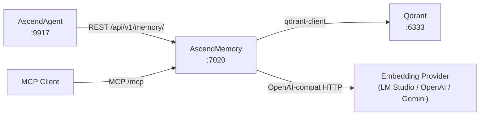

# 3. Context and Scope

---

### System boundary

AscendMemory is a standalone microservice. It owns no data store of its own beyond what it pushes into Qdrant. It
receives memory operations from callers and delegates to the mem0ai library, which handles embedding and Qdrant I/O.

---

### External interfaces

| Neighbour | Direction | Protocol | Notes |
| :-------- | :-------- | :------- | :---- |
| AscendAgent | Inbound | HTTP REST | Calls `/api/v1/memory/insert`, `/search`, `/wipe`, `/delete` after each chat turn and at prompt time. See AscendAgent ADR-003 for why REST is used instead of MCP for this consumer. |
| MCP clients (AscendAgent or any FastMCP-capable agent) | Inbound | MCP Streamable HTTP | Tools `memory_insert`, `memory_search`, `memory_delete`, `memory_wipe` at `/mcp`. |
| Qdrant | Outbound | qdrant-client SDK (HTTP/gRPC) | Vector storage. Default `localhost:6333`. Configured via `QDRANT_HOST` / `QDRANT_PORT`. |
| Embedding provider (LM Studio / OpenAI / Gemini) | Outbound | OpenAI-compatible HTTP | Embedding generation. Provider, base URL, and API key selected per request via `PROVIDER_CONFIGS`. |

---

### Context diagram

