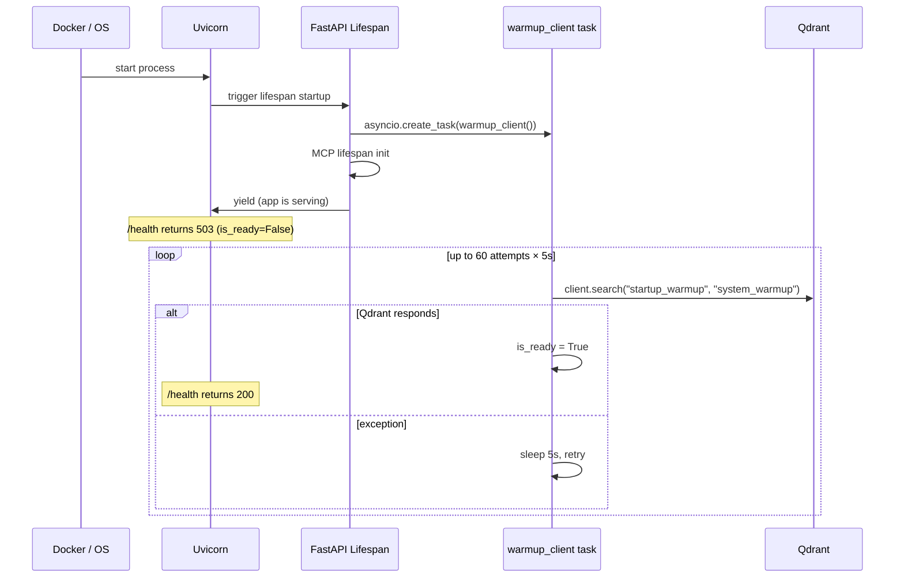
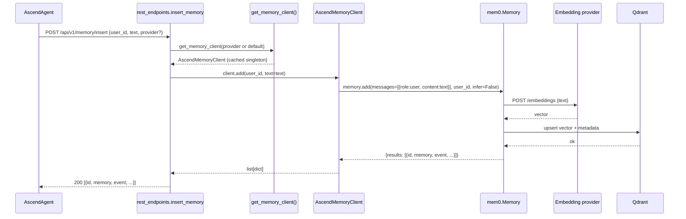
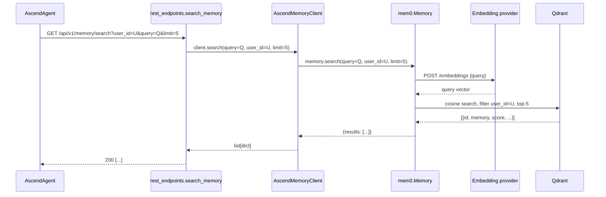
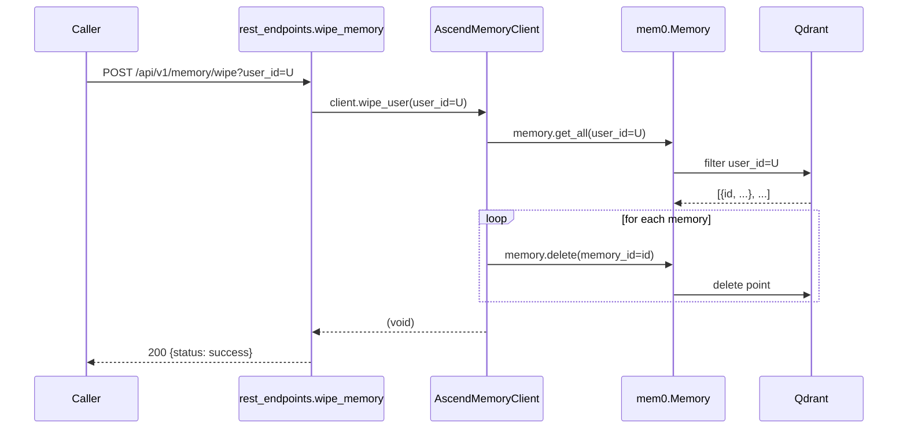

# 6. Runtime View

---

### Scenario 1: Service startup

Source: `src/main.py:28-55`, `src/main.py:85-90`.

---

### Scenario 2: Memory insert (REST path)

Source: `src/api/rest/rest_endpoints.py:43-62`, `src/service/memory_client.py:118-138`.

---

### Scenario 3: Memory search

Source: `src/api/rest/rest_endpoints.py:20-32`, `src/service/memory_client.py:109-116`.

---

### Scenario 4: Memory wipe (workaround path)

The standard mem0ai `delete_all` resets the entire collection. The workaround fetches all memories for the user, then
deletes them one by one.

Source: `src/service/memory_client.py:148-166`.

---

### Scenario 5: MCP tool call

The MCP path calls the same `get_memory_client()` factory used by REST. The only difference is that the MCP
`memory_insert` tool does not accept `messages`; it accepts only `text`. The JSON-RPC session must be initialized
first (`method: initialize`) to obtain a session ID returned in `MCP-Session-Id`.

Source: `src/api/mcp/mcp_server.py`.
