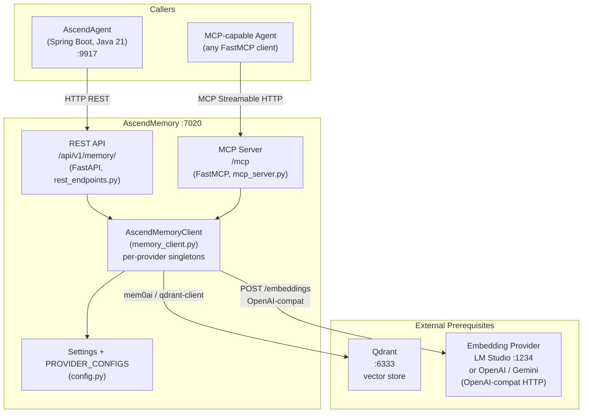

# C4 Container Diagram — AscendMemory

---

AscendAgent is the primary REST caller. It calls `/api/v1/memory/insert` after each chat turn (via
`SemanticMemoryExtractor`) and `/api/v1/memory/search` at prompt time (via `SemanticMemoryClient`). The MCP surface
at `/mcp` exposes the same operations as tools; AscendAgent does not use this path, but any FastMCP-capable agent
can.

Both REST and MCP handlers delegate to `AscendMemoryClient` via `get_memory_client()`. That client constructs a
`mem0.Memory` instance from the per-provider configuration in `PROVIDER_CONFIGS`, which maps each named provider to
its embedding model, Qdrant collection, base URL, and API key env var.

Qdrant stores the vectors. The embedding provider generates them. In the default configuration (`provider=lmstudio`),
LM Studio runs locally at port 1234 serving `text-embedding-nomic-embed-text-v2-moe` (768 dimensions, collection
`ascend_memory_768`). Switching to `provider=openai` routes to `api.openai.com` and uses collection
`ascend_memory_1536` (1536 dimensions).
