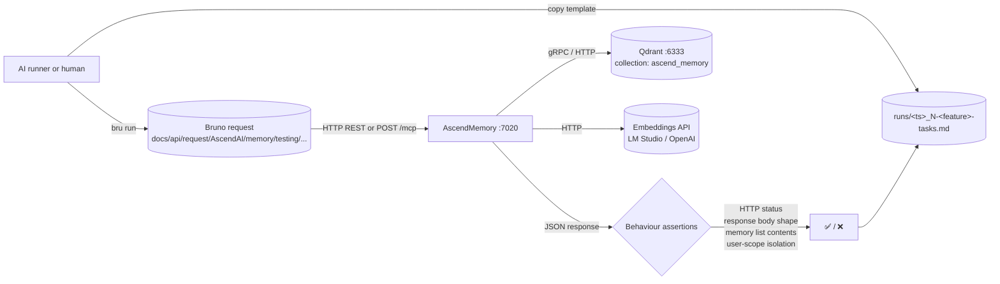

# AscendMemory: end-to-end capability tests

Manual / AI-runnable e2e suite for the AscendMemory module. Each test exercises **one memory operation** end-to-end
against a live AscendMemory container on port 7020. Assertions are observable behaviour only — HTTP status codes,
response body shape and content, persisted state in the backing Qdrant collection (`ascend_memory`). Logs are
diagnostic, not authoritative.

AscendMemory holds user-scoped memories in Qdrant via mem0ai. Reset for these tests means wiping the specific
`user_id`(s) the test touches via `POST /api/v1/memory/wipe?user_id=...` — never restarting the container or wiping
all users.

## What's here

```text
AscendMemory/e2e/
├── README.md                            # this file
├── fixtures/                            # canary inputs (none today; AscendMemory payloads are text-only)
│   └── README.md
└── testing/                             # numbered specs + templates/ + runs/
    ├── README.md
    ├── 1-invalid-input-test.md          # immutable spec (lowest cost — no Qdrant writes)
    ├── 2-insert-and-search-test.md
    ├── 3-wipe-user-scope-test.md
    ├── 4-mcp-tools-list-test.md
    ├── 5-mcp-insert-and-search-test.md
    ├── templates/                       # run-record templates (immutable), one per spec
    │   ├── README.md
    │   ├── 1-invalid-input-tasks.template.md
    │   ├── 2-insert-and-search-tasks.template.md
    │   ├── 3-wipe-user-scope-tasks.template.md
    │   ├── 4-mcp-tools-list-tasks.template.md
    │   └── 5-mcp-insert-and-search-tasks.template.md
    └── runs/
        ├── README.md
        └── <UTC-timestamp>_<N>-<capability>-tasks.md   # one per executed test (gitignored)
```

Tests are number-prefixed by setup cost. `1` runs without writing any persisted state (FastAPI validation rejects
the request before mem0 is touched). `2`-`5` write to Qdrant via mem0ai; each is responsible for wiping its own
user-scoped state at the start.

The Bruno collection isn't here. It lives at the **repo root** under
`docs/api/request/AscendAI/memory/testing/` so it stays a portable API client artifact. Each spec references the
matching Bruno request file under that path. The pre-existing ad-hoc dev requests under
`docs/api/request/AscendAI/memory/` are left untouched — only the `testing/` subfolder is e2e-suite property.

## Flow



Every spec follows the same template:

1. **What this verifies.** Bullet list of behaviours.
2. **Prerequisites.** Concrete check commands the runner executes before starting. Each command is its own code
   block; the prose around it states what success looks like.
3. **Reset state.** One command per code block, executed in order, to wipe state so the test is reproducible. For
   AscendMemory this means wiping the specific `user_id`(s) the test touches.
4. **Run.** One or more numbered steps. Each step is a single Bruno CLI invocation (REST) or a paired curl +
   Bruno sequence (MCP, because the `initialize` handshake must run before any `tools/call`). Steps wait for HTTP
   200 before continuing.
5. **Expected.** Observable behaviour only: HTTP status, response body fields, persisted state visible via a
   subsequent search call. No log substrings.
6. **Fixtures.** Paths to local files the test reads (none for the current suite — all payloads are inline text).

The paired `templates/<N>-<feature>-tasks.template.md` is the runner's checklist for one execution: prerequisites,
reset state, run steps, expected, verdict, plus **Result summary** (with **Input tokens**, **Output tokens**,
**Start (UTC)**, **End (UTC)**, **Duration** fields) and **Additional tasks I did** (anything done outside the
spec). The runner copies the template from [testing/templates/](testing/templates/) into
[testing/runs/](testing/runs/) as `<UTC-timestamp>_<N>-<feature>-tasks.md` and fills it in.

## Parallelism and execution order

Every AscendMemory test that writes state is **user-scoped**: the test seeds a unique `user_id`, asserts against
it, and wipes it. Two tests with disjoint `user_id` lists can run side by side. Two tests touching the same
`user_id` must run serially.

| Constraint | Tests | Why |
| :--- | :--- | :--- |
| **No persistence** | 1 | Test 1 hits FastAPI's request validator (422) before mem0 is invoked. No Qdrant writes. Runs in any order. |
| **Disjoint user IDs** | 2, 3, 5 | Each test owns its own dedicated user IDs (`frostyMemoryInsertSearchTest`, `frostyMemoryWipeAlpha`/`Beta`, `frostyMemoryMcpInsertSearchTest`). No overlap, so they can run in parallel. |
| **Read-only protocol probe** | 4 | `tools/list` is a pure read against the MCP server. No state writes. |

Recommended layout: run test 1 first (offline-equivalent, fail-fast on validator behaviour), then tests 2-5 in
parallel or sequential; ordering inside that group does not matter because their `user_id`s are disjoint.

## Prerequisites before any test

1. AscendMemory container running on port 7020. The docker-compose `ascend-ai` project starts it: `docker compose up -d ascend-memory` (or include in the full stack).
2. `curl -fsS http://localhost:7020/health` returns HTTP 200 with `{"status":"ok"}`. While the container is still warming up it returns HTTP 503 with `{"status":"starting"}`; wait for `"ok"` before starting the suite.
3. Qdrant reachable on `:6333` (AscendMemory needs it for any insert/search).
4. The embedding backend (LM Studio at `:1234` or OpenAI, depending on configured `OPENAI_BASE_URL`) is reachable.
5. Bruno CLI installed: `bru --version` returns a version string. Install once with `npm install -g @usebruno/cli`.

## Running tests

Install Bruno CLI once.

```powershell
npm install -g @usebruno/cli
```

Run one capability.

```powershell
cd docs/api/request/AscendAI
```

```powershell
bru run "memory/testing/insert-reykjavik.yml" --env ascend-local
```

Run the whole testing subfolder (Bruno's directory mode).

```powershell
cd docs/api/request/AscendAI
```

```powershell
bru run "memory/testing" --env ascend-local
```

## Capability tests

Numbered by setup cost. Easiest first.

| #  | Spec | What it proves |
| :- | :--- | :--- |
| 1  | [testing/1-invalid-input-test.md](testing/1-invalid-input-test.md) | `POST /api/v1/memory/insert` with a body missing the required `user_id` field is rejected by FastAPI with HTTP 422 before any mem0 / Qdrant call. |
| 2  | [testing/2-insert-and-search-test.md](testing/2-insert-and-search-test.md) | A memory inserted via `POST /api/v1/memory/insert` for a unique `user_id` is retrievable via `GET /api/v1/memory/search` with a semantically related query; the returned `memory` field contains the canary substring `"Reykjavik"`. |
| 3  | [testing/3-wipe-user-scope-test.md](testing/3-wipe-user-scope-test.md) | `POST /api/v1/memory/wipe?user_id=Alpha` removes Alpha's memories but leaves Beta's intact, proving wipe is scoped to the supplied `user_id` and never bleeds across users. |
| 4  | [testing/4-mcp-tools-list-test.md](testing/4-mcp-tools-list-test.md) | `tools/list` against `:7020/mcp` (after the `initialize` handshake) advertises memory tools whose names include `insert` and `search`. |
| 5  | [testing/5-mcp-insert-and-search-test.md](testing/5-mcp-insert-and-search-test.md) | The MCP layer is wired to the same memory client as REST: an insert via the MCP `memory_insert` tool is retrievable via the MCP `memory_search` tool for the same `user_id`. |

## Adding a new test

1. Add the Bruno request(s) under `docs/api/request/AscendAI/memory/testing/<request>.yml`.
2. Pick the next number prefix that matches the test's setup cost.
3. Write `testing/<N>-<capability>-test.md` using the template structure (**What this verifies / Prerequisites /
   Reset state / Run / Expected / Fixtures**). Assert behaviour, not logs.
4. Write `testing/templates/<N>-<capability>-tasks.template.md` mirroring the spec's checkboxes, with
   `## Result summary` containing the **Input tokens / Output tokens / Start (UTC) / End (UTC) / Duration** fields
   at the bottom.
5. Add a row to the capability table above.
