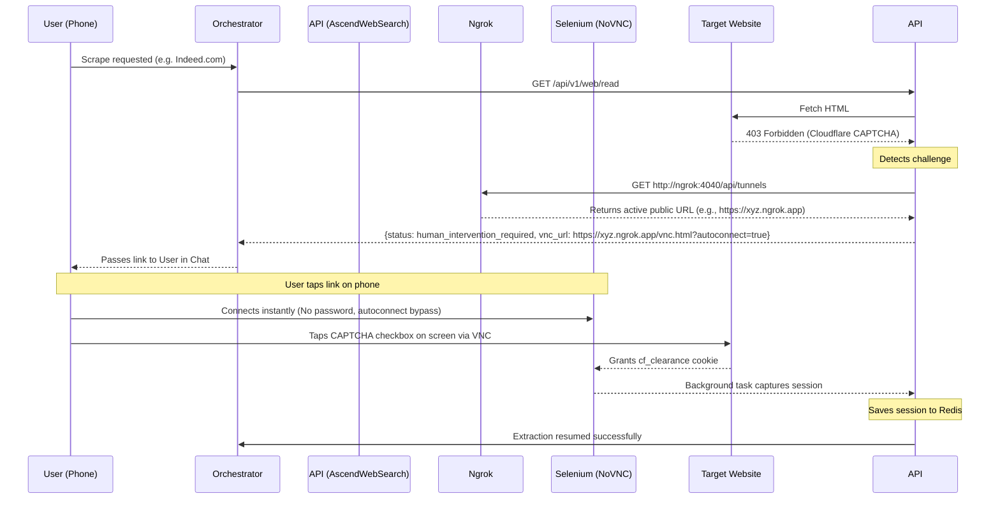

# AscendWebSearch

Web search and content extraction service for the AscendAI ecosystem. SearXNG handles meta-search. A multi-tiered
extraction stack (curl_cffi, FlareSolverr, Playwright, NoVNC) handles reading, escalating only when the previous tier
fails.

---

### Table of Contents

- [API Documentation](#api-documentation)
- [Agent Skill](#agent-skill)
- [Versioning & Changelog](#versioning--changelog)
- [Prerequisites](#prerequisites)
- [Configuration](#configuration)
- [Running the Service](#running-the-service)
- [MCP Server Mode](#mcp-server-mode)
- [REST API Examples](#rest-api-examples)
- [How it Works](#how-it-works)
- [Troubleshooting](#troubleshooting)
- [Docs map](#docs-map)

---

### API Documentation

- **Swagger UI**: [http://localhost:7021/docs](http://localhost:7021/docs)
- **Redoc**: [http://localhost:7021/redoc](http://localhost:7021/redoc)

---

### Agent Skill

A drop-in skill ships at [skills/ascend-web-scrapper/SKILL.md](skills/ascend-web-scrapper/SKILL.md). Copy
[skills/ascend-web-scrapper/](skills/ascend-web-scrapper/) into your agent's skills folder (`.claude/skills/`,
`.agents/skills/`, `.opencode/skills/`, etc.) and the agent will pick it up automatically.

The skill covers the two endpoints (`POST /api/v2/web/read`, `GET /api/v1/web/search`), the
success / error / `human_intervention_required` response shapes, and the CAPTCHA / login-wall flow: surface the
returned `vnc_url`, let the user solve it on any device, then re-call `/read` with the same URL so the cached session
in Redis takes over. Base URL is intentionally left out (varies per environment); the agent runtime provides it.

When you change endpoint shapes here, update the SKILL.md so downstream agents stay accurate.

---

### Versioning & Changelog

The microservice version lives in [pyproject.toml](pyproject.toml) under `version`. Bump it and record structural
changes in [CHANGELOG.md](CHANGELOG.md) whenever:

1. You deploy a new release to Docker Hub.
2. You introduce new scraping strategies or network-breaking dependencies (e.g. adding FlareSolverr or NoVNC
   bridges).

---

### Prerequisites

- **Python 3.12**
- **SearXNG** instance reachable on `9020` (Docker exposed) or `8080` (container-internal)
- **Playwright browsers** (only when running locally outside Docker)
- **Ngrok auth token** for remote CAPTCHA solving. Get a free token from
  [dashboard.ngrok.com](https://dashboard.ngrok.com) and set it as the `NGROK_AUTHTOKEN` env var.

---

### Configuration

Settings live in [src/config/config.py](src/config/config.py) (pydantic-settings, reads `.env` automatically).

| Variable                | Default                                     | Purpose                                                              |
| :---------------------- | :------------------------------------------ | :------------------------------------------------------------------- |
| `SEARXNG_BASE_URL`      | `http://localhost:9020`                     | URL of the SearXNG instance (Docker: `http://searxng:8080`)          |
| `API_PORT`              | `7021`                                      | Service port                                                         |
| `API_HOST`              | `0.0.0.0`                                   | Bind address                                                         |
| `LOG_LEVEL`             | `INFO`                                      | Log level                                                            |
| `FLARESOLVERR_URL`      | `http://localhost:8191/v1`                  | FlareSolverr endpoint                                                |
| `REDIS_URL`             | `redis://localhost:6379/0`                  | Redis URL for session persistence                                    |
| `BLOCKLIST_URL`         | `https://secure.fanboy.co.nz/fanboy-annoyance.txt` | Ad blocklist downloaded at startup                            |
| `NGROK_AUTHTOKEN`       | (none)                                      | Required for the Ngrok-backed NoVNC tunnel                           |

---

### Running the Service

#### As a standard Python app

**1. Create a virtual environment.**

Bash:

```bash
python3 -m venv .venv
```

PowerShell:

```powershell
python -m venv .venv
```

**2. Activate it.**

Bash:

```bash
source .venv/bin/activate
```

PowerShell:

```powershell
.\.venv\Scripts\activate
```

**3. Install dependencies.**

```bash
pip install -e .[dev]
```

**4. Install Playwright browsers.**

```bash
playwright install --with-deps chromium
```

**5. Export env vars and run.**

Bash:

```bash
export SEARXNG_BASE_URL="http://localhost:9020"
```

```bash
export LOG_LEVEL="INFO"
```

```bash
python src/main.py
```

PowerShell:

```powershell
$env:SEARXNG_BASE_URL="http://localhost:9020"
```

```powershell
$env:LOG_LEVEL="INFO"
```

```powershell
python src/main.py
```

#### With Docker (recommended)

**1. Build the image.**

```bash
docker build -t ascend-web-search:latest .
```

**2. Run the container.** Inside the compose network, use `http://searxng:8080` instead of `host.docker.internal`.

```bash
docker run -d --name ascend-web-search -p 7021:7021 -e SEARXNG_BASE_URL="http://host.docker.internal:9020" ascend-web-search:latest
```

**3. Tag and push (optional).**

Bash:

```bash
docker tag ascend-web-search:latest lukk17/ascend-web-search:v0.1.0
```

```bash
docker push lukk17/ascend-web-search:v0.1.0
```

```bash
docker tag ascend-web-search:latest lukk17/ascend-web-search:latest
```

```bash
docker push lukk17/ascend-web-search:latest
```

PowerShell:

```powershell
docker tag ascend-web-search:latest lukk17/ascend-web-search:v0.1.0
```

```powershell
docker push lukk17/ascend-web-search:v0.1.0
```

```powershell
docker tag ascend-web-search:latest lukk17/ascend-web-search:latest
```

```powershell
docker push lukk17/ascend-web-search:latest
```

---

### MCP Server Mode

The service exposes an MCP server over HTTP at `/mcp`.

#### Tool configuration

```json
{
  "mcpServers": {
    "ascend-web-search": {
      "type": "sse",
      "url": "http://localhost:7021/mcp"
    }
  }
}
```

#### Available tools

- `web_search(query, limit)`. Search the web.
- `web_read(url)`. Extract content from a URL.

---

### REST API Examples

#### Health check

Bash:

```bash
curl -X GET http://localhost:7021/health
```

PowerShell:

```powershell
Invoke-RestMethod -Uri http://localhost:7021/health
```

#### Web search

`GET /api/v1/web/search`.

Bash:

```bash
curl "http://localhost:7021/api/v1/web/search?query=AscendAI&limit=3"
```

PowerShell:

```powershell
Invoke-RestMethod -Uri "http://localhost:7021/api/v1/web/search?query=AscendAI&limit=3"
```

#### Web read

`GET /api/v1/web/read`.

Bash:

```bash
curl "http://localhost:7021/api/v1/web/read?url=https://example.com"
```

PowerShell:

```powershell
Invoke-RestMethod -Uri "http://localhost:7021/api/v1/web/read?url=https://example.com"
```

#### Call an MCP tool over HTTP

The MCP server accepts JSON-RPC `tools/call` requests on `/mcp`.

`web_search`:

```bash
curl -X POST http://localhost:7021/mcp -H "Content-Type: application/json" -d '{"jsonrpc":"2.0","method":"tools/call","params":{"name":"web_search","arguments":{"query":"AscendAI","limit":1}},"id":1}'
```

`web_read`:

```bash
curl -X POST http://localhost:7021/mcp -H "Content-Type: application/json" -d '{"jsonrpc":"2.0","method":"tools/call","params":{"name":"web_read","arguments":{"url":"https://example.com"}},"id":2}'
```

PowerShell equivalents:

```powershell
Invoke-RestMethod -Uri http://localhost:7021/mcp -Method Post -ContentType "application/json" -Body '{"jsonrpc":"2.0","method":"tools/call","params":{"name":"web_search","arguments":{"query":"AscendAI","limit":1}},"id":1}'
```

```powershell
Invoke-RestMethod -Uri http://localhost:7021/mcp -Method Post -ContentType "application/json" -Body '{"jsonrpc":"2.0","method":"tools/call","params":{"name":"web_read","arguments":{"url":"https://example.com"}},"id":2}'
```

---

### How it Works

The `web_read` tool uses a multi-tiered cascade to bypass WAFs (Cloudflare, etc.).

1. **Fast path (`curl_cffi`).** GET via curl_cffi with a Chrome 120 TLS fingerprint, then extract with
   `trafilatura` or `BeautifulSoup`. Fast, resource-efficient, bypasses basic blocks.
2. **Automated WAF solver (`FlareSolverr`).** When Cloudflare blocks the fast path, the request is sent to the
   FlareSolverr container, which resolves JavaScript challenges and caches clearance cookies for future requests.
3. **Render path (`Playwright` + `Crawlee`).** For complex dynamic sites that need rendering but don't actively
   block, `undetected-playwright` runs with `headless=False` to mimic human behaviour and render the DOM.
4. **Human fallback and login auth (`NoVNC`).** When automated methods fail or the page needs a manual login, the
   `ChallengeDetector` triggers a remote Playwright session. Response status is `human_intervention_required` with a
   VNC URL and `intervention_type` (`login` or `captcha`). The orchestrator presents the URL to the user, who solves
   the challenge visually; the system captures the authenticated session and resumes extraction.

#### Remote human intervention (Ngrok flow)

To allow CAPTCHA or login solving from anywhere (e.g. your phone) without an SSH tunnel back to the server,
AscendWebSearch wires Ngrok into the compose network.

1. **The dynamic URL problem.** When the `ngrok` container starts, it gets a random public domain (e.g.
   `https://xyz.ngrok.app`). Since this changes every restart, the URL can't be statically hardcoded.
2. **The API solution.** During init, AscendWebSearch sets `PUBLIC_VNC_URL=http://ngrok:4040/api/tunnels`. When a
   CAPTCHA triggers, the Python code calls this local diagnostic API on the Ngrok container and extracts the
   *active* public URL dynamically.
3. **The result.** The system appends `?autoconnect=true` to the extracted URL and returns it in the orchestrator
   chat payload. You tap the link, bypass the VNC login screen, solve the CAPTCHA, and the background task continues.



#### Session persistence (Redis)

Authenticated sessions, clearance tokens, and CAPTCHAs solved via NoVNC or FlareSolverr are stored in the shared
Redis container. This means:

- **Persistent auth.** Authenticated sessions outlive `ascend-web-search` container restarts and deployments.
- **Distributed scaling.** Prevents split-brain caching in multi-worker environments. Any worker reads the shared
  tokens, preventing repeat manual logins.

---

### Startup readiness banner

On startup, [src/config/startup_banner.py](src/config/startup_banner.py) logs a single multi-line INFO entry with an
ANSI Shadow `ASCEND SEARCH` banner, access URLs, parallel 2 s probes for SearXNG / FlareSolverr / Redis, and the
list of observability and REST endpoints. Shared convention with every other long-running service in the repo. See
[.agents/skills/coding-standards/SKILL.md](../.agents/skills/coding-standards/SKILL.md).

---

### Troubleshooting

#### Reinstalling Python dependencies

Terminal in your activated virtual environment. Lists installed packages, uninstalls them, removes the list, then
reinstalls.

Bash:

```bash
pip freeze > uninstall.txt
```

```bash
pip uninstall -y -r uninstall.txt
```

```bash
rm uninstall.txt
```

```bash
pip install -e .[dev]
```

PowerShell:

```powershell
pip freeze > uninstall.txt
```

```powershell
pip uninstall -y -r uninstall.txt
```

```powershell
Remove-Item uninstall.txt
```

```powershell
pip install -e .[dev]
```

---

### Docs map

| File                                                                              | What's in it                                                |
| :-------------------------------------------------------------------------------- | :---------------------------------------------------------- |
| [AGENTS.md](AGENTS.md)                                                            | Module-level instructions for AI coding agents.             |
| [CHANGELOG.md](CHANGELOG.md)                                                      | Structural changes per release.                             |
| [src/config/config.py](src/config/config.py)                                      | Settings, defaults, env-var bindings.                       |
| [src/config/startup_banner.py](src/config/startup_banner.py)                      | Startup readiness banner (ANSI Shadow + probes).            |
| [src/api/rest/rest_endpoints.py](src/api/rest/rest_endpoints.py)                  | REST endpoints under `/api/v1` and `/api/v2`.               |
| [src/api/mcp/mcp_server.py](src/api/mcp/mcp_server.py)                            | FastMCP tool definitions.                                   |
| [skills/ascend-web-scrapper/SKILL.md](skills/ascend-web-scrapper/SKILL.md)        | Drop-in agent skill for downstream agents.                  |
| [../README.md](../README.md)                                                      | Monorepo overview, architecture, ports.                     |
| [../docs/architecture/README.md](../docs/architecture/README.md)                  | Monorepo architecture, ADRs.                                |
