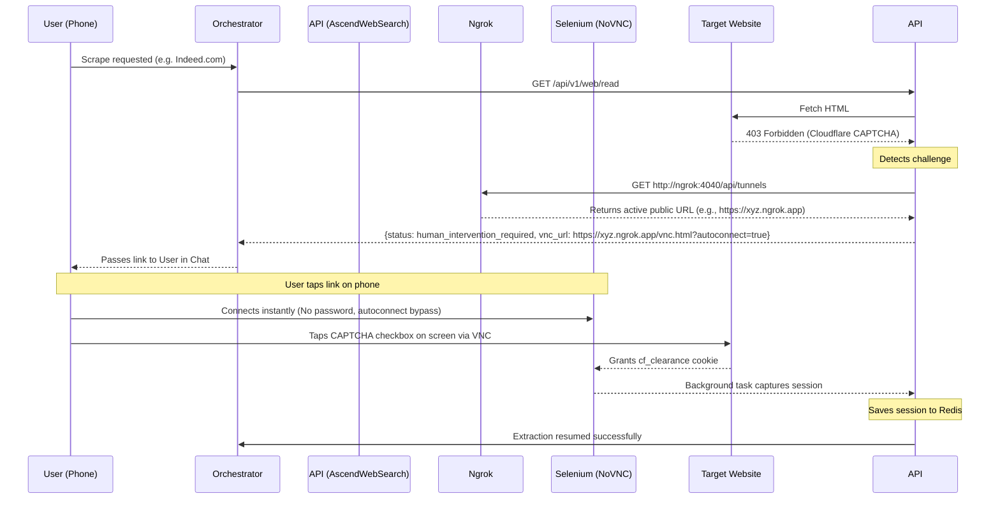

# AscendWebSearch

AscendWebSearch is a powerful web search and extraction service for the AscendAI ecosystem. It integrates **SearXNG** for meta-search capabilities and combines **Trafilatura** with **Playwright** for robust content extraction (reading).

---

## Table of Contents

*   [API Documentation](#api-documentation)
*   [Prerequisites](#prerequisites)
*   [Configuration (Environment Variables)](#configuration-environment-variables)
*   [Running the Service](#running-the-service)
    *   [Standard Python App](#running-as-a-standard-python-app-without-docker)
    *   [Docker](#running-with-docker-recommended)
*   [MCP Server Mode](#mcp-server-mode)
*   [REST API Examples](#rest-api-examples)
*   [How it Works (Extraction Strategy)](#how-it-works-extraction-strategy)

---

## API Documentation

*   **Swagger UI**: [http://localhost:7021/docs](http://localhost:7021/docs)
*   **Redoc**: [http://localhost:7021/redoc](http://localhost:7021/redoc)

---

## Prerequisites

*   **Python 3.12**
*   **SearXNG Instance** (Running on port 8080 or accessible via URL)
*   **Playwright Browsers** (If running locally)
*   **Ngrok Auth Token** (For remote CAPTCHA solving. Get free from dashboard.ngrok.com and set as a system environment variable `NGROK_AUTHTOKEN`)

---

## Configuration (Environment Variables)

*   `SEARXNG_BASE_URL`: **(Required)** URL of the SearXNG instance. Default: `http://searxng:8080` (Docker) or `http://localhost:9020` (Local).
*   `API_PORT`: **(Optional)** Port to run the server on. Default: `7021`.
*   `API_HOST`: **(Optional)** Host to bind to. Default: `0.0.0.0`.
*   `LOG_LEVEL`: **(Optional)** Logging level. Default: `INFO`.
*   `NGROK_AUTHTOKEN`: **(Required for remote VNC)** Token required by the Ngrok docker container. Set this directly in your Windows/Linux environment variables. Docker Compose will automatically detect and pass it to the container.

---

## Running the Service

### Running as a standard Python App (without Docker)

1.  **Create virtual environment**

    Linux/MacOS:
    ```shell
    python3 -m venv .venv
    ```

    Windows:
    ```powershell
    python -m venv .venv
    ```

2.  **Activate virtual environment**

    Linux/MacOS:
    ```shell
    source .venv/bin/activate
    ```

    Windows:
    ```powershell
    .\.venv\Scripts\activate
    ```

3.  **Install dependencies**

    ```shell
    pip install -e .[dev]
    ```
    *The `-e` flag stands for "editable". It allows you to modify the source code and see changes immediately without reinstalling the package.*

4.  **Install Playwright Browsers**

    ```shell
    playwright install --with-deps chromium
    ```

5.  **Run the Server**

    Ensure `SEARXNG_BASE_URL` is set (e.g., `http://localhost:9020` if using Docker mapping).

    *Exporting variables:*

    Linux/MacOS:
    ```shell
    export SEARXNG_BASE_URL="http://localhost:9020"
    export LOG_LEVEL="INFO"
    ```

    ```shell
    python src/main.py
    ```

    Windows:
    ```powershell
    $env:SEARXNG_BASE_URL="http://localhost:9020"
    $env:LOG_LEVEL="INFO"
    ```

    ```powershell
    python src/main.py
    ```

### Running with Docker (Recommended)

1.  **Build the Image**

    ```shell
    docker build -t ascend-web-search:latest .
    ```

2.  **Tag and Publish (Optional):**

    If you want to push this image to Docker Hub (e.g., to use it in another environment or specific `docker-compose.yaml`):

    ```shell
    docker tag ascend-ai-ascend-web-search:latest lukk17/ascend-web-search:v0.0.2
    ```

    ```shell
    docker push lukk17/ascend-web-search:v0.0.2
    ```
    
    ```shell
    docker tag ascend-ai-ascend-web-search:latest lukk17/ascend-web-search:latest
    ```

    ```shell
    docker push lukk17/ascend-web-search:latest
    ```

3.  **Run the Container**

    Linux/MacOS:
    ```shell
    docker run -d \
      --name ascend-web-search \
      -p 7021:7021 \
      -e SEARXNG_BASE_URL="http://host.docker.internal:9020" \
      ascend-web-search:latest
    ```

    Windows:
    ```powershell
    docker run -d `
      --name ascend-web-search `
      -p 7021:7021 `
      -e SEARXNG_BASE_URL="http://host.docker.internal:9020" `
      ascend-web-search:latest
    ```

    *Note: If running in the same Docker Compose network, use `http://searxng:8080` instead of `host.docker.internal`.*

---

## MCP Server Mode

The service exposes an MCP server over HTTP at `/mcp`.

### Tool Configuration

```json
{
  "mcpServers": {
    "ascend-web-search": {
      "type": "sse",
      "url": "http://localhost:7021/mcp"
    }
  }
}
```

### Available Tools

*   `web_search(query, limit)`: Search the web.
*   `web_read(url)`: Extract content from a URL.

---

## REST API Examples

### Health Check

Linux/MacOS:
```shell
curl -X GET http://localhost:7021/health
```

Windows:
```powershell
curl -X GET http://localhost:7021/health
```

### Standard REST API

#### 1. Web Search
**GET** `/api/v1/web/search`

```shell
curl "http://localhost:7021/api/v1/web/search?query=AscendAI&limit=3"
```

#### 2. Web Read
**GET** `/api/v1/web/read`

```shell
curl "http://localhost:7021/api/v1/web/read?url=https://example.com"
```

### Call MCP Tool (POST)

#### 1. Web Search (`web_search`)

**Linux/MacOS**:
```shell
curl -X POST http://localhost:7021/mcp \
  -H "Content-Type: application/json" \
  -d '{
    "jsonrpc": "2.0",
    "method": "tools/call",
    "params": {
      "name": "web_search",
      "arguments": {
        "query": "AscendAI",
        "limit": 1
      }
    },
    "id": 1
  }'
```

**Windows**:
```powershell
curl -X POST http://localhost:7021/mcp `
  -H "Content-Type: application/json" `
  -d '{
    "jsonrpc": "2.0",
    "method": "tools/call",
    "params": {
      "name": "web_search",
      "arguments": {
        "query": "AscendAI",
        "limit": 1
      }
    },
    "id": 1
  }'
```

#### 2. Web Read (`web_read`)

**Linux/MacOS**:
```shell
curl -X POST http://localhost:7021/mcp \
  -H "Content-Type: application/json" \
  -d '{
    "jsonrpc": "2.0",
    "method": "tools/call",
    "params": {
      "name": "web_read",
      "arguments": {
        "url": "https://example.com"
      }
    },
    "id": 2
  }'
```

**Windows**:
```powershell
curl -X POST http://localhost:7021/mcp `
  -H "Content-Type: application/json" `
  -d '{
    "jsonrpc": "2.0",
    "method": "tools/call",
    "params": {
      "name": "web_read",
      "arguments": {
        "url": "https://example.com"
      }
    },
    "id": 2
  }'
```

---

## How it Works (Extraction Strategy)

The `web_read` tool uses a multi-tiered smart cascade strategy to bypass Web Application Firewalls (WAFs) like Cloudflare, ensuring maximum success rates:

1.  **Fast Path (`curl_cffi`)**: Attempts to fetch the URL using HTTP GET via `curl_cffi` (mimicking a Chrome 120 TLS fingerprint) and extracts content with `trafilatura` or `BeautifulSoup`. This is fast, resource-efficient, and bypasses basic blocks.
2.  **Automated WAF Solver (`FlareSolverr`)**: If Cloudflare blocks the fast path, the request is sent to a dedicated FlareSolverr container that automatically resolves JavaScript challenges and caches the clearance cookies for future requests.
3.  **Render Path (`Playwright` & `Crawlee`)**: For complex dynamic sites that require rendering (but aren't actively blocking), it uses `undetected-playwright` running with `headless=False` to mimic human behavior and render the DOM.
4.  **Human Fallback & Login Auth (`NoVNC`)**: If all automated methods fail to bypass an advanced Captcha, or the requested page requires a manual Account Login, the `ChallengeDetector` triggers a remote Playwright session to the target site. This returns a `human_intervention_required` status with a VNC URL and an `intervention_type` (e.g. `login` or `captcha`). The Ascend orchestrator can present this URL to the user, allowing them to log in or solve the captcha visually in their own browser before the system automatically captures the authenticated session and resumes extraction.

### Remote Human Intervention (Ngrok Flow)

To allow you to solve CAPTCHAs or Logins from anywhere (e.g., your smartphone) without needing an SSH tunnel to your server, AscendWebSearch implements an automated Ngrok integration within the Docker Compose network.

1. **The Dynamic URL Problem:** When the `ngrok` container launches, it assigns a random public domain (e.g. `https://xyz.ngrok.app`). Since this changes every restart, the URL cannot be statically hardcoded.
2. **The API Solution:** During initialization, AscendWebSearch sets `PUBLIC_VNC_URL=http://ngrok:4040/api/tunnels`. When a CAPTCHA triggers, the Python code calls this local diagnostic API on the Ngrok container. It extracts the *active* public URL dynamically.
3. **The Result:** The system appends `?autoconnect=true` to the extracted URL and returns it to your Orchestrator chat payload. You tap the link, bypass the VNC login screen, solve the CAPTCHA, and the background task continues.



### Session Persistence (Redis)
All authenticated sessions, clearance tokens, and captchas solved by the `NoVNC` fallback or `FlareSolverr` are permanently stored within the shared `redis` Docker cache container. This architectural decision ensures that:
*   **Persistent Auth:** Authenticated sessions outlive `ascend-web-search` API container restarts and deployments.
*   **Distributed Scaling:** Prevents "split-brain" caching in multi-worker environments. Any of the `N` FastAPI workers can instantly access the shared tokens, fully preventing the system from repeatedly prompting users for manual logins.

---

## Troubleshooting

### Reinstalling python dependencies
Terminal in your activated virtual environment.

This creates a list of everything that's currently installed, uninstalls it, and then deletes the list file.

```shell
pip freeze > uninstall.txt
```

```shell
pip uninstall -y -r uninstall.txt
```

```shell
del uninstall.txt
```

Then reinstall:
```shell
pip install -e .[dev]
```
