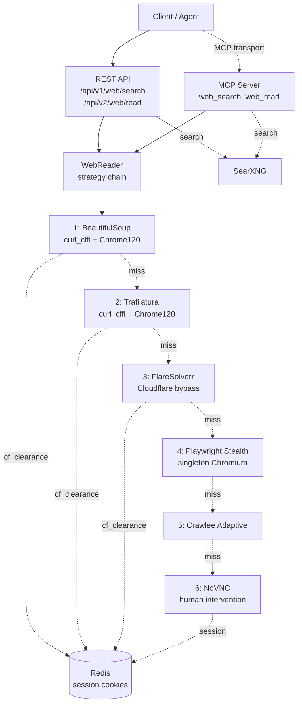

# AscendWebSearch

*SearXNG meta-search and multi-tier content extraction for the AscendAI platform.*

[](https://www.python.org/)
[](https://fastapi.tiangolo.com/)
[](https://playwright.dev/)
[](#)
[](LICENSE)

---

### What it is

AscendWebSearch is a Python microservice (port 7021) that exposes two surfaces over one process: a REST API for
direct callers and an MCP server for AI agents. It runs SearXNG queries and reads pages through a six-tier
escalation chain that walks from cheap HTTP fetches to a remote browser session humans can drive over VNC.

Pages get extracted by whichever tier wins first. WAFs (Cloudflare, Turnstile), login walls, and JavaScript
gating each trigger the next tier rather than a generic failure. Clearance cookies and authenticated sessions
land in Redis so the next request to the same domain reuses them.

---

### Quick start

```bash
docker compose -f ../ascend-scrapper.docker-compose.yaml up -d --build
```

Hit the health endpoint to verify:

```bash
curl http://localhost:7021/health
```

Local development without Docker is in [docs/running.md](docs/running.md).

---

### Architecture

The strategy chain escalates one tier at a time, bounded by `READ_TOTAL_BUDGET=90s`. NoVNC is the terminal
strategy and exits the loop with a 428 response that asks the human to solve the challenge out-of-band.



Full architecture in [docs/architecture/](docs/architecture/), strategy chain rationale in
[ADR-001](docs/architecture/decisions/ADR-001-multi-tier-extraction-strategy.md), budget and singleton
browser rationale in
[ADR-005](docs/architecture/decisions/ADR-005-strategy-budget-and-singleton-chromium.md).

---

### Features

- **Two surfaces, one process.** REST under `/api/v1`, `/api/v2` and MCP at `/mcp`. Same orchestrator behind
  both. See [docs/api-examples.md](docs/api-examples.md).
- **Six-tier escalation chain.** Cheap tiers handle the easy 80%, browser tiers handle the rest, NoVNC handles
  the irreducible human-needed cases.
- **PSL-aware cookie persistence.** Clearance cookies keyed by registrable domain via `tldextract`. Sites under
  shared ccTLDs (`*.co.uk`, `*.com.au`) stay isolated. See
  [ADR-002](docs/architecture/decisions/ADR-002-cloudflare-cookie-persistence-redis.md).
- **Singleton Chromium.** One browser process across requests, per-request context. Saves ~1 second per
  Playwright invocation versus the per-request launch pattern.
- **Budget-bounded reads.** `READ_TOTAL_BUDGET=90s` caps wall-clock across tiers 1-5. NoVNC exempt.
- **Observability ready.** `/health` (liveness), `/ready` (dependency probes), `/metrics` (Prometheus
  counters), `X-Request-ID` middleware on every response.
- **Remote CAPTCHA solving via Ngrok.** Solve from a phone, no SSH required. See
  [ADR-003](docs/architecture/decisions/ADR-003-novnc-ngrok-captcha-intervention.md).

---

### Configuration

Settings live in [src/config/config.py](src/config/config.py), bound through pydantic-settings against env vars
and `.env`. The most-used variables:

| Variable             | Default                            | Purpose                                              |
| :------------------- | :--------------------------------- | :--------------------------------------------------- |
| `API_PORT`           | `7021`                             | Service port                                         |
| `SEARXNG_BASE_URL`   | `http://localhost:9020`            | SearXNG meta-search instance                         |
| `FLARESOLVERR_URL`   | `http://localhost:8191/v1`         | FlareSolverr Cloudflare-bypass instance              |
| `REDIS_URL`          | `redis://localhost:6379/0`         | Redis for cookie persistence                         |
| `READ_TOTAL_BUDGET`  | `90.0`                             | Wall-clock cap across the strategy chain (seconds)   |
| `PLAYWRIGHT_HEADLESS`| `false`                            | Headless Chromium; flip to `true` in CI / no X       |
| `PUBLIC_VNC_URL`     | `http://localhost:7900`            | NoVNC URL (or `http://ngrok:4040/api/tunnels`)       |
| `NOVNC_TIMEOUT_SECONDS` | `600`                           | NoVNC monitor task lifetime                          |

Full settings reference in [docs/configuration.md](docs/configuration.md).

---

### Agent skill

A drop-in skill ships at [skills/ascend-web-scrapper/SKILL.md](skills/ascend-web-scrapper/SKILL.md). Copy
[skills/ascend-web-scrapper/](skills/ascend-web-scrapper/) into your agent's skills folder
(`.claude/skills/`, `.agents/skills/`, `.opencode/skills/`) and the agent picks it up automatically. The
skill covers both endpoints, the `human_intervention_required` response shape, and the
captcha-solve-then-resume flow.

---

### Docs map

| File | What's in it |
| :--- | :--- |
| [docs/running.md](docs/running.md) | Local Python and Docker run instructions, MCP client setup |
| [docs/api-examples.md](docs/api-examples.md) | REST and MCP request examples (curl + PowerShell) |
| [docs/configuration.md](docs/configuration.md) | Every settings field with defaults and effect |
| [docs/troubleshooting.md](docs/troubleshooting.md) | Reinstalling deps, common failure modes |
| [docs/architecture/README.md](docs/architecture/README.md) | Architecture index: arc42 chapters, ADRs, diagrams |
| [docs/architecture/decisions/](docs/architecture/decisions/) | ADRs (strategy chain, cookie persistence, NoVNC, SearXNG, budget) |
| [AGENTS.md](AGENTS.md) | Module-level instructions for AI coding agents |
| [CHANGELOG.md](CHANGELOG.md) | Structural changes per release |
| [../README.md](../README.md) | Monorepo overview |

---

### License

MIT. See [LICENSE](LICENSE).
