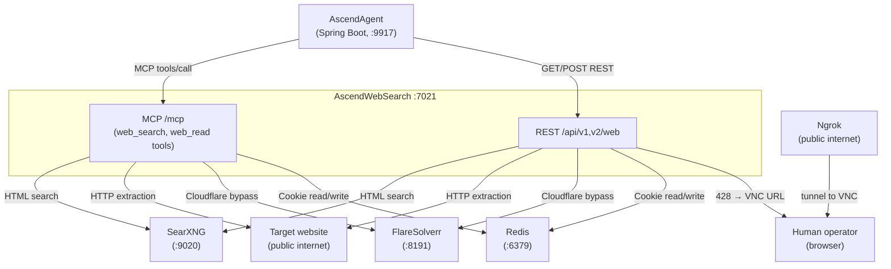

# 3. Context and Scope

---

### System context

---

### Interfaces

| Interface | Direction | Protocol | Description |
| :--- | :--- | :--- | :--- |
| REST `GET /api/v1/web/search` | Inbound | HTTP/JSON | Search by query string; returns list of `{title, url, content}`. |
| REST `POST /api/v2/web/read` | Inbound | HTTP/JSON | Extract content from a URL; optional `include_links`, `heavy_mode`. |
| MCP `web_search` tool | Inbound | MCP / Streamable HTTP | Same as REST search; used by AscendAgent. |
| MCP `web_read` tool | Inbound | MCP / Streamable HTTP | Same as REST read; used by AscendAgent. |
| SearXNG `GET /search` | Outbound | HTTP/HTML | Fetches search results. Parsed with BeautifulSoup. |
| FlareSolverr `POST /v1` | Outbound | HTTP/JSON | Submits URLs for Cloudflare bypass. Returns solved HTML + cookies. |
| Redis `SETEX / GET` | Outbound | Redis protocol | Stores and retrieves per-domain session cookies with TTL. |
| Target sites | Outbound | HTTP/HTTPS | Direct page fetches by strategies 1, 2, 4, 5. Strategy 3 fetches via FlareSolverr. |
| NoVNC / Ngrok | Outbound (URL returned to caller) | HTTP | VNC URL sent to the human operator via the 428 response body. |

---

### Out of scope

- Authentication on the inbound API surface. The docker-compose network is the trust boundary.
- Content indexing or caching of extracted page content. Results are returned to the caller and not stored.
- Search ranking beyond what SearXNG provides. The service returns results in SearXNG's order.
