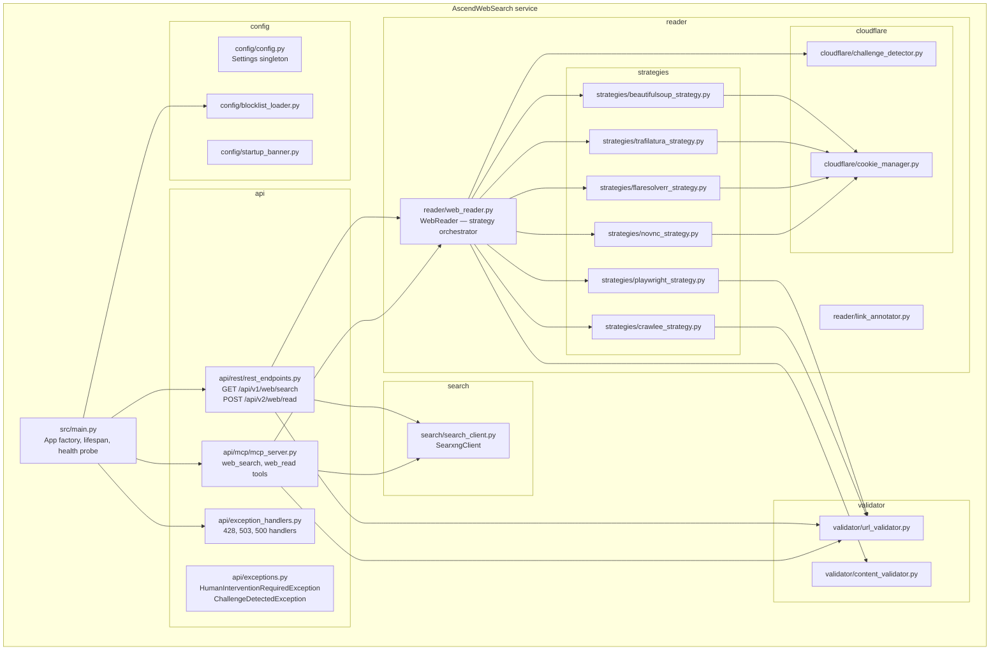

# 5. Building Block View

---

### Level 1: module map

---

### Component responsibilities

| Component | File | Responsibility |
| :--- | :--- | :--- |
| App factory | `src/main.py` | Creates FastAPI app, runs lifespan blocklist load, mounts MCP sub-app, registers `/health`. |
| `rest_endpoints.py` | `src/api/rest/rest_endpoints.py` | Two routers (`/api/v1`, `/api/v2`). Validates URL safety, delegates to `WebReader` or `SearxngClient`. |
| `mcp_server.py` | `src/api/mcp/mcp_server.py` | FastMCP instance. `web_search` and `web_read` tools. Same SSRF guard as REST. |
| `exception_handlers.py` | `src/api/exception_handlers.py` | 428 for `HumanInterventionRequiredException`, 503 for `httpx.HTTPError`, 500 fallback. |
| `WebReader` | `src/reader/web_reader.py` | Ordered dict of six strategies. Iterates until `ContentValidator` passes or all strategies exhausted. |
| `BeautifulSoupStrategy` | `src/reader/strategies/beautifulsoup_strategy.py` | `curl_cffi` Chrome120 impersonation + BeautifulSoup parse. Reads cached session from `CookieManager`. |
| `TrafilaturaStrategy` | `src/reader/strategies/trafilatura_strategy.py` | Same `curl_cffi` transport; Trafilatura extraction pipeline instead of BeautifulSoup. |
| `FlareSolverrStrategy` | `src/reader/strategies/flaresolverr_strategy.py` | Posts URL to FlareSolverr, parses solved HTML with Trafilatura, saves `cf_clearance` to `CookieManager`. |
| `PlaywrightStrategy` | `src/reader/strategies/playwright_strategy.py` | Headless=False Chromium with `playwright-stealth`. Polls for network idle; runs adblock route filter. |
| `CrawleeStrategy` | `src/reader/strategies/crawlee_strategy.py` | Crawlee `AdaptivePlaywrightCrawler`; geolocation context; adblock route filter. |
| `NoVNCStrategy` | `src/reader/strategies/novnc_strategy.py` | Spawns background cookie monitor; raises `HumanInterventionRequiredException` with resolved VNC URL. |
| `ChallengeDetector` | `src/reader/cloudflare/challenge_detector.py` | Inspects response status, HTML snippets, and URL patterns to detect WAF blocks and login walls. |
| `CookieManager` | `src/reader/cloudflare/cookie_manager.py` | Singleton. Redis-backed session store with in-process fallback. Apex domain normalisation. |
| `SearxngClient` | `src/search/search_client.py` | Async `httpx` client for SearXNG HTML search. BeautifulSoup `article.result` parser. |
| `ContentValidator` | `src/validator/content_validator.py` | Word count, error-keyword check, Flesch reading ease, type-token ratio. |
| `URLValidator` | `src/validator/url_validator.py` | Wraps adblock `AdblockRules` for route filtering; `is_safe_external_url` standalone SSRF guard. |
| `Settings` | `src/config/config.py` | Pydantic-settings class. Single `settings` singleton. Reads `.env` file or environment. |
