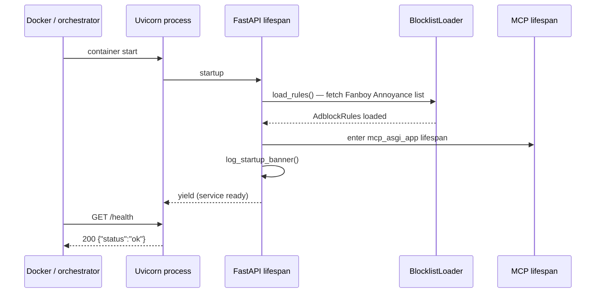
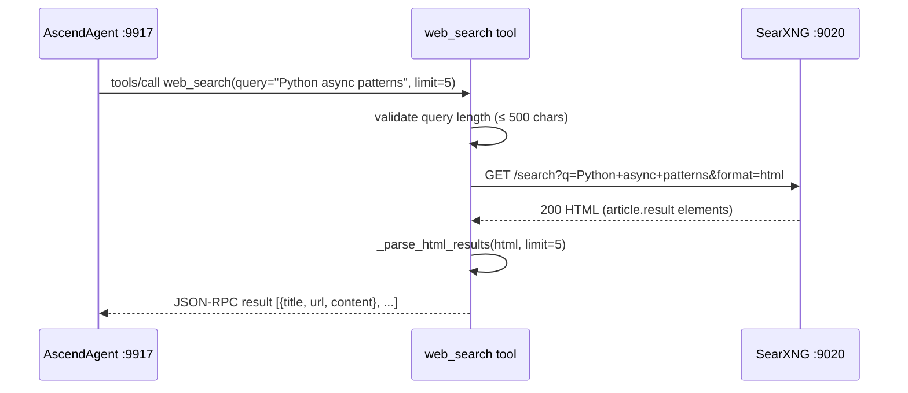
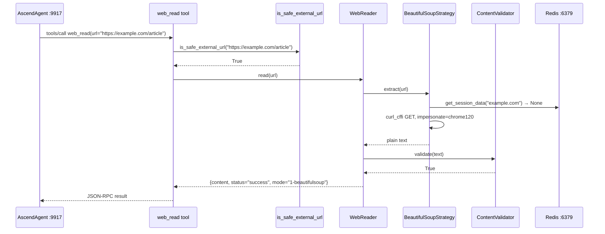
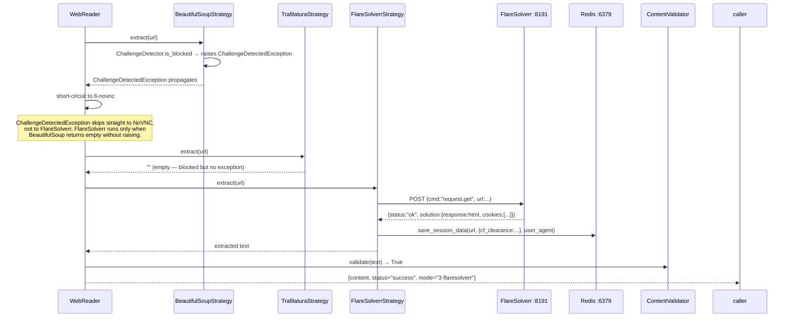
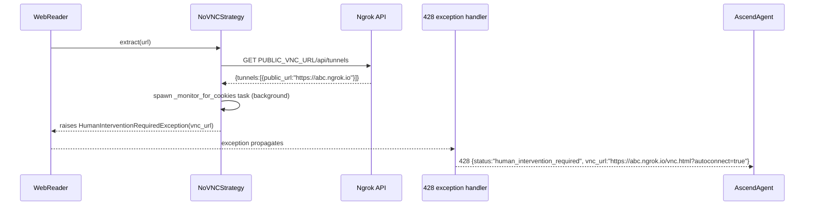

# 6. Runtime View

---

### Cold start sequence

The blocklist load is a hard failure: if `BlocklistLoader.load_rules()` raises, the lifespan raises
`RuntimeError` and Uvicorn exits (`src/main.py:37-39`). There is no `/ready` endpoint separate from `/health`;
liveness is the only probe.

---

### Search happy path

---

### Extraction escalation — BeautifulSoup hit

---

### Extraction escalation — Cloudflare block → FlareSolverr

---

### NoVNC trigger

---

### Error catalog

| Condition | HTTP status | Response |
| :--- | :--- | :--- |
| `HumanInterventionRequiredException` | 428 | `{status, intervention_type, vnc_url, message}` |
| `httpx.HTTPError` (external service) | 503 | `{detail, error}` |
| All other unhandled exceptions | 500 | `{detail: "Internal Server Error"}` |
| SSRF guard rejects URL | 400 | `{detail: "URL resolves to a private ... address"}` |
| Empty or short query | 400 | `{detail: "query must not be empty"}` |
