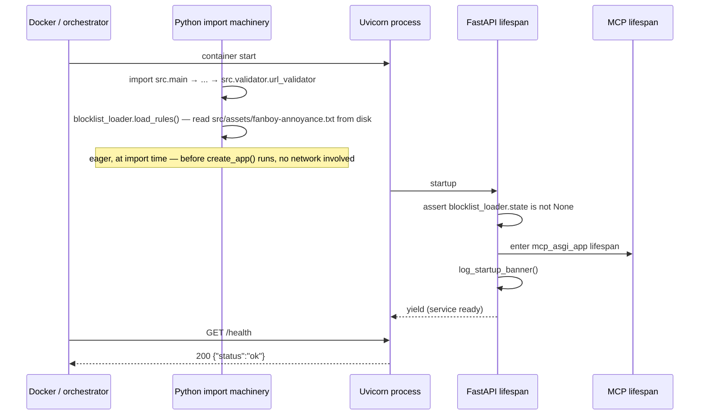
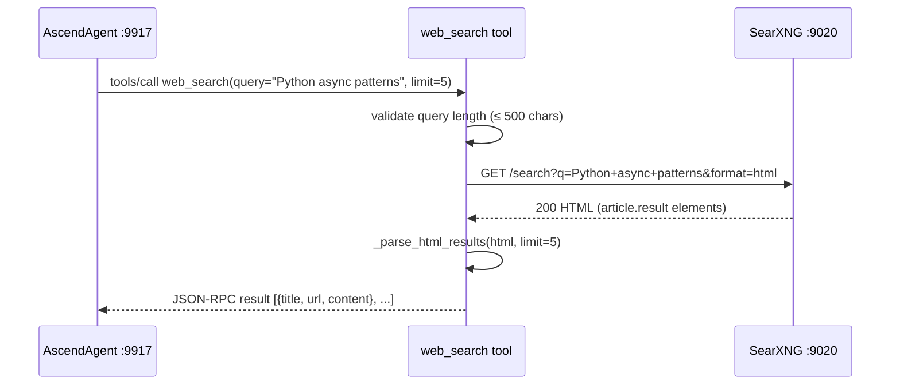
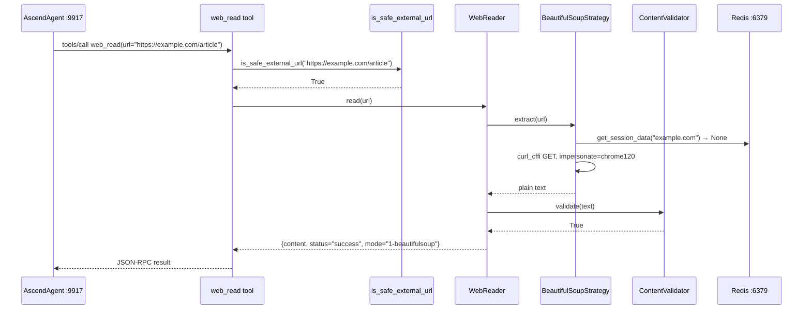
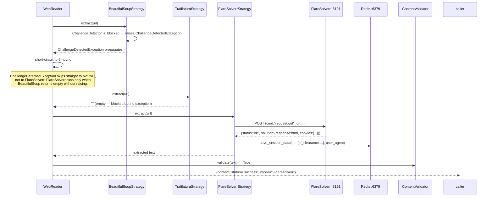
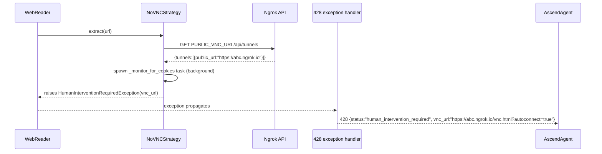
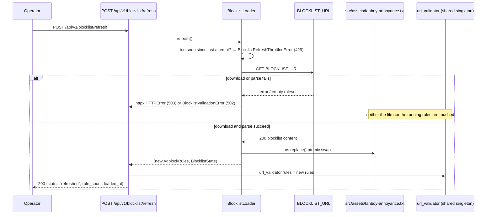

# 6. Runtime View

---

### Cold start sequence

```mermaid
sequenceDiagram
    participant Docker as Docker / orchestrator
    participant Python as Python import machinery
    participant Uvicorn as Uvicorn process
    participant Lifespan as FastAPI lifespan
    participant MCP as MCP lifespan

    Docker->>Uvicorn: container start
    Python->>Python: import src.main → ... → src.validator.url_validator
    Python->>Python: blocklist_loader.load_rules() — read src/assets/fanboy-annoyance.txt from disk
    Note over Python: eager, at import time — before create_app() runs, no network involved
    Uvicorn->>Lifespan: startup
    Lifespan->>Lifespan: assert blocklist_loader.state is not None
    Lifespan->>MCP: enter mcp_asgi_app lifespan
    Lifespan->>Lifespan: log_startup_banner()
    Lifespan-->>Uvicorn: yield (service ready)
    Docker->>Uvicorn: GET /health
    Uvicorn-->>Docker: 200 {"status":"ok"}
```

The blocklist load is a hard failure only in the packaging-defect sense: if the vendored file is missing or fails
to parse, `blocklist_loader.load_rules()` raises during module import and the process never reaches
`create_app()`. In normal operation this cannot depend on any external host — the file ships in the image, and
nothing downloads at startup. There is no `/ready` endpoint separate from `/health`; liveness is the only probe.

---

### Search happy path

```mermaid
sequenceDiagram
    participant Agent as AscendAgent :9917
    participant MCP as web_search tool
    participant Searxng as SearXNG :9020

    Agent->>MCP: tools/call web_search(query="Python async patterns", limit=5)
    MCP->>MCP: validate query length (≤ 500 chars)
    MCP->>Searxng: GET /search?q=Python+async+patterns&format=html
    Searxng-->>MCP: 200 HTML (article.result elements)
    MCP->>MCP: _parse_html_results(html, limit=5)
    MCP-->>Agent: JSON-RPC result [{title, url, content}, ...]
```

---

### Extraction escalation — BeautifulSoup hit

```mermaid
sequenceDiagram
    participant Agent as AscendAgent :9917
    participant MCP as web_read tool
    participant Guard as is_safe_external_url
    participant WR as WebReader
    participant BS as BeautifulSoupStrategy
    participant CV as ContentValidator
    participant Redis as Redis :6379

    Agent->>MCP: tools/call web_read(url="https://example.com/article")
    MCP->>Guard: is_safe_external_url("https://example.com/article")
    Guard-->>MCP: True
    MCP->>WR: read(url)
    WR->>BS: extract(url)
    BS->>Redis: get_session_data("example.com") → None
    BS->>BS: curl_cffi GET, impersonate=chrome120
    BS-->>WR: plain text
    WR->>CV: validate(text)
    CV-->>WR: True
    WR-->>MCP: {content, status="success", mode="1-beautifulsoup"}
    MCP-->>Agent: JSON-RPC result
```

---

### Extraction escalation — Cloudflare block → FlareSolverr

```mermaid
sequenceDiagram
    participant WR as WebReader
    participant BS as BeautifulSoupStrategy
    participant TR as TrafilaturaStrategy
    participant FS as FlareSolverrStrategy
    participant FlareSolverr as FlareSolverr :8191
    participant Redis as Redis :6379
    participant CV as ContentValidator

    WR->>BS: extract(url)
    BS->>BS: ChallengeDetector.is_blocked → raises ChallengeDetectedException
    BS-->>WR: ChallengeDetectedException propagates
    WR->>WR: short-circuit to 6-novnc
    note over WR: ChallengeDetectedException skips straight to NoVNC,<br/>not to FlareSolverr. FlareSolverr runs only when<br/>BeautifulSoup returns empty without raising.
    WR->>TR: extract(url)
    TR-->>WR: "" (empty — blocked but no exception)
    WR->>FS: extract(url)
    FS->>FlareSolverr: POST {cmd:"request.get", url:...}
    FlareSolverr-->>FS: {status:"ok", solution:{response:html, cookies:[...]}}
    FS->>Redis: save_session_data(url, {cf_clearance:...}, user_agent)
    FS-->>WR: extracted text
    WR->>CV: validate(text) → True
    WR-->>caller: {content, status="success", mode="3-flaresolverr"}
```

---

### NoVNC trigger

```mermaid
sequenceDiagram
    participant WR as WebReader
    participant NoVNC as NoVNCStrategy
    participant Ngrok as Ngrok API
    participant Handler as 428 exception handler
    participant Agent as AscendAgent

    WR->>NoVNC: extract(url)
    NoVNC->>Ngrok: GET PUBLIC_VNC_URL/api/tunnels
    Ngrok-->>NoVNC: {tunnels:[{public_url:"https://abc.ngrok.io"}]}
    NoVNC->>NoVNC: spawn _monitor_for_cookies task (background)
    NoVNC-->>WR: raises HumanInterventionRequiredException(vnc_url)
    WR-->>Handler: exception propagates
    Handler-->>Agent: 428 {status:"human_intervention_required", vnc_url:"https://abc.ngrok.io/vnc.html?autoconnect=true"}
```

---

### Blocklist refresh — operator-triggered, never automatic

```mermaid
sequenceDiagram
    participant Op as Operator
    participant Endpoint as POST /api/v1/blocklist/refresh
    participant Loader as BlocklistLoader
    participant Fanboy as BLOCKLIST_URL
    participant Disk as src/assets/fanboy-annoyance.txt
    participant Validator as url_validator (shared singleton)

    Op->>Endpoint: POST /api/v1/blocklist/refresh
    Endpoint->>Loader: refresh()
    Loader->>Loader: too soon since last attempt? → BlocklistRefreshThrottledError (429)
    Loader->>Fanboy: GET BLOCKLIST_URL
    alt download or parse fails
        Fanboy-->>Loader: error / empty ruleset
        Loader-->>Endpoint: httpx.HTTPError (503) or BlocklistValidationError (502)
        Note over Disk,Validator: neither the file nor the running rules are touched
    else download and parse succeed
        Fanboy-->>Loader: 200 blocklist content
        Loader->>Disk: os.replace() atomic swap
        Loader-->>Endpoint: (new AdblockRules, BlocklistState)
        Endpoint->>Validator: url_validator.rules = new rules
        Endpoint-->>Op: 200 {status:"refreshed", rule_count, loaded_at}
    end
```

`GET /api/v1/blocklist/status` reads `blocklist_loader.state` directly and never touches the network or the
lock; it reports `rule_count` and `age_seconds` for whatever is currently active. Neither endpoint is on the MCP
surface.

---

### Error catalog

| Condition | HTTP status | Response |
| :--- | :--- | :--- |
| `HumanInterventionRequiredException` | 428 | `{status, intervention_type, vnc_url, message}` |
| `httpx.HTTPError` (external service) | 503 | `{detail, error}` |
| `BlocklistValidationError` (empty refresh result) | 502 | RFC 7807 problem+json |
| `BlocklistRefreshThrottledError` (refresh cooldown) | 429 | RFC 7807 problem+json, `Retry-After` header |
| All other unhandled exceptions | 500 | `{detail: "Internal Server Error"}` |
| SSRF guard rejects URL | 400 | `{detail: "URL resolves to a private ... address"}` |
| Empty or short query | 400 | `{detail: "query must not be empty"}` |
