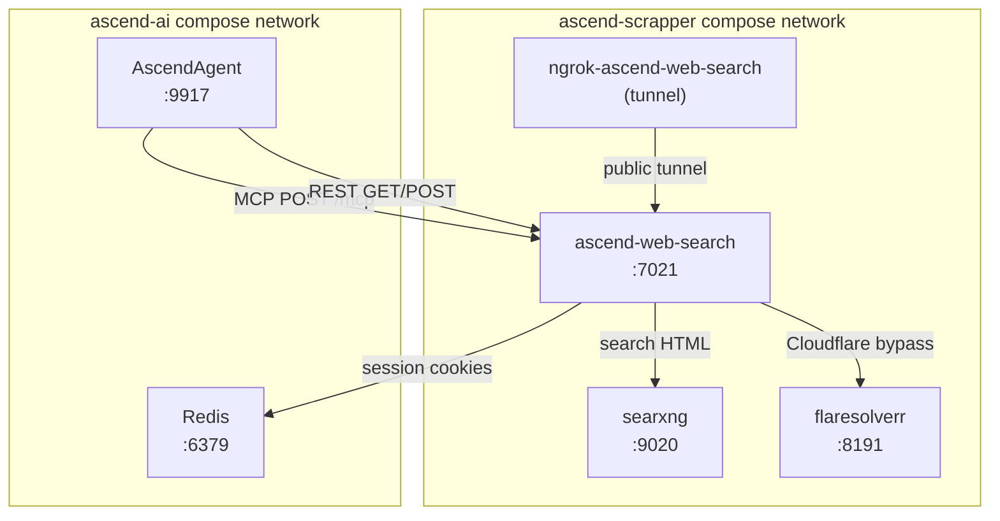

# 7. Deployment View

---

### docker-compose placement

AscendWebSearch runs as the `ascend-web-search` service in `ascend-scrapper.docker-compose.yaml` (project
`ascend-scrapper`). This file is included by the top-level `docker-compose.yaml` via `include:`, so
`docker compose up` from the monorepo root brings up the scraper stack alongside the main application stack.
It can also be started independently as its own Docker Desktop group.

Redis is an external prerequisite shared across both compose projects; the scraper stack reaches it via the
host bridge network or a shared Docker network depending on deployment configuration.

---

### Healthcheck wiring

The `GET /health` endpoint (`src/main.py:56-58`) returns `{"status": "ok"}` as long as the process is alive.
There is no separate readiness probe. The blocklist must load successfully before the lifespan yields; a failed
load raises `RuntimeError` and prevents the service from starting, so a healthy `/health` implies the blocklist
is loaded.

---

### Environment variables

| Variable | Default | Description |
| :--- | :--- | :--- |
| `API_HOST` | `0.0.0.0` | Bind address for Uvicorn. |
| `API_PORT` | `7021` | Listen port. |
| `LOG_LEVEL` | `INFO` | Logging level. |
| `SEARXNG_BASE_URL` | `http://localhost:9020` | SearXNG endpoint. Docker Compose overrides to `http://searxng:8080`. |
| `SEARXNG_USER_AGENT` | `AscendWebSearch/1.0` | User-Agent sent to SearXNG. |
| `FLARESOLVERR_URL` | `http://localhost:8191/v1` | FlareSolverr endpoint. |
| `REDIS_URL` | `redis://localhost:6379/0` | Redis connection for session cookie store. |
| `BLOCKLIST_URL` | `https://secure.fanboy.co.nz/fanboy-annoyance.txt` | Ad/annoyance blocklist. |
| `VALIDATION_MIN_WORDS` | `10` | Minimum word count for extracted content to pass validation. |
| `DEFAULT_TIMEOUT` | `30.0` | Default HTTP timeout in seconds. |
| `SEARCH_TIMEOUT` | `10.0` | Timeout for SearXNG search requests. |
| `EXTRACT_TIMEOUT` | `30.0` | Timeout per HTTP extraction strategy. |
| `NOVNC_TIMEOUT_SECONDS` | `600` | Background monitor runtime cap for NoVNC sessions (10 minutes). |
| `PUBLIC_VNC_URL` | `http://localhost:7900` | Public VNC URL returned in 428 responses. Set to Ngrok API URL to enable dynamic resolution. |
| `SELENIUM_BROWSER_VNC_URL` | `http://localhost:7900` | Fallback VNC URL when Ngrok API call fails. |
| `MIN_FLESCH_SCORE` | `20.0` | Minimum Flesch reading ease score for content validation. |
| `MIN_TTR` | `0.1` | Minimum type-token ratio for repetition check. |

---

### Docker image

The service uses `mcr.microsoft.com/playwright/python:v1.58.0-noble` as its base image. This provides Chromium,
Xvfb, and the full Playwright browser dependencies required by `PlaywrightStrategy`, `CrawleeStrategy`, and
`NoVNCStrategy`. The image is significantly larger than a minimal Python image; browser dependencies are the
dominant size contributor.
