# 10. Quality Requirements

---

### Quality tree

```mermaid
graph TB
    Quality["Quality"]
    Quality --> Security
    Quality --> Availability
    Quality --> Transparency
    Quality --> Testability

    Security --> S1["SSRF guard on all user-supplied URLs (REST and MCP)"]
    Security --> S2["No internal stack traces in error responses"]
    Security --> S3["Blocklist filtering in browser strategies blocks tracker requests"]

    Availability --> A1["Six-strategy escalation maximises extraction success rate"]
    Availability --> A2["428 with VNC URL enables human-in-the-loop for unsolvable challenges"]
    Availability --> A3["Redis session persistence avoids repeated CAPTCHA solves"]

    Transparency --> T1["Response mode field identifies which strategy produced content"]
    Transparency --> T2["Startup banner logs all runtime config at INFO level"]
    Transparency --> T3["Strategy start/stop logged at INFO; failures at WARNING"]

    Testability --> TE1["pytest-asyncio with asyncio_mode=auto for async test cases"]
    Testability --> TE2["asgi-lifespan + httpx for integration tests without live dependencies"]
```

---

### Quality scenarios

| Quality | Scenario | Expected behaviour |
| :--- | :--- | :--- |
| Security | REST caller sends `url: "http://169.254.169.254/latest/meta-data/"` | `is_safe_external_url` resolves to link-local address, returns False; handler returns 400 with SSRF detail message. |
| Security | MCP `web_read` receives `url: "http://localhost:6379"` | Same SSRF guard; 400 returned to the agent. |
| Availability | Target page is Cloudflare-protected, strategies 1 and 2 return empty | Strategy 3 (FlareSolverr) is invoked; if it succeeds, response carries `mode="3-flaresolverr"`. |
| Availability | Target page requires CAPTCHA; strategies 1-5 fail | Strategy 6 (NoVNC) raises 428 with `vnc_url`. AscendAgent displays the URL to the user. |
| Transparency | Caller wants to know extraction cost | `response.mode` is always set: `"1-beautifulsoup"` means zero escalation cost; `"4-playwright_stealth"` means a full browser was launched. |
| Transparency | Operator checks container startup | Startup banner includes `SEARXNG_BASE_URL`, `FLARESOLVERR_URL`, `REDIS_URL`, and all timeout values. |

---

### Security non-goals

AscendWebSearch runs inside a private docker-compose network. These properties are explicitly out of scope:

- **Authentication and authorisation.** No API key, JWT, or mTLS on port 7021. The network is the trust
  boundary. Any process that can reach port 7021 can call any endpoint.
- **Rate limiting.** No per-caller limit exists. A single caller can exhaust Playwright memory by firing
  concurrent heavy-mode requests.
- **Input content scanning.** Extracted page content is returned to the caller as-is. The service does not
  scan for malicious content in pages it scrapes.
