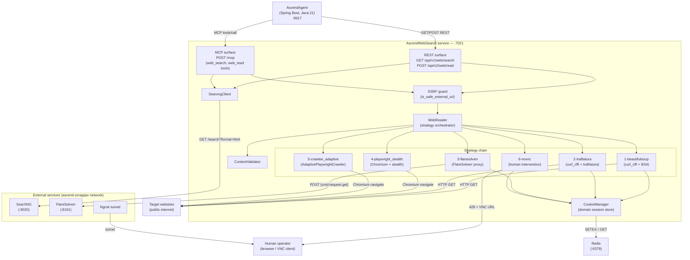
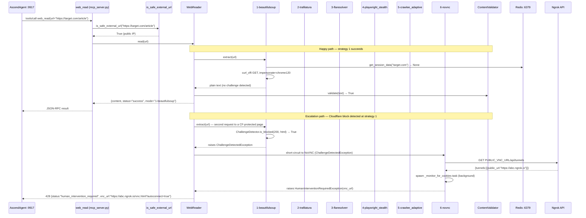

# AscendWebSearch — Diagrams

---

### C4 Container diagram

AscendWebSearch has no database. The only persistent state is session cookies in Redis, which expire after
2 hours. See [ADR-002](../decisions/ADR-002-cloudflare-cookie-persistence-redis.md).

---

### Extraction strategy escalation

This sequence shows the happy path where strategy 1 succeeds, and a comparison path where strategy 1 detects a
Cloudflare block and the chain escalates all the way to NoVNC.

When strategy 1 or 2 return empty string without raising (not a detected block, just no content), the chain
continues to strategy 3 (FlareSolverr) and then strategies 4, 5, 6. `ChallengeDetectedException` is a hard
short-circuit that skips directly to strategy 6; ordinary strategy failures (empty string returned) proceed
sequentially. See [ADR-001](../decisions/ADR-001-multi-tier-extraction-strategy.md).
