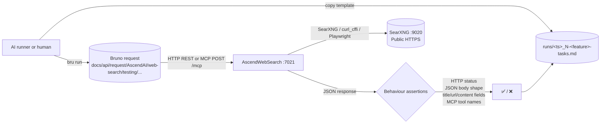

# AscendWebSearch: end-to-end capability tests

Manual / AI-runnable e2e suite for the AscendWebSearch module. Each test exercises **one capability** end-to-end
against a live AscendWebSearch container on port 7021. Assertions are observable behaviour only — HTTP status
codes, JSON response body shape and content, the MCP `tools/list` enumeration, and the MCP `tools/call` payload.
AscendWebSearch keeps no per-user state beyond a Redis-backed session cache keyed by URL / extraction context;
the search path itself is stateless. Where a test needs reproducible upstream conditions, the reset step calls
the appropriate Redis key wipe.

## What's here

```text
AscendWebSearch/e2e/
├── README.md                            # this file
├── fixtures/                            # canary inputs (none today; AscendWebSearch tools take string args, not files)
│   └── README.md
└── testing/                             # numbered specs + templates/ + runs/
    ├── README.md
    ├── 1-invalid-input-test.md          # immutable spec (lowest cost — no SearXNG, no internet egress)
    ├── 2-search-happy-path-test.md
    ├── 3-read-example-com-test.md
    ├── 4-mcp-tools-list-test.md
    ├── 5-mcp-search-test.md
    ├── templates/                       # run-record templates (immutable), one per spec
    │   ├── README.md
    │   ├── 1-invalid-input-tasks.template.md
    │   ├── 2-search-happy-path-tasks.template.md
    │   ├── 3-read-example-com-tasks.template.md
    │   ├── 4-mcp-tools-list-tasks.template.md
    │   └── 5-mcp-search-tasks.template.md
    └── runs/
        ├── README.md
        └── <UTC-timestamp>_<N>-<capability>-tasks.md   # one per executed test (gitignored)
```

Tests are number-prefixed by setup cost. `1` runs offline (REST validator short-circuit, no SearXNG hit); `2` needs
SearXNG reachable; `3` needs outbound HTTPS to `example.com` via the tiered extraction stack (curl_cffi tier is
sufficient); `4` only needs the AscendWebSearch process itself; `5` needs SearXNG again via the MCP path.

The Bruno collection isn't here. It lives at the **repo root** under
`docs/api/request/AscendAI/web-search/testing/` so it stays a portable API client artifact. Each spec references
the matching Bruno request file under that path. (The pre-existing ad-hoc requests directly under
`docs/api/request/AscendAI/web-search/` are kept untouched as dev-time fixtures; e2e specs only point at the
`testing/` subfolder.)

## Flow



Every spec follows the same template:

1. **What this verifies.** Bullet list of behaviours.
2. **Prerequisites.** Concrete check commands the runner executes before starting. Each command is its own code
   block; the prose around it states what success looks like.
3. **Reset state.** One command per code block, executed in order, to wipe state so the test is reproducible. Most
   AscendWebSearch tests do not need reset; the v2 read tests can optionally flush the Redis session cache.
4. **Run.** One or more numbered steps. Each step is a single Bruno CLI invocation (or, for MCP tests, a `curl`
   handshake followed by Bruno). Steps wait for HTTP 200 before continuing.
5. **Expected.** Observable behaviour only: HTTP status, JSON body shape, list-element keys (`title`, `url`,
   `content`), MCP tool registry contents. No log substrings.
6. **Fixtures.** Paths to local files the test reads (none for the current suite).

The paired `templates/<N>-<feature>-tasks.template.md` is the runner's checklist for one execution: prerequisites,
reset state, run steps, expected, verdict, plus **Result summary** (with **Input tokens**, **Output tokens**,
**Start (UTC)**, **End (UTC)**, **Duration** fields) and **Additional tasks I did** (anything done outside the
spec). The runner copies the template from [testing/templates/](testing/templates/) into [testing/runs/](testing/runs/)
as `<UTC-timestamp>_<N>-<feature>-tasks.md` and fills it in.

## Parallelism and execution order

AscendWebSearch holds no per-user state in Postgres or Qdrant — only a Redis session cache for the extraction
pipeline plus an in-process blocklist. The two execution constraints:

| Constraint | Tests | Why |
| :--- | :--- | :--- |
| **Redis-cache shared key** | 3 | The v2 read test for `example.com` may share a Redis cache key with any other read against the same URL. Two concurrent runs against the same URL are still safe (the cache is read-after-write idempotent), but a deterministic cold run can flush the URL's key first. |
| **No cross-test interference** | 1, 2, 4, 5 | Search calls write only to ephemeral SearXNG cache (out of process). MCP-list and invalid-input tests touch no upstream service. |

Recommended layout: run test 1 first (offline, fail-fast on validator bugs without burning egress), then tests
2, 4, 5 in parallel or sequential against the SearXNG / MCP path, then test 3 last (extraction tier the slowest).

## Prerequisites before any test

1. Docker compose stack up: the `ascend-scrapper` project group needs to be running — `ascend-web-search`,
   `searxng`, and `flaresolverr` containers all healthy.
2. `curl -fsS http://localhost:7021/health` returns HTTP 200 with `{"status":"ok"}`.
3. `curl -fsS "http://localhost:9020/search?q=test&format=html"` returns HTTP 200 with HTML content (proves SearXNG
   is reachable from the host).
4. Bruno CLI installed: `bru --version` returns a version string. Install once with `npm install -g @usebruno/cli`.

If the AscendWebSearch startup readiness banner shows any `[FAILED]` rows for upstream services, fix the
connectivity before running the suite.

## Running tests

Install Bruno CLI once.

```powershell
npm install -g @usebruno/cli
```

Run one capability.

```powershell
cd docs/api/request/AscendAI
```

```powershell
bru run "web-search/testing/search-stable-query.yml" --env ascend-local
```

Run the whole `testing/` suite (Bruno's directory mode).

```powershell
cd docs/api/request/AscendAI
```

```powershell
bru run "web-search/testing" --env ascend-local
```

## Capability tests

Numbered by setup cost. Easiest first.

| #  | Spec | What it proves |
| :- | :--- | :--- |
| 1  | [testing/1-invalid-input-test.md](testing/1-invalid-input-test.md) | `GET /api/v1/web/search` with a blank `query` returns HTTP 400; with an over-length `query` returns HTTP 400. No SearXNG egress required. |
| 2  | [testing/2-search-happy-path-test.md](testing/2-search-happy-path-test.md) | `GET /api/v1/web/search?query=OpenStreetMap&limit=3` returns HTTP 200 with a JSON array of ≥ 1 result; each entry has `title`, `url`, `content`. |
| 3  | [testing/3-read-example-com-test.md](testing/3-read-example-com-test.md) | `POST /api/v2/web/read` with `https://www.example.com/` returns HTTP 200, `status="success"`, and the extracted content contains `"Example Domain"`. |
| 4  | [testing/4-mcp-tools-list-test.md](testing/4-mcp-tools-list-test.md) | MCP `tools/list` returns an entry with `name="web_search"` and one with `name="web_read"`, each carrying a `query` (or `url`) parameter in its input schema. |
| 5  | [testing/5-mcp-search-test.md](testing/5-mcp-search-test.md) | MCP `tools/call` for `web_search` with a stable query returns a structured result containing ≥ 1 entry with `title`, `url`, `content`. |

## Adding a new test

1. Add the Bruno request(s) under `docs/api/request/AscendAI/web-search/testing/<request>.yml`.
2. Pick the next number prefix that matches the test's setup cost.
3. Write `testing/<N>-<capability>-test.md` using the template structure (**What this verifies / Prerequisites /
   Reset state / Run / Expected / Fixtures**). Assert behaviour, not logs.
4. Write `testing/templates/<N>-<capability>-tasks.template.md` mirroring the spec's checkboxes, with
   `## Result summary` containing the **Input tokens / Output tokens / Start (UTC) / End (UTC) / Duration** fields
   at the bottom.
5. Add a row to the capability table above.
