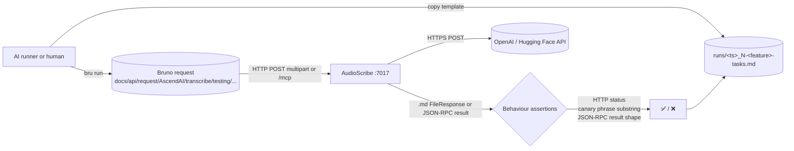

# AudioScribe: end-to-end capability tests

Manual / AI-runnable e2e suite for the AudioScribe speech-to-text microservice. Each test exercises **one capability**
end-to-end against a live AudioScribe container on port 7017. Assertions are observable behaviour only — HTTP status
codes, response `.md` body content (canary phrase substring match), JSON-RPC tool-result shape. AudioScribe holds no
persisted database, no Redis, no Qdrant, no MinIO; the only state it keeps is a TTL-bounded `/tmp` transcript-download
cache. Where a test could be polluted by leftover `.md` files, the reset step is to delete `/tmp/transcript_*.md`
inside the container.

## What's here

```text
AudioScribe/e2e/
├── README.md                            # this file
├── fixtures/                            # canary audio files the upload tests submit
│   └── README.md
└── testing/                             # numbered specs + templates/ + runs/
    ├── README.md
    ├── 1-invalid-input-test.md          # immutable spec (lowest cost — no external API egress)
    ├── 2-transcribe-openai-test.md
    ├── 3-transcribe-hf-test.md
    ├── 4-mcp-tools-list-test.md
    ├── 5-mcp-transcribe-test.md
    ├── templates/                       # run-record templates (immutable), one per spec
    │   ├── README.md
    │   ├── 1-invalid-input-tasks.template.md
    │   ├── 2-transcribe-openai-tasks.template.md
    │   ├── 3-transcribe-hf-tasks.template.md
    │   ├── 4-mcp-tools-list-tasks.template.md
    │   └── 5-mcp-transcribe-tasks.template.md
    └── runs/
        ├── README.md
        └── <UTC-timestamp>_<N>-<feature>-tasks.md   # one per executed test (gitignored)
```

Tests are number-prefixed by setup cost. `1` runs offline (no external API egress). `2`-`3` need `OPENAI_API_KEY` /
`HF_TOKEN` on the AudioScribe container and outbound HTTPS to `api.openai.com` / `api-inference.huggingface.co`. `4`
is a pure MCP-protocol probe (`tools/list`). `5` exercises the MCP `transcribe_openai` tool against a `file://` URI
served from a fixture volume-mounted into the container, so it requires the same `OPENAI_API_KEY` as test 2.

The Bruno collection isn't here. It lives at the **repo root** under
`docs/api/request/AscendAI/transcribe/testing/` so it stays a portable API client artifact. Each spec references the
matching Bruno request file under that path.

## Out of scope

- **`/api/v1/transcribe/local`** (faster-whisper backend) and the MCP `transcribe_local` tool. The local backend
  requires NVIDIA CUDA 12.6 + cuDNN on the host plus the multi-GB faster-whisper model weights. Hardware-dependent
  tests cannot run on a generic e2e runner and would produce noisy verdicts on machines without a CUDA-capable GPU.
  Add a `6-transcribe-local-test.md` only when the suite is run on a dedicated GPU host with a known-good local stack.
- **`/api/v1/transcribe/audacity`** (multi-track Audacity project transcription). The fixture-construction cost
  (zipped `.aup` + `_data` folder with multiple short tracks, conversation merger output to assert) is high relative
  to the marginal coverage over tests 2-3. Add it later if Audacity-flow regressions become a real failure mode.
- **SSE streaming mode** (`stream=true`). The `stream=false` happy path exercises the same orchestration layer (
  `src/scribe.py`) plus the same provider client; streaming adds SSE-framing assertions on top, not new capability
  coverage. Add a streaming-specific spec only when the SSE framing contract itself needs regression coverage.

## Flow



Every spec follows the same template:

1. **What this verifies.** Bullet list of behaviours.
2. **Prerequisites.** Concrete check commands the runner executes before starting. Each command is its own code
   block; the prose around it states what success looks like.
3. **Reset state.** One command per code block, executed in order, to wipe state so the test is reproducible. Tests
   that write to the `/tmp` transcript cache delete those files before starting; the MCP tests document no reset.
4. **Run.** One or more numbered steps. Each step is a single Bruno CLI invocation (REST tests) or a `curl`
   `initialize` handshake followed by a `bru run` `tools/call` (MCP tests). Steps wait for HTTP 200 before continuing.
5. **Expected.** Observable behaviour only: HTTP status, `.md` body contains the canary phrase substring, JSON-RPC
   `result.content[0].text` parses as JSON and contains the canary substring in `transcription`. No log substrings.
6. **Fixtures.** Paths under `AudioScribe/e2e/fixtures/` to the canary audio files the test uploads.

The paired `templates/<N>-<feature>-tasks.template.md` is the runner's checklist for one execution: prerequisites,
reset state, run steps, expected, verdict, plus **Result summary** (with **Input tokens**, **Output tokens**, **Start
(UTC)**, **End (UTC)**, **Duration** fields) and **Additional tasks I did** (anything done outside the spec). The
runner copies the template from [testing/templates/](testing/templates/) into [testing/runs/](testing/runs/) as
`<UTC-timestamp>_<N>-<feature>-tasks.md` and fills it in.

## Parallelism and execution order

AudioScribe holds no per-user state — only TTL-bounded `.md` files in `/tmp` keyed by random UUIDs. The execution
constraints:

| Constraint | Tests | Why |
| :--- | :--- | :--- |
| **External API quota** | 2, 3, 5 | Each call consumes paid OpenAI or Hugging Face quota. Run sequentially if the project is on a low rate-limit tier; otherwise parallel is fine. |
| **No cross-test interference** | 1-5 | Each test owns its own `.md` file in `/tmp` (random UUID). Two tests cannot collide on the same transcript download URL even running in parallel. |

Recommended layout: run test 1 first (offline, fail-fast on validator bugs without burning quota), then tests 2-3 in
parallel or sequential, then tests 4-5 (MCP). Test 4 must run before test 5 within an MCP sweep because test 5 reuses
the same `initialize` handshake pattern and a smoke `tools/list` confirms the handshake works before the heavier
transcribe call.

## Prerequisites before any test

1. Docker compose stack up: `docker compose up -d --build audio-scribe` (or include in the full `ascend-ai` stack).
2. `curl -fsS http://localhost:7017/health` returns HTTP 200 with `{"status":"ok","service":"AudioScribe"}`.
3. Bruno CLI installed: `bru --version` returns a version string. Install once with `npm install -g @usebruno/cli`.
4. For tests 2 and 5: `docker exec audio-scribe printenv OPENAI_API_KEY | head -c 8` returns a non-empty prefix.
5. For test 3: `docker exec audio-scribe printenv HF_TOKEN | head -c 8` returns a non-empty prefix.
6. For test 5: the fixtures directory is volume-mounted into the container — see the spec's Prerequisites for the
   exact mount instruction.

## Running tests

Install Bruno CLI once.

```powershell
npm install -g @usebruno/cli
```

Run one capability.

```powershell
cd docs/api/request/AscendAI
```

```powershell
bru run "transcribe/testing/transcribe-openai-canary.yml" --env ascend-local
```

Run the whole testing folder (Bruno's directory mode).

```powershell
cd docs/api/request/AscendAI
```

```powershell
bru run "transcribe/testing" --env ascend-local
```

## Capability tests

Numbered by setup cost. Easiest first.

| #  | Spec | What it proves |
| :- | :--- | :--- |
| 1  | [testing/1-invalid-input-test.md](testing/1-invalid-input-test.md) | `POST /api/v1/transcribe/openai` with the `file` form field missing returns HTTP 422 with a FastAPI validation-error body that names `file` as the missing field. No external API egress required. |
| 2  | [testing/2-transcribe-openai-test.md](testing/2-transcribe-openai-test.md) | Upload `canary-openai.wav` to `POST /api/v1/transcribe/openai` with `stream=false`; HTTP 200, `Content-Type: text/markdown`, body contains the canary phrase substring. Requires `OPENAI_API_KEY`. |
| 3  | [testing/3-transcribe-hf-test.md](testing/3-transcribe-hf-test.md) | Same as test 2 for `POST /api/v1/transcribe/hf` with `canary-hf.wav`. Requires `HF_TOKEN`. |
| 4  | [testing/4-mcp-tools-list-test.md](testing/4-mcp-tools-list-test.md) | MCP `tools/list` over Streamable HTTP at `POST /mcp` advertises the four transcribe tools (`transcribe_local`, `transcribe_openai`, `transcribe_hf`, `transcribe_audacity`) plus `health`, each with the documented argument schema. |
| 5  | [testing/5-mcp-transcribe-test.md](testing/5-mcp-transcribe-test.md) | MCP `tools/call` for `transcribe_openai` with `audio_uri="file:///fixtures/canary-openai.wav"` returns a JSON-RPC `result.content[0].text` whose parsed JSON body has `source="openai"`, the canary phrase substring in `transcription`. Requires `OPENAI_API_KEY` and a fixtures bind-mount. |

## Adding a new test

1. Add the Bruno request(s) under `docs/api/request/AscendAI/transcribe/testing/<request>.yml`.
2. Pick the next number prefix that matches the test's setup cost.
3. Write `testing/<N>-<capability>-test.md` using the template structure (**What this verifies / Prerequisites /
   Reset state / Run / Expected / Fixtures**). Assert behaviour, not logs.
4. Write `testing/templates/<N>-<capability>-tasks.template.md` mirroring the spec's checkboxes, with
   `## Result summary` containing the **Input tokens / Output tokens / Start (UTC) / End (UTC) / Duration** fields at
   the bottom.
5. Add a row to the capability table above.
