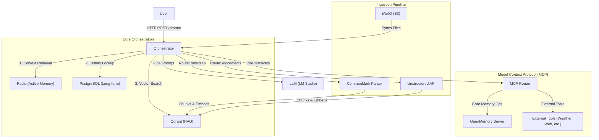

# AscendAI Orchestrator

---

This project is the central hub of the AI system, acting as an orchestrator.  
It's a Spring Boot application that provides a REST API to connect user prompts with a Large Language Model (LLM).  
Crucially, it extends the LLM's capabilities by dynamically discovering and integrating external tools via the Model Context Protocol (MCP) and providing a RAG (Retrieval-Augmented Generation) pipeline for document ingestion.

---

## Architecture Overview

The orchestrator manages the flow of information between the user, the LLM, persistent storage, and external tools.



### Core Components
1.  **Redis**:
    *   **Purpose**: High-performance caching and "Active Memory".
    *   **Usage**: Stores short-term conversation context, user instructions, and cached embedding results to reduce latency.
2.  **PostgreSQL**:
    *   **Purpose**: Persistent, reliable storage.
    *   **Usage**: Archival of all Chat History and structured User Metadata (preferences, profile data).
3.  **OpenMemory (MCP)**:
    *   **Purpose**: Core memory management via MCP.
    *   **Usage**: Exposed as a tool, allowing the AI to explicitly "save" or "recall" facts that don't fit into the standard vector search (e.g., "I am allergic to peanuts").
4.  **Qdrant**:
    *   **Purpose**: Vector Database for RAG.
    *   **Usage**: Stores semantic embeddings of ingested documents (Markdown, PDF, etc.) for similarity search.

---

## Operational Workflow

### 1. Memory vs. Tools
The Orchestrator uses a "Smart Prioritization" logic within the System Prompt to decide how to handle requests:
*   **Real-time Usage**: If the user asks for dynamic data (e.g., "Stock Price", "Weather"), the AI uses External MCP Tools immediately. It strictly avoids searching memory for this data to prevent hallucinations.
*   **Memory Persistence**: If the user states a fact (e.g., "My name is Luke"), the AI uses the `OpenMemory` tool to save this information.
*   **Context Retrieval**: For general questions, the AI defaults to searching its Context (Redis/Postgres) and RAG (Qdrant) before generating an answer.

### 2. Document & Image Ingestion
*   **Direct Ingestion**: Users can upload images or documents directly in the `/prompt` request (`multipart/form-data`). These are processed on-the-fly (`On-Demand Ingestion`) and added to the temporary context window for the current reply.
*   **Background Ingestion (S3)**:
    *   The system monitors a **MinIO S3 Bucket (`knowledge-base`)**.
    *   **Startup**: On boot, the system automatically scans the bucket. New files are detected, downloaded, processed (Markdown locally, PDFs via Unstructured API), and embedded into Qdrant.
    *   **Continuous**: The poller checks for new files every few seconds, ensuring the Knowledge Base is always up-to-date.

---

## Model Selection & Justification

### LLM: `meta-llama-3.1-8b-instruct`
*   **Why**: We prioritize reliability and instruction following over raw creative power for the Orchestrator.
*   **Issue with Qwen**: While powerful, Qwen models occasionally output non-standard tokens or struggle with the strict tool-calling format required by our MCP implementation, leading to parsing errors.
*   **Llama 3.1**: Provides a balanced trade-off—excellent tool use coherence, robust instruction following, and decent reasoning capabilities for an 8B model.

### Embeddings: `text-embedding-nomic-embed-text-v2-moe`
*   **Why**:
    *   **Matryoshka Representation**: Allows flexible embedding sizes.
    *   **Multilingual Support**: Crucial for our use case (Polish/English mixing). The `v2` version specifically handles non-English contexts significantly better than `v1.5` or standard BERT models.

---

## Prerequisites

Before running the application, ensure you have the following services up and running.

1.  **Docker Environment**:
    *   The project uses `docker-compose.yaml` in the root directory to spin up required services.
    *   **MinIO**: S3-compatible storage for file ingestion (Ports: 9070 API, 9071 Console).
    *   **Qdrant**: Vector database for storing embeddings.
    *   **Unstructured API**: For parsing complex document types (PDFs, PPTX, etc.).
    *   **PostgreSQL**: Metadata store for the ingestion pipeline (schema `ascend_ai`).
    *   **Redis**: Caching and active memory store.

2.  **LLM Provider**:
    *   **LM Studio** (or similar) running locally on port `1234` (default).
    *   Ensure an embedding model is also loaded or accessible if using a separate embedding service (default config uses OpenAI format, potentially pointing to local or remote).

---

## RAG Pipeline & Document Ingestion

The orchestrator includes an automated ingestion pipeline that monitors an S3 bucket for new files.

### 1. S3 Storage (MinIO)
*   **Bucket Name**: `knowledge-base` (Created automatically on startup if missing).
*   **Access**:
    *   **Console**: http://localhost:9071
    *   **User**: `admin`
    *   **Password**: `password`
*   **Uploads**: You can upload files directly via the MinIO Console or using the AWS CLI/MinIO Client (`mc`).

### 2. File Routing & Supported Types
The pipeline routes files based on the folder specifically in the S3 bucket:

| Folder Path in S3 | Processor | Supported Formats | Description |
| :--- | :--- | :--- | :--- |
| `obsidian/` | **Markdown Flow** | `.md` | Uses a local CommonMark parser. Optimized for Obsidian vaults and markdown notes. Extracts headers as metadata. |
| `documents/` | **Unstructured Flow** | `.pdf`, `.docx`, `.pptx`, `.html`, `.txt`, etc. | Sends files to the **Unstructured API** container. Capable of performing OCR and extracting text from complex layouts. |

### 3. How it Works
1.  **Polling**: The application polls the `knowledge-base` bucket every 5 seconds.
2.  **Synchronization**: New files are downloaded to a local `downloads/` directory.
3.  **Routing**:
    *   Files containing `obsidian` in their path go to the Markdown processor.
    *   Files containing `documents` in their path go to the Unstructured processor.
4.  **Processing**:
    *   **Markdown**: Parsed into text, split into chunks.
    *   **Unstructured**: Sent to the Unstructured API, which returns extracted text, then split into chunks.
5.  **Embedding & Storage**: Text chunks are converted to vectors and stored in **Qdrant**.

---

## How to Run and Test

### 1. Start Support Services
From the project root:
```bash
docker-compose up -d
```
Ensure MinIO, Qdrant, Redis, Postgres, and Unstructured API are running.

### 2. Run the Orchestrator
```bash
./gradlew bootRun
```
Access the fancy startup log to see the running port (default `9917`) and active profiles.
It will also display:
*   Postgres & Redis Connection Status.
*   Count of available files in S3 (`knowledge-base`) ready for ingestion.
*   List of active MCP Tools.

### 3. Test Ingestion (RAG)
1.  Open MinIO Console: http://localhost:9071
2.  Navigate to the `knowledge-base` bucket.
3.  **Test Markdown**:
    *   Create a folder `obsidian`.
    *   Upload a sample `.md` file inside it.
    *   Check application logs. You should see: `Indexed markdown document: <id>`
4.  **Test Unstructured**:
    *   Create a folder `documents`.
    *   Upload a `.pdf` or `.docx`.
    *   Check application logs. You should see: `Indexed structured document: <id>`

### 4. Testing Scenarios (CURL)

**Prerequisites**:
- Server running on `localhost:9917`.
- `X-User-Id` header is required for context.

#### 1. RAG: Summarizing a Document

**Windows (PowerShell)**:
```powershell
curl -X POST "http://localhost:9917/prompt" `
     -H "X-User-Id: user1" `
     -H "Content-Type: multipart/form-data" `
     -F "prompt=Summarize the key points." `
     -F "doc=@notes.md"
```

**Linux/Mac (Bash)**:
```bash
curl -X POST "http://localhost:9917/prompt" \
     -H "X-User-Id: user1" \
     -H "Content-Type: multipart/form-data" \
     -F "prompt=Summarize the key points." \
     -F "doc=@notes.md"
```

#### 2. Vision: Describing a Picture

**Windows (PowerShell)**:
```powershell
curl -X POST "http://localhost:9917/prompt" `
     -H "X-User-Id: user1" `
     -H "Content-Type: multipart/form-data" `
     -F "prompt=Describe this image." `
     -F "image=@screenshot.png"
```

**Linux/Mac (Bash)**:
```bash
curl -X POST "http://localhost:9917/prompt" \
     -H "X-User-Id: user1" \
     -H "Content-Type: multipart/form-data" \
     -F "prompt=Describe this image." \
     -F "image=@screenshot.png"
```

#### 3. MCP Tool Usage (Weather)

**Windows (PowerShell)**:
```powershell
curl -X POST "http://localhost:9917/prompt" `
     -H "X-User-Id: user1" `
     -H "Content-Type: multipart/form-data" `
     -F "prompt=What is the weather in Warsaw?"
```

#### 4. Memory Context

**Set Context (Bash)**:
```bash
curl -X POST "http://localhost:9917/prompt" \
     -H "X-User-Id: user1" \
     -H "Content-Type: multipart/form-data" \
     -F "prompt=My name is Luke."
```

**Retrieve Context (Bash)**:
```bash
curl -X POST "http://localhost:9917/prompt" \
     -H "X-User-Id: user1" \
     -H "Content-Type: multipart/form-data" \
     -F "prompt=What is my name?"
```

### 5. Verify Persistence & Memory

#### 1. Redis (Chat History & Instructions)

**Connect to Redis**:
```bash
docker exec -it orchestrator-redis-1 redis-cli
```

**Check Keys**:
All keys:
```bash
KEYS *
```
Specific keys:
```bash
KEYS "user:user1:*"
```

**View History**:
```bash
LRANGE user:user1:history 0 -1
```

**View Instructions**:
```bash
GET user:user1:instructions
```

#### 2. PostgreSQL (Long-term Storage)

**Connect to Database**:
```bash
docker exec -it orchestrator-postgres-1 psql -U postgres -d orchestrator_db
```

**Check History**:
```sql
SELECT * FROM chat_history WHERE user_id = 'user1' ORDER BY created_at DESC LIMIT 5;
```

**Check Instructions**:
```sql
SELECT * FROM user_instructions WHERE user_id = 'user1';
```

---

## Configuration

### Key Application Properties (`application.yaml`)

*   **Server Port**: `9917`
*   **S3 Configuration**:
    *   `s3.endpoint`: `http://localhost:9070`
    *   `s3.bucket`: `knowledge-base`
*   **Data Source**: Postgres connection for metadata store.
*   **Unstructured API**: Base URL for the document parsing service.

### MCP Client
*   `spring.ai.mcp.client`: Configured to manage local MCP servers (e.g., `sqlite`, `filesystem`) via `mcp-servers-config.json`.
