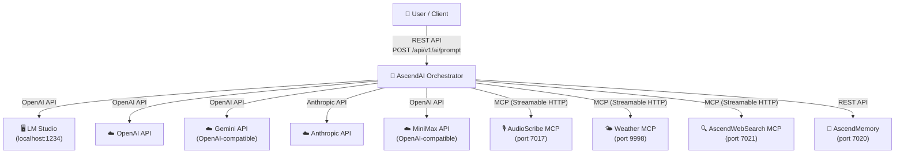

# 3. Context and Scope

## System Context

## External Interfaces

| Interface | Protocol | Direction | Purpose |
|---|---|---|---|
| User REST API | HTTP/JSON | Inbound | Prompt submission with optional image/document/provider/model |
| LLM Provider APIs | HTTP/JSON | Outbound | Chat completion requests (OpenAI-compatible or Anthropic) |
| MCP Tool Services | Streamable HTTP | Outbound | Tool discovery and invocation (transcription, weather, web search) |
| AscendMemory | REST API | Outbound | Semantic memory storage and retrieval |
| Redis | TCP | Outbound | Chat history caching |
| PostgreSQL | TCP | Outbound | Persistent metadata and chat history |
| Qdrant | gRPC | Outbound | Vector similarity search for RAG |
| MinIO | S3 API | Outbound | Document object storage |
