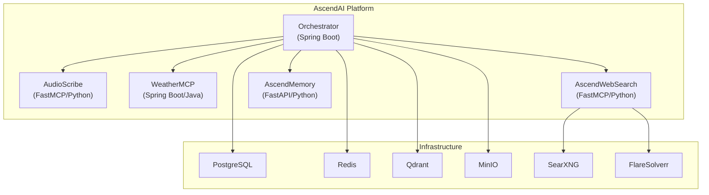
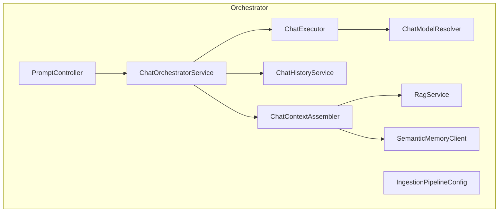

# 5. Building Block View

## Level 1: System Decomposition

## Level 2: Orchestrator Internals

## Component Responsibilities

| Component | Responsibility |
|---|---|
| `PromptController` | REST endpoint, request validation, provider/model parameter extraction |
| `ChatOrchestratorService` | Orchestrates context assembly, history, AI execution |
| `ChatContextAssembler` | Builds system message with RAG context and semantic memory |
| `ChatHistoryService` | Loads/saves chat history from Redis with PostgreSQL fallback |
| `ChatExecutor` | Builds per-request `ChatClient`, attaches MCP tools, calls LLM |
| `ChatModelResolver` | Resolves `ChatModel` by provider name from pre-initialized map |
| `RagService` | Performs vector similarity search in Qdrant |
| `SemanticMemoryClient` | Direct REST calls to AscendMemory for user profiles |
| `IngestionPipelineConfig` | S3 → Unstructured API → Token splitter → Qdrant pipeline |
