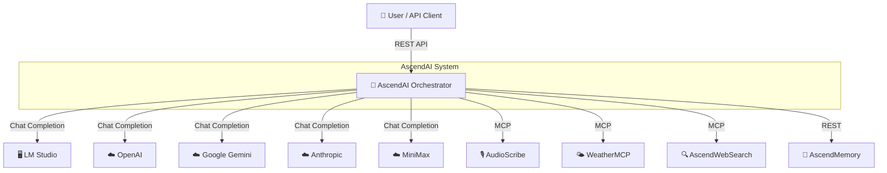

# C4 Context Diagram (Level 1)

The Orchestrator is the central component — it receives user prompts, routes them to the selected AI provider, and invokes MCP tools as needed. AscendMemory provides semantic user context via direct REST.
