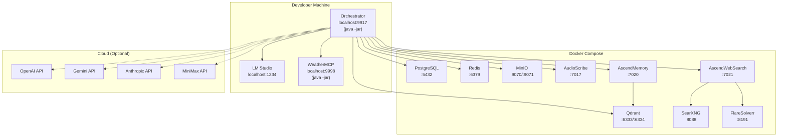

# Deployment Diagram

In development, the Orchestrator and WeatherMCP run directly on the host JVM. All infrastructure services and Python-based MCP servers run in Docker Compose. Cloud AI providers are optional (dashed lines) — only accessed when their provider is enabled and selected.
