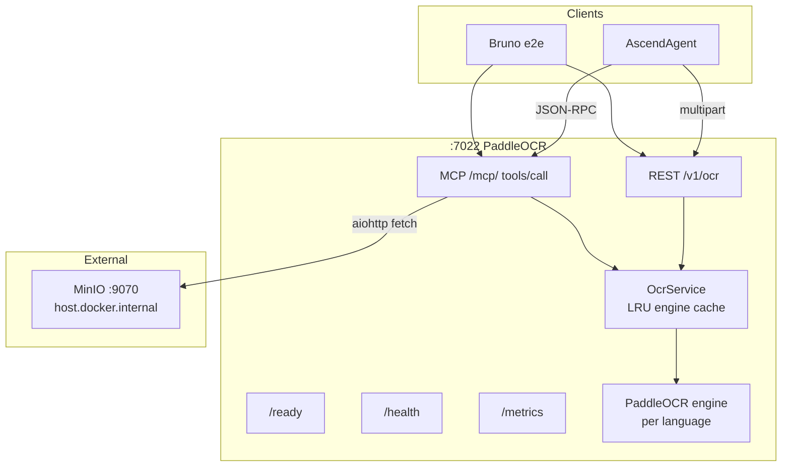

# PaddleOCR Service

*OCR microservice for AscendAI. FastAPI REST and FastMCP tool on the same port, with multi-language PaddleOCR
backing both.*


---

### What this is

PaddleOCR Service wraps the [PaddleOCR](https://github.com/PaddlePaddle/PaddleOCR) library behind two API surfaces on
port `7022`. The REST endpoint accepts multipart uploads. The MCP tool accepts URIs (http, https, or jailed `file://`).
Both produce the same `OcrJsonResponse` shape: a per-page list of recognised lines with confidence scores and bounding
boxes. The service is consumed by [AscendAgent](../AscendAgent/AGENTS.md), which routes prompts that need text
extraction from images or PDFs.

The service runs models locally. Warm-up happens during FastAPI lifespan: the engine for `DEFAULT_LANGUAGE` is loaded
before `/ready` returns `status=ready`. The Docker `HEALTHCHECK` probes `/health` (liveness), so the orchestrator does
not mark the container healthy until the process is responsive.

---

### Tech stack

Runtime pins live in [pyproject.toml](pyproject.toml). The shape is:

- Python 3.11 (the only version with full PaddlePaddle wheel coverage today)
- FastAPI 0.136.3, Uvicorn 0.48.0, FastMCP 3.3.1
- PaddlePaddle 3.3.1, PaddleOCR 3.6.0, Pillow 12.2.0
- aiohttp 3.13.5 + aiofiles 25.1.0 for the MCP URL fetch
- slowapi 0.1.9 for per-IP rate limiting
- prometheus-fastapi-instrumentator 8.0.0, opentelemetry-sdk 1.42.1 for metrics and traces
- python-json-logger 4.1.0 for structured logs
- Pydantic 2.13.4 with pydantic-settings 2.14.1 for typed configuration

Dev tooling: pytest 9.0.3, pytest-asyncio 1.4.0, pytest-cov 6.0.0, ruff 0.13.0, mypy 1.18.2, mutmut 3.5.0,
pact-python 3.4.0.

---

### Quick start

If you opened the project in IntelliJ (or VS Code with the Python extension), the venv already exists at
[.venv/](.venv/). Use it directly. The commands below assume Windows PowerShell 7+.

Activate the venv. PowerShell may block the activation script with an execution-policy error on first use; the bypass
applies only to the current process:

```powershell
Set-ExecutionPolicy -ExecutionPolicy Bypass -Scope Process
```

```powershell
.\.venv\Scripts\activate.ps1
```

Install the project plus dev extras into the venv. First install is 5 to 10 minutes because PaddlePaddle pulls
roughly 3 GB of wheels:

```powershell
pip install -e ".[dev]"
```

Run the dev server with auto-reload:

```powershell
uvicorn src.main:app --host 0.0.0.0 --port 7022 --reload
```

Hit the readiness probe to wait until the default-language engine is warm:

```powershell
curl.exe -fsS http://localhost:7022/ready
```

Send a real OCR request once `/ready` returns `status=ready`:

```powershell
curl.exe -fsS -F "file=@e2e/fixtures/argent-saga-chronicles-page1.png" -F "lang=en" http://localhost:7022/v1/ocr
```

**Linux / macOS users**: create the venv with `python3.11 -m venv .venv`, activate with `source .venv/bin/activate`,
then the same `pip install`, `uvicorn`, and `curl` commands above (drop the `.exe` suffix on `curl`).

**No-activate alternative** that IntelliJ's Run button uses under the hood. Call the venv interpreter directly,
nothing touches your shell:

```powershell
.\.venv\Scripts\python.exe -m pip install -e ".[dev]"
```

```powershell
.\.venv\Scripts\python.exe -m uvicorn src.main:app --host 0.0.0.0 --port 7022 --reload
```

---

### Architecture



The REST handler and the MCP tool both delegate to one `OcrService` singleton. Sync engine calls run in
`asyncio.to_thread`, so the event loop stays free for `/health`, `/ready`, `/metrics`, and concurrent requests. The
MCP path has an SSRF guard on `http(s)://` URIs and a `realpath` jail on `file://` URIs; see
[ADR-001](docs/architecture/decisions/ADR-001-mcp-file-transport-uri-only.md) for the policy.

---

### Endpoints

| Method | Path        | Purpose                                                                 |
| :----- | :---------- | :---------------------------------------------------------------------- |
| GET    | /health     | Liveness probe. Always 200 when the process is up.                      |
| GET    | /ready      | Readiness probe. 200 with `status=ready` once the default lang is warm. |
| GET    | /metrics    | Prometheus exposition for the counters in [src/observability/metrics.py](src/observability/metrics.py). |
| POST   | /v1/ocr     | Multipart upload, returns [OcrJsonResponse](src/model/ocr_models.py).   |
| POST   | /mcp/       | FastMCP Streamable HTTP transport. Tool `ocr_process` takes `file_uri`. |

The error body shape across both surfaces is `{"code": "...", "detail": "..."}`. The six-code catalog is in
[ADR-002](docs/architecture/decisions/ADR-002-mcp-error-catalog.md).

---

### Configuration

The full env-var matrix (sixteen settings across service, OCR engine, MCP transport, rate limits, OpenTelemetry) is
documented in [docs/CONFIGURATION.md](docs/CONFIGURATION.md). The defaults are safe for a single-instance local run;
the docker-compose service at [docker-compose.yaml](../docker-compose.yaml) carries the production overrides.

---

### Build, test, and lint

All four commands run cleanly today and are gated in CI at
[.github/workflows/paddle-ocr-ci.yml](../.github/workflows/paddle-ocr-ci.yml).

Run the full pytest suite. The configured gate is 100 percent branch coverage:

```bash
pytest
```

Lint and import-sort:

```bash
ruff check .
```

Format check (no rewrite):

```bash
ruff format --check .
```

Static type check on the source tree:

```bash
mypy src
```

Mutation testing against the source. Slow, optional:

```bash
mutmut run
```

---

### Docker

The repo-root [docker-compose.yaml](../docker-compose.yaml) defines the `ascend-paddle-ocr` service with the env
vars, the healthcheck, and resource limits. From the repo root:

Build the image. First build is 5 to 15 minutes because the PaddlePaddle wheels are heavy and the model cache is
prefetched in the builder stage:

```bash
docker build -t ascend-paddle-ocr:local PaddleOCR
```

Start the service through compose:

```bash
docker compose up -d --build ascend-paddle-ocr
```

Tail the logs:

```bash
docker logs --tail 80 -f ascend-paddle-ocr
```

Force a clean recreate after a Dockerfile or env-var change:

```bash
docker compose up -d --build --force-recreate ascend-paddle-ocr
```

---

### e2e tests

Capability specs and Bruno requests are documented separately. [e2e/README.md](e2e/README.md) lists the twelve specs
and the run contract; [e2e/load/README.md](e2e/load/README.md) covers the k6 ramp profile.

Run one Bruno request from the repo root:

```bash
bru run "paddle-ocr/testing/ocr-english.yml" --env ascend-local --root docs/api/request/AscendAI
```

---

### Docs map

Everything below is shipped with the service.

| File                                                                                                     | Audience                                  |
| :------------------------------------------------------------------------------------------------------- | :---------------------------------------- |
| [AGENTS.md](AGENTS.md)                                                                                   | AI coding agents working in the module    |
| [docs/README.md](docs/README.md)                                                                         | Architecture documentation index          |
| [docs/CONFIGURATION.md](docs/CONFIGURATION.md)                                                           | Full env-var matrix and `.env` example    |
| [docs/architecture/decisions/README.md](docs/architecture/decisions/README.md)                           | ADR index                                 |
| [docs/architecture/decisions/ADR-001-mcp-file-transport-uri-only.md](docs/architecture/decisions/ADR-001-mcp-file-transport-uri-only.md) | MCP file transport policy |
| [docs/architecture/decisions/ADR-002-mcp-error-catalog.md](docs/architecture/decisions/ADR-002-mcp-error-catalog.md) | Error code catalog                |
| [docs/architecture/decisions/ADR-003-versioning-strategy.md](docs/architecture/decisions/ADR-003-versioning-strategy.md) | Versioning strategy           |
| [docs/architecture/decisions/ADR-004-liveness-readiness-split.md](docs/architecture/decisions/ADR-004-liveness-readiness-split.md) | Liveness vs readiness split |
| [docs/architecture/arc42/](docs/architecture/arc42/)                                                     | Twelve-chapter arc42 walkthrough          |
| [docs/architecture/diagrams/container-diagram.md](docs/architecture/diagrams/container-diagram.md)       | C4 container and runtime diagrams         |
| [e2e/README.md](e2e/README.md)                                                                           | e2e contract and capability matrix        |
| [e2e/load/README.md](e2e/load/README.md)                                                                 | Load-profile guide for k6                 |
| [tests/contract/test_ascendagent_pact_stub.py](tests/contract/test_ascendagent_pact_stub.py)             | Pact provider verification stub           |

---

### License

MIT. See the top-level [LICENSE](../LICENSE) at the monorepo root.
