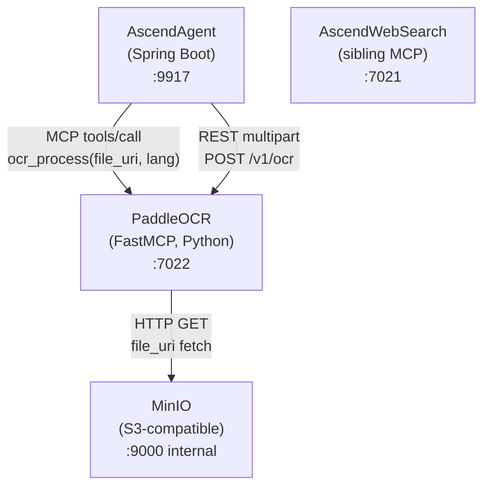

# 3. Context and Scope

---

### System context

---

### External interfaces

| System | Direction | Protocol | Notes |
| :--- | :--- | :--- | :--- |
| AscendAgent | Inbound | MCP (Streamable HTTP) via `POST /mcp` | Primary consumer. Sends `tools/call name="ocr_process"` with a `file_uri` argument pointing to MinIO or another HTTP source. |
| AscendAgent | Inbound | HTTP multipart `POST /v1/ocr` | Secondary path for direct upload (e.g. developer tooling, curl, Bruno collection). |
| MinIO | Outbound | HTTP GET | Used by the MCP path. The `file_uri` in the `ocr_process` call is typically `http://minio:9000/<bucket>/<key>`. The SSRF guard must allowlist `minio` via `MCP_ALLOWED_HOSTS`. |
| AscendWebSearch | None | N/A | Sibling service in the same docker-compose network. No direct dependency. Mentioned as a reference for how the monorepo's Python MCP pattern is applied across services. |

---

### What PaddleOCR does NOT do

- It does not store results. Every response is ephemeral; there is no database.
- It does not call any LLM or AI provider. OCR is fully local, CPU-bound.
- It does not push events. The response is synchronous JSON-RPC or HTTP JSON.
- It does not manage users. There is no authentication at the service boundary; the docker-compose network is the
  trust boundary.
- It does not handle audio, web search, or any capability other than OCR.
