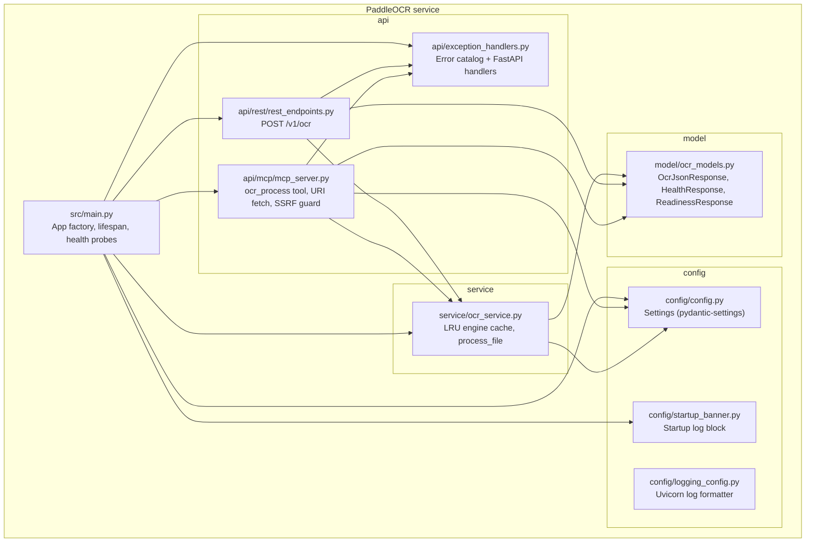

# 5. Building Block View

---

### Level 1: module map

---

### Component responsibilities

| Component | File | Responsibility |
| :--- | :--- | :--- |
| App factory | `src/main.py` | Creates the FastAPI app, runs lifespan warm-up, mounts the MCP ASGI sub-app, registers `/health` and `/ready`. |
| `rest_endpoints.py` | `src/api/rest/rest_endpoints.py` | `APIRouter(prefix="/v1")`. Validates file type and size, reads upload bytes, dispatches to `ocr_service` via `asyncio.to_thread`. |
| `mcp_server.py` | `src/api/mcp/mcp_server.py` | FastMCP instance. Owns the `aiohttp.ClientSession` lifespan. `ocr_process` tool: scheme dispatch, SSRF guard, `file://` jail, size enforcement, thread-pool OCR call. |
| `exception_handlers.py` | `src/api/exception_handlers.py` | Defines the five domain exception classes and the `INTERNAL_ERROR` fallback. Registers one FastAPI handler per class. Every handler emits `{"code": "...", "detail": "..."}` with a generic phrase; no internal details returned. |
| `OcrService` | `src/service/ocr_service.py` | `OrderedDict`-backed LRU cache of `PaddleOCR` engines keyed by language code. `process_file` writes bytes to a tempfile, calls `engine.predict`, builds `OcrJsonResponse` from the result, deletes the tempfile in a `finally` block. |
| `Settings` | `src/config/config.py` | Pydantic-settings class. Reads from env and `.env` file. Single `settings` singleton imported across the codebase. |
| `ocr_models.py` | `src/model/ocr_models.py` | Pydantic models: `OcrTextLine`, `OcrPageResult`, `OcrJsonResponse` (carries `schema_version: Literal["1"]`), `HealthResponse`, `ReadinessResponse`. |
| `startup_banner.py` | `src/config/startup_banner.py` | Emits a log block at startup listing both probe URLs, MCP config, and all runtime tuning knobs. |
