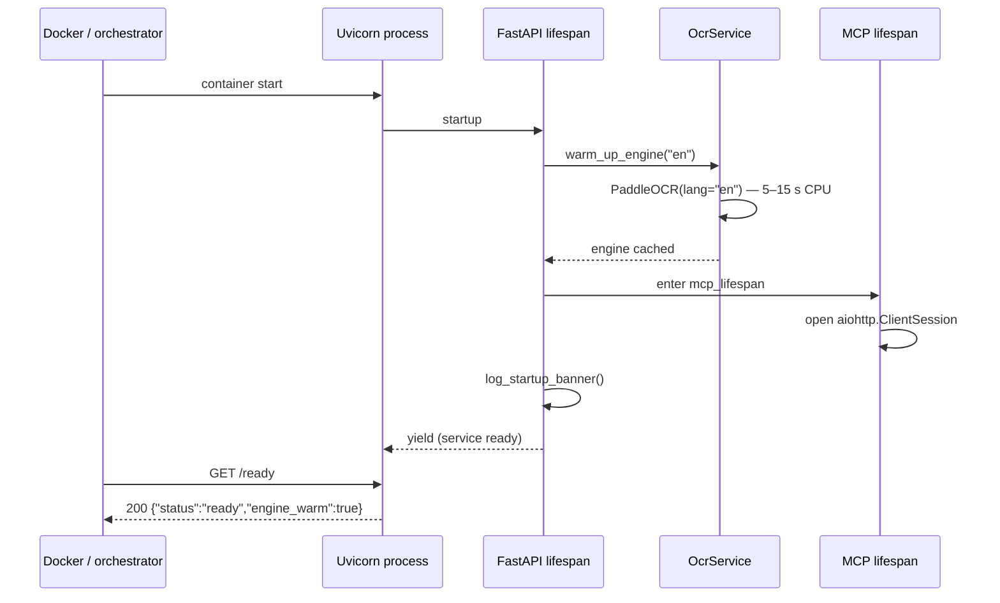
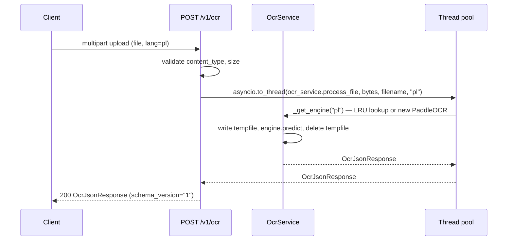
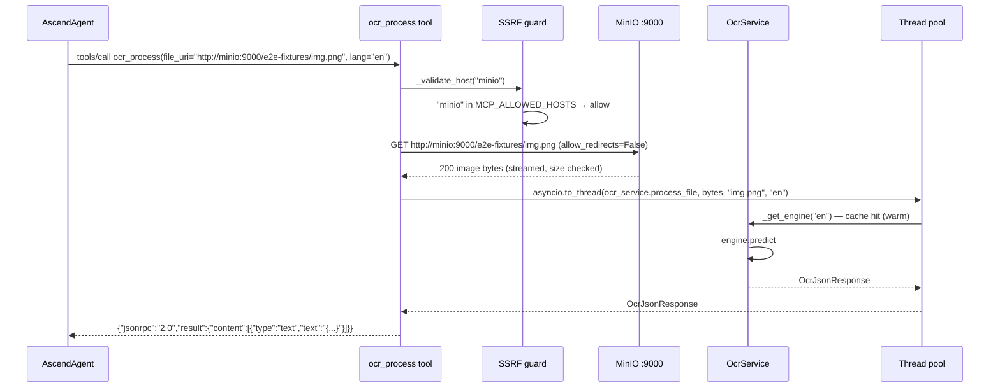

# 6. Runtime View

---

### Cold start sequence

The Docker `HEALTHCHECK` targets `/health`, which returns 200 immediately after the process starts. The readiness
probe at `/ready` only returns `ready` after `warm_up_engine` completes. During the warm-up window, `/ready` returns
`{"status":"not-ready","engine_warm":false}`.

---

### REST happy path

---

### MCP happy path via MinIO

The `minio` hostname resolves to a private RFC1918 address inside the docker-compose network. Without
`MCP_ALLOWED_HOSTS=minio`, the SSRF guard would reject it. See
[ADR-001](../decisions/ADR-001-mcp-file-transport-uri-only.md).

---

### Error catalog mapping

| Exception raised | HTTP status (REST) | MCP JSON-RPC | Code string |
| :--- | :--- | :--- | :--- |
| `OcrProcessingError` | 422 | tool error frame | `OCR_FAILED` |
| `FileSizeExceededError` | 400 | tool error frame | `FILE_TOO_LARGE` |
| `UnsupportedFileTypeError` | 400 | tool error frame | `UNSUPPORTED_FILE_TYPE` |
| `UnsafeUriError` | 400 | tool error frame | `UNSAFE_URI` |
| `DownloadFailedError` | 502 | tool error frame | `DOWNLOAD_FAILED` |
| `Exception` (unhandled) | 500 | tool error frame | `INTERNAL_ERROR` |

All handlers are registered in `src/api/exception_handlers.py:38-44`. The `detail` field carries a generic phrase;
the original exception message is logged at WARNING or ERROR but never returned to the client.
