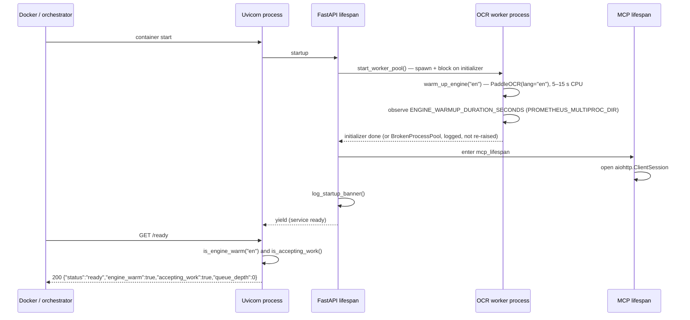
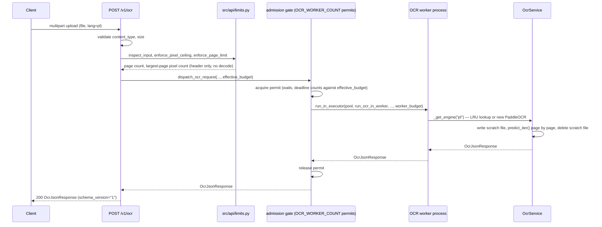
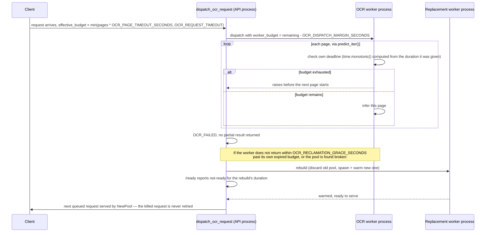
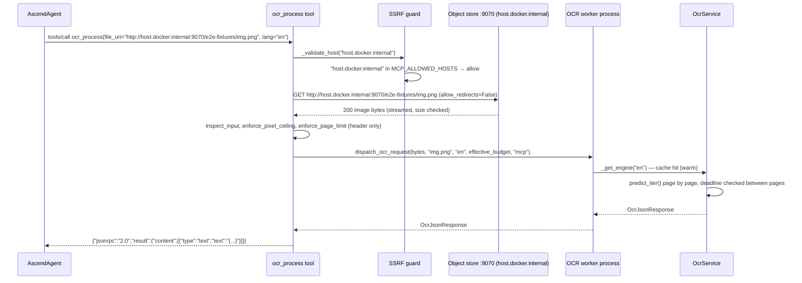

# 6. Runtime View

---

### Cold start sequence

```mermaid
sequenceDiagram
    participant Docker as Docker / orchestrator
    participant Uvicorn as Uvicorn process
    participant Lifespan as FastAPI lifespan
    participant Pool as OCR worker process
    participant MCPLife as MCP lifespan

    Docker->>Uvicorn: container start
    Uvicorn->>Lifespan: startup
    Lifespan->>Pool: start_worker_pool() — spawn + block on initializer
    Pool->>Pool: warm_up_engine("en") — PaddleOCR(lang="en"), 5–15 s CPU
    Pool->>Pool: observe ENGINE_WARMUP_DURATION_SECONDS (PROMETHEUS_MULTIPROC_DIR)
    Pool-->>Lifespan: initializer done (or BrokenProcessPool, logged, not re-raised)
    Lifespan->>MCPLife: enter mcp_lifespan
    MCPLife->>MCPLife: open aiohttp.ClientSession
    Lifespan->>Lifespan: log_startup_banner()
    Lifespan-->>Uvicorn: yield (service ready)
    Docker->>Uvicorn: GET /ready
    Uvicorn->>Uvicorn: is_engine_warm("en") and is_accepting_work()
    Uvicorn-->>Docker: 200 {"status":"ready","engine_warm":true,"accepting_work":true,"queue_depth":0}
```

The Docker `HEALTHCHECK` targets `/health`, which returns 200 immediately after the process starts. The readiness
probe at `/ready` returns `ready` only once the OCR worker process has recorded a successful warm-up **and** the
service is accepting work — see "Request budget, deadline stop, and worker reclamation" below for the four
conditions that make `accepting_work` false. During the warm-up window, and if the worker's pool initializer fails
outright, `/ready` returns `{"status":"not-ready", ...}` rather than crashing the container. See
[ADR-004](../decisions/ADR-004-liveness-readiness-split.md).

---

### REST happy path

```mermaid
sequenceDiagram
    participant Client
    participant REST as POST /v1/ocr
    participant Limits as src/api/limits.py
    participant Gate as admission gate (OCR_WORKER_COUNT permits)
    participant Pool as OCR worker process
    participant OcrSvc as OcrService

    Client->>REST: multipart upload (file, lang=pl)
    REST->>REST: validate content_type, size
    REST->>Limits: inspect_input, enforce_pixel_ceiling, enforce_page_limit
    Limits-->>REST: page count, largest-page pixel count (header only, no decode)
    REST->>Gate: dispatch_ocr_request(..., effective_budget)
    Gate->>Gate: acquire permit (waits, deadline counts against effective_budget)
    Gate->>Pool: run_in_executor(pool, run_ocr_in_worker, ..., worker_budget)
    Pool->>OcrSvc: _get_engine("pl") — LRU lookup or new PaddleOCR
    OcrSvc->>OcrSvc: write scratch file, predict_iter() page by page, delete scratch file
    OcrSvc-->>Pool: OcrJsonResponse
    Pool-->>Gate: OcrJsonResponse
    Gate->>Gate: release permit
    Gate-->>REST: OcrJsonResponse
    REST-->>Client: 200 OcrJsonResponse (schema_version="1")
```

The MCP happy path below follows the identical `dispatch_ocr_request` path once past its own header-only guards; only
the source of the bytes differs (a download instead of a multipart body).

---

### Request budget, deadline stop, and worker reclamation

```mermaid
sequenceDiagram
    participant Client
    participant Gate as dispatch_ocr_request (API process)
    participant Pool as OCR worker process
    participant NewPool as Replacement worker process

    Client->>Gate: request arrives, effective_budget = min(pages * OCR_PAGE_TIMEOUT_SECONDS, OCR_REQUEST_TIMEOUT)
    Gate->>Pool: dispatch with worker_budget = remaining - OCR_DISPATCH_MARGIN_SECONDS
    loop each page, via predict_iter()
        Pool->>Pool: check own deadline (time.monotonic() computed from the duration it was given)
        alt budget exhausted
            Pool-->>Gate: raises before the next page starts
        else budget remains
            Pool->>Pool: infer this page
        end
    end
    Gate->>Gate: OCR_FAILED, no partial result returned

    Note over Gate,Pool: If the worker does not return within OCR_RECLAMATION_GRACE_SECONDS<br/>past its own expired budget, or the pool is found broken:
    Gate->>NewPool: rebuild (discard old pool, spawn + warm new one)
    Gate->>Gate: /ready reports not-ready for the rebuild's duration
    NewPool-->>Gate: warmed, ready to serve
    Gate->>Client: next queued request served by NewPool — the killed request is never retried
```

A worker can only be asked to stop between pages, so a worker that overruns badly inside a single page keeps
computing until that page finishes — the reclamation grace bounds the total exposure to roughly one page's worth of
extra time, not the unbounded runaway this mechanism replaces. See the `ocr-request-deadlines`,
`ocr-service-readiness`, `ocr-input-limits`, and `ocr-memory-bounds` capability specs under
`openspec/changes/stop-ocr-getting-stuck-on-large-jobs/specs/` for the full requirement set.

---

### MCP happy path via the S3-compatible object store

```mermaid
sequenceDiagram
    participant Agent as AscendAgent
    participant MCP as ocr_process tool
    participant Guard as SSRF guard
    participant ObjectStore as Object store :9070 (host.docker.internal)
    participant Pool as OCR worker process
    participant OcrSvc as OcrService

    Agent->>MCP: tools/call ocr_process(file_uri="http://host.docker.internal:9070/e2e-fixtures/img.png", lang="en")
    MCP->>Guard: _validate_host("host.docker.internal")
    Guard->>Guard: "host.docker.internal" in MCP_ALLOWED_HOSTS → allow
    MCP->>ObjectStore: GET http://host.docker.internal:9070/e2e-fixtures/img.png (allow_redirects=False)
    ObjectStore-->>MCP: 200 image bytes (streamed, size checked)
    MCP->>MCP: inspect_input, enforce_pixel_ceiling, enforce_page_limit (header only)
    MCP->>Pool: dispatch_ocr_request(bytes, "img.png", "en", effective_budget, "mcp")
    Pool->>OcrSvc: _get_engine("en") — cache hit (warm)
    OcrSvc->>OcrSvc: predict_iter() page by page, deadline checked between pages
    OcrSvc-->>Pool: OcrJsonResponse
    Pool-->>MCP: OcrJsonResponse
    MCP-->>Agent: {"jsonrpc":"2.0","result":{"content":[{"type":"text","text":"{...}"}]}}
```

The `host.docker.internal` hostname resolves to a private address inside the docker-compose network. Without
`MCP_ALLOWED_HOSTS=host.docker.internal`, the SSRF guard would reject it. See
[ADR-001](../decisions/ADR-001-mcp-file-transport-uri-only.md).

---

### Error catalog mapping

| Exception raised | HTTP status (REST) | MCP JSON-RPC | Code string |
| :--- | :--- | :--- | :--- |
| `OcrProcessingError` | 422 | tool error frame | `OCR_FAILED` |
| `FileSizeExceededError` | 400 | tool error frame | `FILE_TOO_LARGE` |
| `UnsupportedFileTypeError` | 400 | tool error frame | `UNSUPPORTED_FILE_TYPE` |
| `UnsafeUriError` | 400 | tool error frame | `UNSAFE_URI` |
| `DownloadFailedError` | 502 | tool error frame | `DOWNLOAD_FAILED` |
| `Exception` (unhandled) | 500 | tool error frame | `INTERNAL_ERROR` |

All handlers are registered in `src/api/exception_handlers.py:38-44`. The `detail` field carries a generic phrase;
the original exception message is logged at WARNING or ERROR but never returned to the client.
