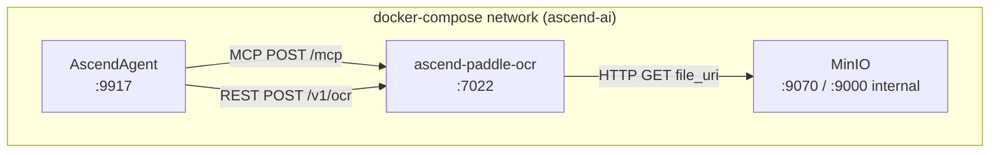

# 7. Deployment View

---

### docker-compose placement

PaddleOCR runs as the `ascend-paddle-ocr` service in `docker-compose.yaml` (root of the monorepo). It is grouped
with the other non-scraper support services — Docling Serve, Unstructured API, WeatherMCP, AudioScribe, AscendMemory.

The network alias `ascend-paddle-ocr` (and the hostname `ascend-paddle-ocr`) allows the AscendAgent to reach the
service by name inside the compose network.

---

### Healthcheck wiring

The Dockerfile `HEALTHCHECK` is deliberately pointed at `/health`, not `/ready`
(`PaddleOCR/Dockerfile:58` sets no explicit `HEALTHCHECK` instruction — the base image default applies, or the
compose `healthcheck` stanza should be set). The operator should configure the load balancer or Kubernetes
`readinessProbe` to poll `/ready` so traffic is held until `engine_warm=true`. See
[ADR-004](../decisions/ADR-004-liveness-readiness-split.md).

---

### Environment variables

| Variable | Default | Description |
| :--- | :--- | :--- |
| `API_HOST` | `0.0.0.0` | Bind address for Uvicorn. |
| `API_PORT` | `7022` | Listen port. |
| `LOG_LEVEL` | `INFO` | Uvicorn log level (`DEBUG`, `INFO`, `WARNING`, `ERROR`, `CRITICAL`). |
| `DEFAULT_LANGUAGE` | `en` | Language warmed up at startup; used when `lang` is absent from the request. |
| `MAX_FILE_SIZE_MB` | `50` | Cap on uploaded or fetched file size in megabytes. |
| `OCR_REQUEST_TIMEOUT` | `120` | Per-request OCR timeout in seconds (float). |
| `ENGINE_CACHE_MAX_SIZE` | `8` | Maximum number of `PaddleOCR` engines held in the LRU cache. |
| `SUPPORTED_LANGUAGES` | `en,pl,de,fr,es,it,pt,nl,ru,ch,ja,ko` | Allowlist of valid language codes. Requests for any other code are rejected. |
| `MCP_FILE_URI_ROOT` | _(unset)_ | Enables `file://` support; URIs must resolve inside this directory. Unset = `file://` disabled. |
| `MCP_ALLOWED_HOSTS` | _(empty)_ | Comma-separated hostnames exempt from the SSRF IP block. Set to `minio` for the standard compose stack. |
| `MCP_DOWNLOAD_TIMEOUT_SECONDS` | `30` | Total timeout for the `aiohttp` download session. |

The `docker-compose.yaml` service block sets `API_PORT`, `API_HOST`, `LOG_LEVEL`, `DEFAULT_LANGUAGE`,
`MAX_FILE_SIZE_MB`, and `OCR_REQUEST_TIMEOUT` explicitly. `MCP_ALLOWED_HOSTS` is not set in the default compose
configuration and must be added manually to run the MCP e2e tests. See
[e2e/testing/6-mcp-ocr-test.md](../../../e2e/testing/6-mcp-ocr-test.md).

---

### Multi-stage Docker build

The Dockerfile uses a two-stage build (`PaddleOCR/Dockerfile`). The builder stage installs dependencies and pre-caches
PaddleOCR models for `en` and `pl` by running a one-off `PaddleOCR(lang=...)` invocation (line 23). The runtime
stage copies site-packages, binaries, and the pre-cached `.paddlex` model directory from the builder. This means:

- Model downloads do not happen at container start.
- Cold-start warm-up in the lifespan is a model-loading step, not a download step.
- Adding a new pre-cached language requires rebuilding the image with an additional `PaddleOCR(lang='xx')` call in
  the builder RUN instruction.

The runtime container runs as a non-root user (`appuser`).
