# 10. Quality Requirements

---

### Quality tree

```mermaid
graph TB
    Quality["Quality"]
    Quality --> Security
    Quality --> Operational
    Quality --> Contractual
    Quality --> Testability

    Security --> S1["SSRF guard blocks private IPs for http(s):// URIs"]
    Security --> S2["file:// disabled by default; jailed to MCP_FILE_URI_ROOT when enabled"]
    Security --> S3["No internal detail in error responses (stack frames, file paths)"]
    Security --> S4["Non-root container user (appuser)"]

    Operational --> O1["/ready returns not-ready until engine warm — no cold-start traffic"]
    Operational --> O2["Startup banner prints all runtime config at INFO level"]
    Operational --> O3["Evictions from LRU cache logged at INFO for capacity tuning"]

    Contractual --> C1["schema_version field on every OcrJsonResponse"]
    Contractual --> C2["Breaking REST changes use /v2/ prefix"]
    Contractual --> C3["Breaking MCP changes use ocr_process_v2 tool name"]

    Testability --> T1["Unit tests with pytest-mock for all exception paths"]
    Testability --> T2["Integration tests via asgi-lifespan + httpx (no live PaddleOCR)"]
    Testability --> T3["E2e capability tests via Bruno collection — behavior assertions, not log substrings"]
```

---

### Quality scenarios

| Quality | Scenario | Expected behaviour |
| :--- | :--- | :--- |
| Security | MCP caller sends `file_uri="http://169.254.169.254/latest/meta-data/"` | `_validate_host` resolves to a link-local address, raises `UnsafeUriError`, returns `{"code":"UNSAFE_URI","detail":"URI is not permitted"}` with HTTP 400. |
| Security | MCP caller sends `file_uri="file:///etc/passwd"` with no `MCP_FILE_URI_ROOT` set | `_read_jailed_file` raises `UnsafeUriError` immediately (root unset check), returns `UNSAFE_URI`. |
| Security | REST response for an engine crash includes the PaddleOCR stack trace | Handler returns `{"code":"OCR_FAILED","detail":"OCR processing failed"}` only; full exception logged at ERROR server-side. |
| Operational | Container starts cold; load balancer polls `/ready` | Returns `{"status":"not-ready","engine_warm":false}` until lifespan `warm_up_engine` completes (5-15 s), then `ready`. |
| Operational | Language `xx` (not in allowlist) requested via REST | `OcrService._get_engine` raises `ValueError` before any allocation; caller gets `UNSUPPORTED_FILE_TYPE` or `OCR_FAILED` (via the `OcrProcessingError` wrapper in `rest_endpoints.py:63-65`). |
| Contractual | Caller checks `schema_version` before deserialising | `OcrJsonResponse.schema_version` is always `"1"` in the current implementation (`src/model/ocr_models.py:5`). Consumers can branch on this without inspecting fields. |

---

### Security non-goals

PaddleOCR is a container service inside a private docker-compose network. These security properties are explicitly
out of scope at the service boundary:

- **Authentication and authorisation.** There is no API key, JWT, or mTLS on port 7022. The docker-compose network
  is the trust boundary. Callers that reach the port can call any endpoint.
- **Content sniffing.** A response with `Content-Type: image/png` whose bytes are a zip bomb still reaches the OCR
  engine. The size cap (`MAX_FILE_SIZE_MB`) is the only guard. Magic-byte sniffing via `python-magic` is a known
  future hardening item (noted in [ADR-001](../decisions/ADR-001-mcp-file-transport-uri-only.md)).
- **Rate limiting.** No per-caller rate limit exists. A single client can saturate CPU by firing concurrent OCR
  requests.
