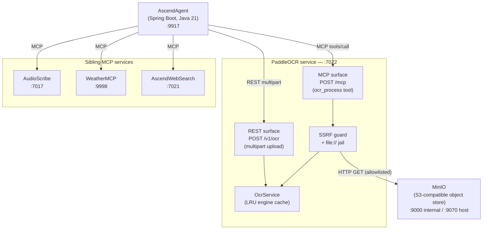
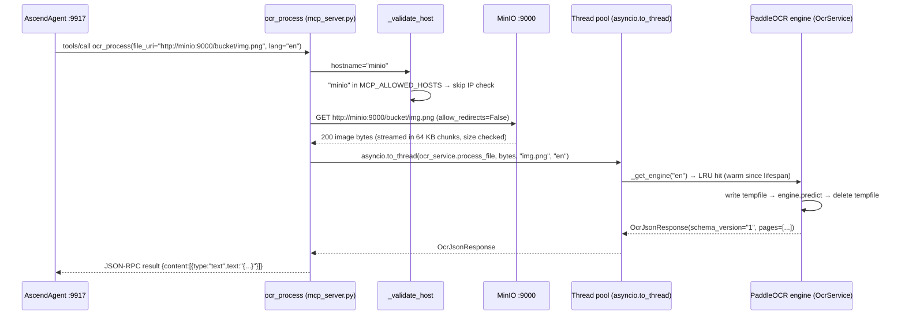

# PaddleOCR — Diagrams

---

### C4 Container diagram

PaddleOCR has no database. Model weights are baked into the container image at build time (`Dockerfile:23`). The only
outbound network call is the MCP tool's URI fetch, which is gated by the SSRF guard.

---

### MCP runtime happy path

If `minio` is not in `MCP_ALLOWED_HOSTS`, `_validate_host` resolves `minio` to a private RFC1918 address and raises
`UnsafeUriError`, returning `{"code":"UNSAFE_URI","detail":"URI is not permitted"}` to the agent. See
[ADR-001](../decisions/ADR-001-mcp-file-transport-uri-only.md).
