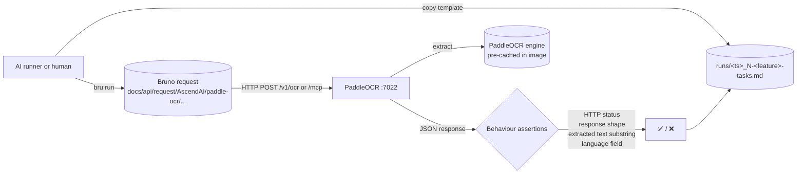

# PaddleOCR: end-to-end capability tests

Manual / AI-runnable e2e suite for the PaddleOCR standalone module. Each test exercises **one OCR capability**
end-to-end against a live PaddleOCR container on port 7022. Assertions are observable behaviour only — HTTP status
codes, response body shape, and extracted text substrings. PaddleOCR holds no persisted state — the only in-process
state is the warmed OCR engine cache, which is initialised at startup and keyed by language. Where a test requires a
cold engine for a previously unseen language, the reset step is to restart the container.

## What's here

```text
PaddleOCR/e2e/
├── README.md                            # this file
├── fixtures/                            # canary images (referenced by the OCR specs)
│   └── README.md
└── testing/                             # numbered specs + templates/ + runs/
    ├── README.md
    ├── 1-invalid-input-test.md          # immutable spec (lowest cost — no model invocation, no fixture)
    ├── 2-ocr-english-test.md
    ├── 3-ocr-polish-test.md
    ├── 4-ocr-default-language-test.md
    ├── 5-mcp-tools-list-test.md
    ├── 6-mcp-ocr-test.md
    ├── templates/                       # run-record templates (immutable), one per spec
    │   ├── README.md
    │   ├── 1-invalid-input-tasks.template.md
    │   ├── 2-ocr-english-tasks.template.md
    │   ├── 3-ocr-polish-tasks.template.md
    │   ├── 4-ocr-default-language-tasks.template.md
    │   ├── 5-mcp-tools-list-tasks.template.md
    │   └── 6-mcp-ocr-tasks.template.md
    └── runs/
        ├── README.md
        └── <UTC-timestamp>_<N>-<feature>-tasks.md   # one per executed test (gitignored)
```

Tests are number-prefixed by setup cost. `1` runs without an OCR model invocation (rejected at the validation layer);
`2`-`4` exercise the REST surface against canary PNGs; `5` is an MCP `tools/list` probe; `6` exercises the MCP
`ocr_process` tool against a container-side file path.

The Bruno collection isn't here. It lives at the **repo root** under
`docs/api/request/AscendAI/paddle-ocr/` so it stays a portable API client artifact. Each spec references the matching
Bruno request file under that path.

## Flow



Every spec follows the same template:

1. **What this verifies.** Bullet list of behaviours.
2. **Prerequisites.** Concrete check commands the runner executes before starting. Each command is its own code
   block; the prose around it states what success looks like.
3. **Reset state.** One command per code block, executed in order, to wipe state so the test is reproducible. Most
   PaddleOCR tests do not need reset; OCR is stateless except for the warmed engine cache populated at startup.
4. **Run.** One or more numbered steps. Each step is a single Bruno CLI invocation (or a `curl` MCP handshake for
   tests that hit `/mcp`). Steps wait for HTTP 200 before continuing.
5. **Expected.** Observable behaviour only: HTTP status, response JSON shape, extracted text substring matches, the
   echoed `language` value, the populated `pages[*].lines[*].text` content. No log substrings.
6. **Fixtures.** Paths to local files the test reads. OCR specs all reference fixtures under
   [`PaddleOCR/e2e/fixtures/`](fixtures/).

The paired `templates/<N>-<feature>-tasks.template.md` is the runner's checklist for one execution: prerequisites,
reset state, run steps, expected, verdict, plus **Result summary** (with **Input tokens**, **Output tokens**, **Time**
fields) and **Additional tasks I did** (anything done outside the spec). The runner copies the template from
[testing/templates/](testing/templates/) into [testing/runs/](testing/runs/) as
`<UTC-timestamp>_<N>-<feature>-tasks.md` and fills it in.

## Parallelism and execution order

PaddleOCR holds no per-user state — only the warmed-engine cache keyed by language code. The two execution constraints:

| Constraint | Tests | Why |
| :--- | :--- | :--- |
| **Cold engine for new language** | none today | All shipped models (`en`, `pl`) are pre-cached at image build time and warmed at startup; the first call for a known language does not pay an engine-load cost. Add a reset row here if a future test exercises a language outside the pre-cached set. |
| **No cross-test interference** | 1-6 | OCR is read-only against the on-disk model files and writes no persisted state. Tests can run in any order, in parallel or serial. |

Recommended layout: run test 1 first (no model invocation, fail-fast on validator bugs), then tests 2-6 in parallel
or sequential. Order inside 2-6 does not matter.

## Prerequisites before any test

1. Docker compose stack up: `docker compose up -d --build paddle-ocr` (or include in the full `ascend-ai` stack).
2. `curl -fsS http://localhost:7022/health` returns HTTP 200 with `{"status":"ok",...}`.
3. Bruno CLI installed: `bru --version` returns a version string. Install once with `npm install -g @usebruno/cli`.
4. Canary fixtures present under `PaddleOCR/e2e/fixtures/` (see [`fixtures/README.md`](fixtures/README.md) for the
   generation recipe). Tests 2-4 and 6 fail without them.

If the PaddleOCR startup log shows the warmup step failed for the default language, fix that before running the suite
— every OCR call will otherwise pay an engine-load cost on the first hit.

## Running tests

Install Bruno CLI once.

```powershell
npm install -g @usebruno/cli
```

Run one capability.

```powershell
cd docs/api/request/AscendAI
```

```powershell
bru run "paddle-ocr/testing/ocr-english.yml" --env ascend-local
```

Run the whole suite (Bruno's directory mode).

```powershell
cd docs/api/request/AscendAI
```

```powershell
bru run "paddle-ocr/testing" --env ascend-local
```

## Capability tests

Numbered by setup cost. Easiest first.

| #  | Spec | What it proves |
| :- | :--- | :--- |
| 1  | [testing/1-invalid-input-test.md](testing/1-invalid-input-test.md) | `POST /v1/ocr` without a `files` part is rejected with HTTP 422 by FastAPI's request validation before any OCR engine call. |
| 2  | [testing/2-ocr-english-test.md](testing/2-ocr-english-test.md) | `POST /v1/ocr` with `canary-english.png` and `lang=en` returns HTTP 200 and an `OcrJsonResponse` whose concatenated `pages[*].lines[*].text` contains the canary substring `PIEROGI`. |
| 3  | [testing/3-ocr-polish-test.md](testing/3-ocr-polish-test.md) | `POST /v1/ocr` with `canary-polish.png` and `lang=pl` returns HTTP 200 and the concatenated extracted text contains `pierogi` plus at least one Polish-specific accented character (`ś`, `ż`, `ą`, `ę`, `ć`, `ó`, `ł`, `ń`, `ź`). |
| 4  | [testing/4-ocr-default-language-test.md](testing/4-ocr-default-language-test.md) | `POST /v1/ocr` with `canary-english.png` and NO `lang` field defaults to the server's `DEFAULT_LANGUAGE` (`en` out of the box) and extracts the canary substring. |
| 5  | [testing/5-mcp-tools-list-test.md](testing/5-mcp-tools-list-test.md) | `tools/list` over the MCP transport advertises a tool named `ocr_process` with `file_path` (required) and `lang` (optional) parameters. |
| 6  | [testing/6-mcp-ocr-test.md](testing/6-mcp-ocr-test.md) | `tools/call` for `ocr_process` with a container-visible `file_path` returns a JSON-RPC `result` whose extracted text contains the canary substring. Requires the fixtures volume-mounted into the container. |

## Adding a new test

1. Add the Bruno request(s) under `docs/api/request/AscendAI/paddle-ocr/testing/<request>.yml`.
2. Pick the next number prefix that matches the test's setup cost.
3. Write `testing/<N>-<capability>-test.md` using the template structure (**What this verifies / Prerequisites /
   Reset state / Run / Expected / Fixtures**). Assert behaviour, not logs.
4. Write `testing/templates/<N>-<capability>-tasks.template.md` mirroring the spec's checkboxes, with
   `## Result summary` containing the **Input tokens / Output tokens / Time** fields at the bottom.
5. Add a row to the capability table above.
