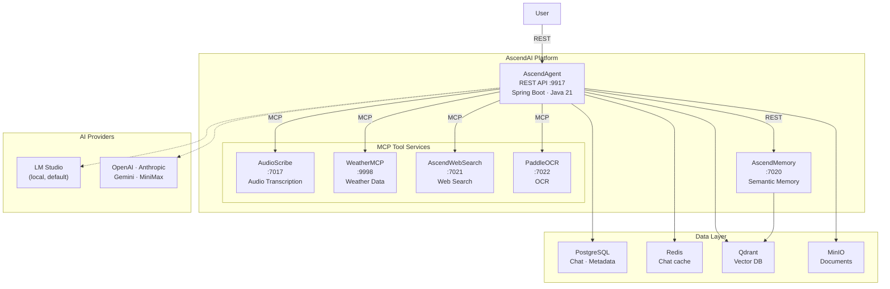
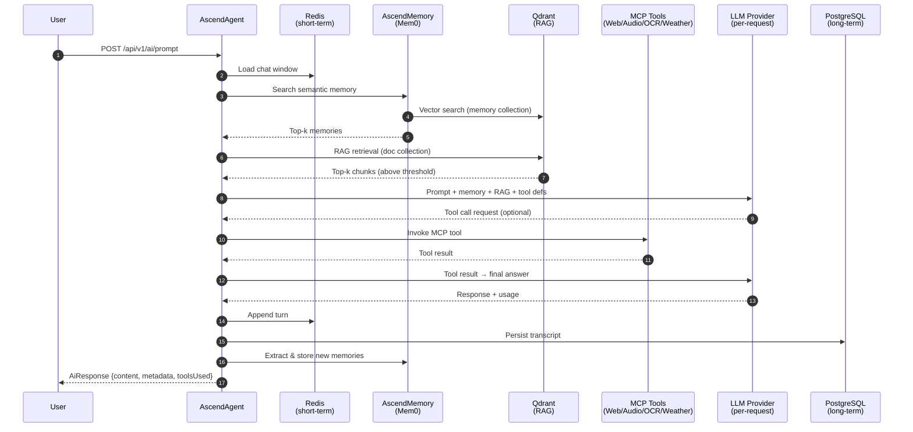

<h1 align="center">AscendAI</h1>

<p align="center">
  <strong>Multi-provider AI orchestrator with MCP, RAG, and semantic memory — built on Spring AI.</strong>
</p>

<p align="center">
  <a href="LICENSE"></a>
  <a href="https://openjdk.org/projects/jdk/21/"></a>
  <a href="https://spring.io/projects/spring-boot"></a>
  <a href="https://spring.io/projects/spring-ai"></a>
  <a href="https://modelcontextprotocol.io/"></a>
  <a href="https://www.python.org/"></a>
  <a href="https://docs.docker.com/compose/"></a>
  <a href="https://github.com/Lukk17/AscendAI/stargazers"></a>
  <a href="https://github.com/Lukk17/AscendAI/commits"></a>
</p>

<p align="center">
  
  
  
  
  
  
  
  
</p>



---

## Table of Contents

- [Why this exists](#why-this-exists)
- [Features](#features)
- [How it compares](#how-it-compares)
- [Demo](#demo)
- [Architecture](#architecture)
- [Quick Start](#quick-start)
- [Supported AI Providers](#supported-ai-providers)
- [Configuration & Ports](#configuration--ports)
- [Documentation](#documentation)

---

## Why this exists

I built AscendAI because off-the-shelf orchestrators don't let you swap providers per-request, run a privacy-respecting search backend you fully control, and persist semantic memory across sessions in a single coherent platform. AscendAI does all three: it routes each prompt to the model you choose at call time (local LM Studio, OpenAI, Anthropic, Gemini, MiniMax), wires in MCP tool servers for audio, web, weather, and OCR, and keeps long-term context in a Mem0-backed Qdrant store so conversations actually accumulate knowledge.

---

## Features

- **Per-request provider routing** — pick LM Studio, OpenAI, Anthropic, Gemini, or MiniMax on every API call without restarts or config changes.
- **RAG pipeline with Qdrant** — thresholded soft-retrieval over ingested documents using provider-matched embedding dimensions (768 / 1536).
- **Semantic memory via Mem0** — long-lived, user-scoped memories searchable across sessions through the AscendMemory service.
- **MCP tool servers** — first-class integrations for audio transcription (AudioScribe), web search (AscendWebSearch + SearXNG), weather (WeatherMCP), and OCR (PaddleOCR).
- **Document ingestion to MinIO** — drop files (Markdown, PDF, DOCX) into a bucket and get them parsed via Docling/Unstructured and indexed automatically.
- **Hybrid chat history** — Redis for the active context window, PostgreSQL for durable long-term archives and analytics.
- **Privacy-respecting web** — SearXNG meta-search plus FlareSolverr for Cloudflare-protected pages, all self-hosted.

---

## How it compares

The honest peer set is other **deployable AI orchestration backends** that bundle multi-provider routing, RAG, memory, and tools into one self-hosted service. Not chat UIs, not low-code workflow builders, not pure router proxies, not libraries. All four below are mature and well-known in this niche.

|                              | **AscendAI**            | [R2R][r2r]            | [Letta][letta]         | [Onyx][onyx]          | [Quivr][quivr]         | [LangChain][langchain]  |
| ---------------------------- | ----------------------- | --------------------- | ---------------------- | --------------------- | ---------------------- | ----------------------- |
| Shape                        | Deployable service      | Deployable service    | Deployable service     | Deployable service    | Deployable service     | Library / framework     |
| Stack                        | Java 21 / Spring AI     | Python                | Python                 | Python                | Python                 | Python (TS port)        |
| API-first (no UI shipped)    | Yes                     | Yes                   | Yes (server on `:8283`)| UI bundled, API-driven| UI bundled, API exposed| N/A — you build it      |
| Per-request provider switch  | Built-in                | Built-in              | Built-in               | Built-in              | Built-in               | Possible via chain rebuild |
| RAG over uploaded docs       | Built-in (Qdrant + threshold) | Built-in (multimodal, hybrid, KGs) | Lighter, agent-state focused | Built-in (40+ connectors) | Built-in (pluggable stores) | Many backends, you wire it |
| Persistent semantic memory   | Mem0 + Qdrant           | Add-on                | Native (OS-style hierarchical) | Add-on        | Built-in               | Roll-your-own           |
| Tool integration model       | MCP-native (Spring AI MCP client) | Function tools  | Function tools        | Function tools + connectors | Function tools  | Tools + MCP via adapters |
| Single docker compose deploy | Yes                     | Yes                   | Yes                    | Yes                   | Yes                    | Bring-your-own          |

[r2r]: https://github.com/SciPhi-AI/R2R
[letta]: https://github.com/letta-ai/letta
[onyx]: https://github.com/onyx-dot-app/onyx
[quivr]: https://github.com/QuivrHQ/quivr
[langchain]: https://github.com/langchain-ai/langchain

LangChain isn't strictly a peer — it's a framework, not a deployable service. It's in the table because it's the most likely thing readers reach for when they think "AI orchestration", and the honest answer is "if you're already wiring your own service in LangChain, you don't need AscendAI."

### Where AscendAI is honestly distinctive

- **JVM-native.** Every credible peer in this niche is Python or TypeScript. If you live in Spring Boot already, AscendAI drops in alongside the rest of your services without a polyglot deploy.
- **MCP-first tool model.** Onyx and Letta do tool use; AscendAI is built around MCP from day one with multiple bundled MCP servers (audio, OCR, web search, weather). Add new tools by pointing the agent at another MCP server, no code changes.
- **Breadth of integration in one stack.** RAG, semantic memory, MCP tools, multi-provider routing, hot/archive chat history — all present, no add-ons.

### Where it loses

- **No UI.** Onyx and Quivr ship one. AscendAI is a backend you put behind your own client.
- **Smaller community.** All four peers above have more stars, more contributors, more battle testing.
- **RAG depth.** R2R has a more sophisticated RAG pipeline (knowledge graphs, multimodal). AscendAI's RAG is solid but plain.
- **Memory depth.** Letta's memory architecture is more advanced than Mem0-based memory.

If you're already happy in Python with R2R or Letta, you don't need this. AscendAI exists because I wanted these capabilities in a Spring-native deployment.

---

## Demo

Send a prompt with per-request provider and model selection. The endpoint accepts `multipart/form-data` (so you can attach an optional `image` or `document`):

```bash
curl -X POST http://localhost:9917/api/v1/ai/prompt \
  -H "X-User-Id: luksarna" \
  -F "prompt=Summarize my notes on Spring AI and MCP." \
  -F "provider=anthropic" \
  -F "model=claude-sonnet-4-6" \
  -F "embeddingProvider=lmstudio"
```

Sample response (`AiResponse` — `content` plus an unwrapped Spring AI `ChatResponseMetadata` and the list of MCP tools invoked during the turn):

```json
{
  "content": "Your notes describe AscendAI as a Spring AI orchestrator that routes prompts across providers and uses MCP for tool calls. Per-request model selection happens via /api/v1/ai/prompt; RAG runs over Qdrant collections (ascendai-768 / -1536); semantic memory is backed by Mem0…",
  "id": "msg_01ABcDEf…",
  "model": "claude-sonnet-4-6",
  "usage": { "promptTokens": 1842, "completionTokens": 312, "totalTokens": 2154 },
  "toolsUsed": ["ascend_memory_search", "web_search"]
}
```

---

## Architecture

📐 **[Monorepo Architecture](docs/architecture/README.md)** — system overview, service interactions, deployment, ADRs.

📐 **[AscendAgent Internals](AscendAgent/docs/architecture/arc42/01-introduction-and-goals.md)** — arc42 documentation, component diagrams, module ADRs.

| Module              | Stack                  | Port | Role                                              |
| ------------------- | ---------------------- | ---- | ------------------------------------------------- |
| **AscendAgent**     | Java 21 / Spring Boot  | 9917 | API gateway, multi-provider AI, RAG, MCP client   |
| **AudioScribe**     | Python / FastMCP       | 7017 | Audio transcription (Whisper / OpenAI / HF)       |
| **AscendWebSearch** | Python / FastMCP       | 7021 | Web search & scraping via SearXNG                 |
| **AscendMemory**    | Python / FastAPI       | 7020 | Semantic memory (Mem0 + Qdrant)                   |
| **WeatherMCP**      | Java / Spring Boot     | 9998 | Weather data MCP server                           |
| **PaddleOCR**       | Python / FastMCP       | 7022 | OCR service                                       |

### Request flow

How a single prompt traverses the platform:



---

## Quick Start

### Prerequisites

- Docker Desktop
- Java 21
- PostgreSQL on `5432`, Redis on `6379`, Qdrant on `6333`/`6334`, MinIO on `9070`/`9071` (`admin` / `password`)

### Run it

**1. Bring up the stack** (full 10-container stack via `include:`):

```bash
docker compose up -d --build
```

```powershell
docker compose up -d --build
```

Optional — bring up only the web-scraping stack as its own Docker Desktop group:

```bash
docker compose -f ascend-scrapper.docker-compose.yaml up -d --build
```

**2. Ensure PostgreSQL has the `ascend_ai` database** (user `postgres`, password `local`).

**3. Start the AscendAgent**:

```bash
cd AscendAgent && ./gradlew bootRun
```

```powershell
cd AscendAgent ; ./gradlew bootRun
```

On first start the agent creates the MinIO `knowledge-base` bucket and initialises metadata tables. The API is then available at [http://localhost:9917](http://localhost:9917) — see the startup banner for live status of every dependency.

For advanced compose flags, per-service rebuilds, and production notes see **[docs/DEPLOYMENT.md](docs/DEPLOYMENT.md)**. For document ingestion see **[docs/INGESTION.md](docs/INGESTION.md)**.

---

## Supported AI Providers

Per-request selection across:

- **OpenAI** — gpt-5.4, gpt-5.1, gpt-5-mini, gpt-4o, gpt-4o-mini
- **Anthropic** — claude-opus-4-6, claude-sonnet-4-6, claude-sonnet-4-5, claude-haiku-4-5
- **Gemini** — gemini-3.1-pro, gemini-3.1-flash, gemini-2.5-pro, gemini-2.5-flash
- **MiniMax** — MiniMax-M2.5, MiniMax-M2.5-highspeed, MiniMax-M2.1
- **LM Studio** — meta-llama-3.1-8b-instruct (default, local)

---

## Configuration & Ports

### AscendAI services

Each service ships both REST and MCP surfaces (except WeatherMCP, MCP-only). The "Used by AscendAgent via" column shows the actual transport AscendAgent uses today; the other surface is available for direct external use.

| Service             | Port    | Surfaces        | Used by AscendAgent via | Role                                                                |
| :------------------ | :------ | :-------------- | :---------------------- | :------------------------------------------------------------------ |
| **AscendAgent**     | `9917`  | REST            | —                       | API gateway / orchestrator. `POST /api/v1/ai/prompt` is the entry. |
| **AscendMemory**    | `7020`  | REST + MCP      | REST                    | Semantic memory store (Mem0 + Qdrant). Search/insert per-user.     |
| **AudioScribe**     | `7017`  | REST + MCP      | MCP (Streamable HTTP)   | Speech-to-text (faster-whisper / OpenAI / HF / Audacity merge).    |
| **AscendWebSearch** | `7021`  | REST + MCP      | MCP (Streamable HTTP)   | Web search + content extraction (SearXNG → Cloudflare → NoVNC).    |
| **PaddleOCR**       | `7022`  | REST + MCP      | MCP (Streamable HTTP)   | Image OCR.                                                         |
| **WeatherMCP**      | `9998`  | MCP only (SSE)  | MCP (SSE)               | Weather data tool (reference Spring AI MCP server).                |

### Support services (in-stack, deployed via compose)

| Service                 | Port    | Default credentials | Role                                                       |
| :---------------------- | :------ | :------------------ | :--------------------------------------------------------- |
| **SearXNG**             | `9020`  | –                   | Privacy-respecting meta-search; backend for AscendWebSearch.|
| **FlareSolverr**        | `8191`  | –                   | Cloudflare bypass proxy used by AscendWebSearch.           |
| **Docling Serve**       | `5001`  | –                   | PDF/DOCX → structured JSON (used by ingestion pipeline).   |
| **Unstructured API**    | `9080`  | –                   | Generic document parsing fallback for ingestion.           |

### External prerequisites (not in compose — managed/cloud in production)

| Service                 | Port            | Default credentials  | Role                                                        |
| :---------------------- | :-------------- | :------------------- | :---------------------------------------------------------- |
| **PostgreSQL**          | `5432`          | `postgres` / `local` | Chat-history archive, ingestion metadata, user instructions.|
| **Redis**               | `6379`          | –                    | Short-term chat-history cache, session state.               |
| **Qdrant**              | `6333` / `6334` | –                    | Vector DB for RAG (`ascendai-768/1536`) and Mem0 memory.    |
| **MinIO**               | `9070` / `9071` | `admin` / `password` | S3-compatible object store for ingested documents.          |

---

## Documentation

- **[Monorepo architecture](docs/architecture/README.md)** — system view, ADRs, deployment topology.
- **[AscendAgent arc42](AscendAgent/docs/architecture/arc42/01-introduction-and-goals.md)** — internals, component diagrams.
- **[Deployment](docs/DEPLOYMENT.md)** — Docker Compose recipes, image publishing, prod notes.
- **[Document ingestion](docs/INGESTION.md)** — upload flows for the RAG pipeline.
- **[End-to-end testing](AscendAgent/e2e/README.md)** — capability tests, fixtures, and the Bruno collection at `docs/api/request/AscendAI/`.
- **[Troubleshooting](docs/TROUBLESHOOTING.md)** — Qdrant / MinIO / PostgreSQL / Redis reset recipes.
- **[Agent tooling & OpenSpec](docs/AGENT_TOOLING.md)** — agent-standards import, OpenSpec workflow.

---

## License

Released under the [MIT License](LICENSE).
