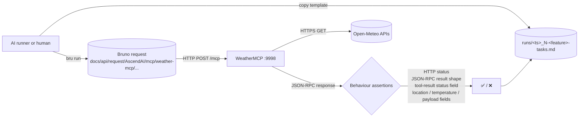

# WeatherMCP: end-to-end capability tests

Manual / AI-runnable e2e suite for the WeatherMCP standalone module. Each test exercises **one MCP tool** end-to-end
against a live WeatherMCP container on port 9998. Assertions are observable behaviour only — HTTP status codes,
JSON-RPC response body shape and content. The only persisted state WeatherMCP holds is the in-process Caffeine cache;
it has no database, no Redis, no Qdrant, no MinIO. Where a test requires a cold cache, the reset step is to restart
the container.

## What's here

```text
WeatherMCP/e2e/
├── README.md                            # this file
├── fixtures/                            # canary inputs (none today; WeatherMCP tools take string args, not files)
│   └── README.md
└── testing/                             # numbered specs + templates/ + runs/
    ├── README.md
    ├── 1-invalid-input-test.md          # immutable spec (lowest cost — no internet egress)
    ├── 2-current-structured-contract-test.md
    ├── 3-current-city-not-found-test.md
    ├── 4-forecast-happy-path-test.md
    ├── 5-air-quality-happy-path-test.md
    ├── 6-geocode-multiple-candidates-test.md
    ├── 7-current-country-code-disambiguation-test.md
    ├── templates/                       # run-record templates (immutable), one per spec
    │   ├── README.md
    │   ├── 1-invalid-input-tasks.template.md
    │   ├── 2-current-structured-contract-tasks.template.md
    │   ├── 3-current-city-not-found-tasks.template.md
    │   ├── 4-forecast-happy-path-tasks.template.md
    │   ├── 5-air-quality-happy-path-tasks.template.md
    │   ├── 6-geocode-multiple-candidates-tasks.template.md
    │   └── 7-current-country-code-disambiguation-tasks.template.md
    └── runs/
        ├── README.md
        └── <UTC-timestamp>_<N>-<feature>-tasks.md   # one per executed test (gitignored)
```

Tests are number-prefixed by setup cost. `1` runs offline; `2`-`6` need outbound HTTPS to `*.open-meteo.com`; `7`
additionally requires a WeatherMCP container restart to clear the geocoding cache between two probes.

The Bruno collection isn't here. It lives at the **repo root** under
`docs/api/request/AscendAI/mcp/weather-mcp/` so it stays a portable API client artifact. Each spec references the
matching Bruno request file under that path.

## Flow



Every spec follows the same template:

1. **What this verifies.** Bullet list of behaviours.
2. **Prerequisites.** Concrete check commands the runner executes before starting. Each command is its own code
   block; the prose around it states what success looks like.
3. **Reset state.** One command per code block, executed in order, to wipe state so the test is reproducible. Most
   WeatherMCP tests do not need reset; tests that need a cold cache restart the container.
4. **Run.** One or more numbered steps. Each step is a single Bruno CLI invocation. Steps wait for HTTP 200 before
   continuing.
5. **Expected.** Observable behaviour only: HTTP status, JSON-RPC `result` payload shape, the structured
   `WeatherToolStatus` value, the populated / null fields per status. No log substrings.
6. **Fixtures.** Paths to local files the test reads (none for the current suite).

The paired `templates/<N>-<feature>-tasks.template.md` is the runner's checklist for one execution: prerequisites,
reset state, run steps, expected, verdict, plus **Result summary** (with **Input tokens**, **Output tokens**, **Time**
fields) and **Additional tasks I did** (anything done outside the spec). The runner copies the template from
[testing/templates/](testing/templates/) into [testing/runs/](testing/runs/) as
`<UTC-timestamp>_<N>-<feature>-tasks.md` and fills it in.

## Parallelism and execution order

WeatherMCP holds no per-user state — only the in-process Caffeine cache keyed by tool arguments. The two execution
constraints:

| Constraint | Tests | Why |
| :--- | :--- | :--- |
| **Cold cache required** | 7 | Test 7 (country-code disambiguation) makes two calls for `Warsaw` with different `countryCode` parameters; both share the geocoding cache key prefix `warsaw\|`. To prove disambiguation works rather than cache-warm artefact, the container must be restarted between the two probes — or the two probes must run before either populates the cache. The spec restarts the container. |
| **No cross-test interference** | 1-6 | All other tests are read-only against Open-Meteo and write only to the cache. They can run in any order, in parallel or serial. |

Recommended layout: run test 1 first (offline, fail-fast on validator bugs without burning egress), then tests 2-6
in parallel or sequential, then test 7 last (because the restart it requires clears caches built up by 2-6).

## Prerequisites before any test

1. Docker compose stack up: `docker compose up -d --build weather-mcp` (or include in the full `ascend-ai` stack).
2. `curl -fsS http://localhost:9998/actuator/health` returns HTTP 200 with `{"status":"UP"}`.
3. Bruno CLI installed: `bru --version` returns a version string. Install once with `npm install -g @usebruno/cli`.

If the WeatherMCP startup readiness banner shows any `[FAILED]` rows under `External services`, fix the upstream
connectivity before running the suite.

## Running tests

Install Bruno CLI once.

```powershell
npm install -g @usebruno/cli
```

Run one capability.

```powershell
cd docs/api/request/AscendAI
```

```powershell
bru run "mcp/weather-mcp/current-warsaw.yml" --env ascend-local
```

Run the whole suite (Bruno's directory mode).

```powershell
cd docs/api/request/AscendAI
```

```powershell
bru run "mcp/weather-mcp" --env ascend-local
```

## Capability tests

Numbered by setup cost. Easiest first.

| #  | Spec | What it proves |
| :- | :--- | :--- |
| 1  | [testing/1-invalid-input-test.md](testing/1-invalid-input-test.md) | `InputValidator` short-circuits blank, CRLF-injected, and over-length city values before any upstream call. No Open-Meteo egress required. |
| 2  | [testing/2-current-structured-contract-test.md](testing/2-current-structured-contract-test.md) | `tools/list` advertises `weather.current` with the documented schema; a call for Warsaw returns `status="ok"` plus structured `location` / `temperature` / `wind` / `weatherCode` fields. |
| 3  | [testing/3-current-city-not-found-test.md](testing/3-current-city-not-found-test.md) | An impossible city name returns `status="city_not_found"`, the verbatim input in `requestedQuery`, fixed string `"Location not found"` in `message`, all payload fields null. |
| 4  | [testing/4-forecast-happy-path-test.md](testing/4-forecast-happy-path-test.md) | `weather.forecast` with `days=3` returns 3 daily entries, ISO dates strictly increasing, numeric max/min temperature, integer weather code. |
| 5  | [testing/5-air-quality-happy-path-test.md](testing/5-air-quality-happy-path-test.md) | `weather.airQuality` for Warsaw returns numeric AQI + PM fields, location matches Warsaw / PL, source `"open-meteo"`. |
| 6  | [testing/6-geocode-multiple-candidates-test.md](testing/6-geocode-multiple-candidates-test.md) | `weather.geocode` for `"Springfield"` with `limit=5` returns ≥3 entries with distinct lat/lon, at least one US candidate. |
| 7  | [testing/7-current-country-code-disambiguation-test.md](testing/7-current-country-code-disambiguation-test.md) | `Warsaw` with no `countryCode` resolves to Poland (PL, ~52.23°N); the same `Warsaw` with `countryCode="US"` resolves to a US Warsaw (~41.24°N for Warsaw, IN) with distinct `latitude` band. |

## Adding a new test

1. Add the Bruno request(s) under `docs/api/request/AscendAI/mcp/weather-mcp/<request>.yml`.
2. Pick the next number prefix that matches the test's setup cost.
3. Write `testing/<N>-<capability>-test.md` using the template structure (**What this verifies / Prerequisites /
   Reset state / Run / Expected / Fixtures**). Assert behaviour, not logs.
4. Write `testing/templates/<N>-<capability>-tasks.template.md` mirroring the spec's checkboxes, with
   `## Result summary` containing the **Input tokens / Output tokens / Time** fields at the bottom.
5. Add a row to the capability table above.
