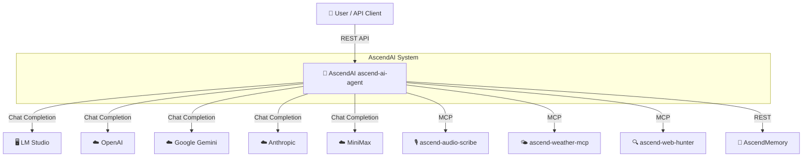

# C4 Context Diagram (Level 1)

The ascend-ai-agent is the central component. It receives user prompts, routes them to the selected AI provider, and
invokes MCP tools as needed. AscendMemory provides semantic user context via direct REST.
