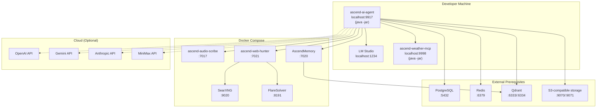

# Deployment Diagram

In development, the ascend-ai-agent and ascend-weather-mcp run directly on the host JVM. PostgreSQL, Redis, Qdrant, and
S3-compatible object storage (provided locally by a self-hosted emulator) are external prerequisites that must be running before
starting docker-compose (in production these map to managed cloud services, with Amazon S3 in its place).
Application and support services (ascend-audio-scribe, ascend-web-hunter, AscendMemory, SearXNG, FlareSolverr) run in Docker
Compose. Cloud AI providers are optional (dashed lines), only accessed when their provider is enabled and selected.
