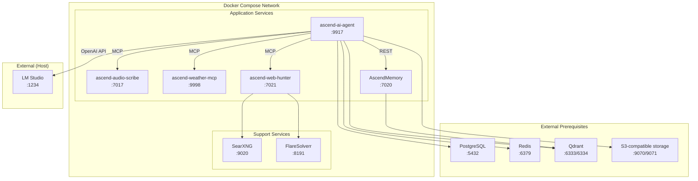

# 7. Deployment View

---

### Docker Compose topology

---

### Service port map

| Service           | Port(s)                       | Protocol      | Notes                                                   |
| :---------------- | :---------------------------- | :------------ | :------------------------------------------------------ |
| ascend-ai-agent       | 9917                          | HTTP          | Main API gateway.                                       |
| LM Studio         | 1234                          | HTTP          | Local LLM, runs on host, not in Docker.                 |
| ascend-audio-scribe       | 7017                          | HTTP          | MCP server for audio transcription.                     |
| ascend-weather-mcp | 9998                          | HTTP          | MCP server for weather data.                            |
| ascend-web-hunter   | 7021                          | HTTP          | MCP server for web search.                              |
| AscendMemory      | 7020                          | HTTP          | REST API for semantic memory.                           |
| PostgreSQL        | 5432                          | TCP           | Relational database (external prerequisite).            |
| Redis             | 6379                          | TCP           | Cache (external prerequisite).                          |
| Qdrant            | 6333 (HTTP), 6334 (gRPC)      | HTTP / gRPC   | Vector database (external prerequisite).                |
| S3-compatible storage | 9070 (API), 9071 (UI)      | HTTP          | Object storage (external prerequisite), provided locally by a self-hosted emulator and by Amazon S3 in production. |
| SearXNG           | 9020                          | HTTP          | Meta search engine.                                     |
| FlareSolverr      | 8191                          | HTTP          | Cloudflare bypass proxy.                                |

---

### Infrastructure requirements

- **Docker Engine** 24+ with Compose V2.
- **Java 21+** for ascend-ai-agent and ascend-weather-mcp (run outside Docker during dev).
- **Python 3.11+** for ascend-audio-scribe, ascend-web-hunter, AscendMemory.
- **LM Studio** installed on host for local LLM inference.
- **External prerequisites.** PostgreSQL, Redis, Qdrant, and S3-compatible object storage must be running before
  starting docker-compose. In production these map to managed cloud services.
