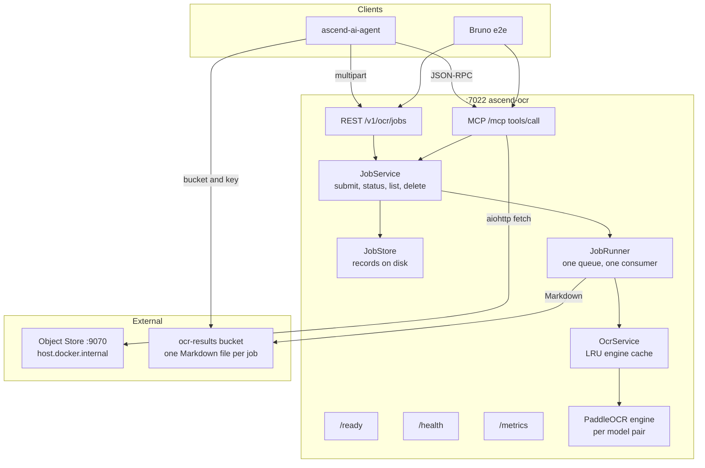

# ascend-ocr Service

*OCR microservice for AscendAI. FastAPI REST and FastMCP tool on the same port, with multi-language PaddleOCR
backing both.*


---

### What this is

ascend-ocr wraps the [PaddleOCR](https://github.com/PaddlePaddle/PaddleOCR) library behind two API surfaces on
port `7022`. The REST surface accepts multipart uploads. The MCP surface accepts URIs (http, https, or jailed
`file://`). Both offer the same four operations over the same queue: submit a document, read the state of the work,
list what is in flight, and stop it. The service is consumed by [ascend-ai-agent](../ascend-ai-agent/AGENTS.md),
which routes prompts that need text extraction from images or PDFs.

**Every request is a job.** A submission is answered immediately with an identifier, never with the document's text,
whatever the document's length. The caller polls the state, and a successful reading leaves one Markdown file in
S3-compatible object storage, whose address the state carries. Nothing holds a connection open while a document is
read, so no work is ever lost to a caller that went away.

The service runs models locally. Warm-up happens during FastAPI lifespan: the engine for `DEFAULT_LANGUAGE` is loaded
before `/ready` returns `status=ready`. The Docker `HEALTHCHECK` probes `/health` (liveness), so the orchestrator does
not mark the container healthy until the process is responsive.

---

### Tech stack

Runtime pins live in [pyproject.toml](pyproject.toml). The shape is:

- Python 3.11 (the only version with full PaddlePaddle wheel coverage today)
- FastAPI 0.136.3, Uvicorn 0.48.0, FastMCP 3.3.1
- PaddlePaddle 3.3.1, PaddleOCR 3.7.0, Pillow 12.2.0
- aiohttp 3.13.5 + aiofiles 25.1.0 for the MCP URL fetch
- slowapi 0.1.9 for per-IP rate limiting
- prometheus-fastapi-instrumentator 8.0.0, opentelemetry-sdk 1.42.1 for metrics and traces
- python-json-logger 4.1.0 for structured logs
- Pydantic 2.13.4 with pydantic-settings 2.14.1 for typed configuration

Dev tooling: pytest 9.0.3, pytest-asyncio 1.4.0, pytest-cov 7.1.0, ruff 0.15.15, mypy 2.1.0, mutmut 3.5.0,
pact-python 3.4.0.

---

### Quick start

If you opened the project in IntelliJ (or VS Code with the Python extension), the venv already exists at
[.venv/](.venv/). Use it directly. The commands below assume Windows PowerShell 7+.

Activate the venv. PowerShell may block the activation script with an execution-policy error on first use; the bypass
applies only to the current process:

```powershell
Set-ExecutionPolicy -ExecutionPolicy Bypass -Scope Process
```

```powershell
.\.venv\Scripts\activate.ps1
```

Install the project plus dev extras into the venv. First install is 5 to 10 minutes because PaddlePaddle pulls
roughly 3 GB of wheels:

```powershell
python -m pip install -e ".[dev]"
```

Run the dev server with auto-reload:

```powershell
python -m uvicorn src.main:app --host 0.0.0.0 --port 7022 --ws none --reload
```

Hit the readiness probe to wait until the default-language engine is warm:

```powershell
curl.exe -fsS http://localhost:7022/ready
```

Submit a document once `/ready` returns `status=ready`. The answer is a job identifier, not the text:

```powershell
curl.exe -fsS -F "file=@e2e/fixtures/argent-saga-chronicles-page1.png" -F "lang=en" http://localhost:7022/v1/ocr/jobs
```

Read the state, and collect the result from the address it carries once the state is `succeeded`. The whole path is
in "Reading a document" below.

**Linux / macOS users**: create the venv with `python3.11 -m venv .venv`, activate with `source .venv/bin/activate`,
then the same `python -m pip install`, `python -m uvicorn`, and `curl` commands above (drop the `.exe` suffix on
`curl`).

**No-activate alternative** that IntelliJ's Run button uses under the hood. Call the venv interpreter directly,
nothing touches your shell:

```powershell
.\.venv\Scripts\python.exe -m pip install -e ".[dev]"
```

```powershell
.\.venv\Scripts\python.exe -m uvicorn src.main:app --host 0.0.0.0 --port 7022 --ws none --reload
```

---

### Architecture



The REST endpoints and the MCP tools both delegate to one `JobService` in
[src/service/job_service.py](src/service/job_service.py), so neither surface has a guard, a state or a bound the
other does not. A submission is checked, written to the jobs directory and queued. The `JobRunner` in
[src/service/job_runner.py](src/service/job_runner.py) is the single consumer of that queue and the only caller of
`dispatch_ocr_request` in [src/service/ocr_service.py](src/service/ocr_service.py), which admits the document onto a
gate sized to `OCR_WORKER_COUNT`, dispatches it to the process pool with its own reading budget, and replaces the
pool if a worker does not stop in time. Engine calls run in that `ProcessPoolExecutor`, not a thread, because
`PaddleOCR.predict()` holds the interpreter lock long enough to stall the event loop if it ran there instead. That
keeps `/health`, `/ready`, `/metrics` and every status read responsive while inference is in flight. The MCP path has
an SSRF guard on `http(s)://` URIs and a `realpath` jail on `file://` URIs; see
[ADR-001](docs/architecture/decisions/ADR-001-mcp-file-transport-uri-only.md) for the policy.

**Reading budgets and memory.** A document's reading budget is its pages times the page allowance of the engine that
reads it, `OCR_PAGE_ALLOWANCE_HEADROOM` times that engine's worst measured page (112.95 s on the small pair every
supported language reads with, 4.5 times a dense Polish A4 prose page measured at 25.1 s with the engine's threads capped
to the container's CPUs, where the earlier 50.4 s was measured with PaddleOCR's 10 threads throttled under 4 CPUs), counted from the
moment the runner picks it up rather than from when it was submitted, and the worker checks it between pages and
stops itself rather than being abandoned. Time spent waiting in the queue is not charged against it, because no
caller is holding a connection and the wait is bounded separately by `OCR_JOB_QUEUE_MAX_PAGES`. Memory was measured
in a Linux container with 4 CPUs as the cgroup's peak, the worst of three runs each, on the `PP-OCRv6_small` pair.
One `high` mode call peaks at 1016 MiB on an A4 page and 1236 MiB on the largest page the mode supports, 4200 x 4200
px. One `normal` mode call peaks at 858 MiB on its largest page, 2100 x 2100 px. A straightened photo is the costliest
call a caller can ask for, 2771 MiB at worst. A loaded engine holds about 333 MiB, and the API process at rest 259 MiB.
Each page of a document adds roughly 11.5 MiB of retained result on top, a term carried forward from a fit against
the previous detector and not yet re-measured. An earlier figure of about 440 MB per page was wrong, because the probe
that produced it sampled memory at intervals and missed the peak. See [ADR-010](docs/architecture/decisions/ADR-010-quality-modes-and-service-side-rendering.md) and
[ADR-006](docs/architecture/decisions/ADR-006-detector-input-bound.md) for the derivation and the accuracy trade the
detector bound makes. The older fitted model, fitted on `PP-OCRv5_server_det` under PaddleOCR 3.6.0, runs 22 to 41
percent above the container measurement of that detector and eleven to fifteen times above the small pair. The startup banner prices each engine in both quality modes from
these measurements, plain and straightened, labels every line measured or fitted, and keeps the fitted model only for
a pair or an input nobody has measured. At the shipped defaults it reports 2859 MiB for one straightened call and
3118 MiB for the whole service with the API process, under the 4 GiB container limit.
See "Memory model and the single worker" in
[07-deployment-view.md](docs/architecture/arc42/07-deployment-view.md).

**Which models run.** The service names its detection and recognition models rather than letting the library pick
one per language: `OCR_TEXT_DETECTION_MODEL` and `OCR_TEXT_RECOGNITION_MODEL`, defaulting to `PP-OCRv6_small_det`
and `PP-OCRv6_small_rec`. That one pair reads every supported language, and the engine cache is keyed by the pair
rather than by the language, so the second language to arrive on a pair costs nothing. `ru` and `korean` are switched
off for now, see Known reading limits below. [ADR-007](docs/architecture/decisions/ADR-007-explicit-ocr-model-selection.md)
records the family, the member, and why the choice is explicit.

---

### Endpoints

| Method | Path                    | Purpose                                                                 |
| :----- | :---------------------- | :---------------------------------------------------------------------- |
| GET    | /health                 | Liveness probe. Always 200 when the process is up.                      |
| GET    | /ready                  | Readiness probe. 200 with `status=ready` once the default lang is warm and the service is accepting work (`accepting_work`, `jobs_queued` and `jobs_running` in the body - see [ADR-004](docs/architecture/decisions/ADR-004-liveness-readiness-split.md)). |
| GET    | /metrics                | Prometheus exposition for the counters in [src/observability/metrics.py](src/observability/metrics.py). |
| POST   | /v1/ocr/jobs            | Multipart upload with optional `lang`, `quality` (`high`, the default, or `normal`) and `straighten` (`false`, the default, or `true`, see below). 202 with a job identifier and a relative `Location` header, never with page content. |
| GET    | /v1/ocr/jobs            | Everything queued or running, in submission order.                      |
| GET    | /v1/ocr/jobs/{job_id}   | The state of one piece of work, its progress, its poll hint, and the address of its result once it succeeded. |
| DELETE | /v1/ocr/jobs/{job_id}   | Stop work that has not finished, or forget work that has, along with its stored result. 204. |
| POST   | /mcp                    | FastMCP Streamable HTTP transport. Tools `ocr_submit` (`file_uri`, `lang`, `quality`, `straighten`), `ocr_job_status`, `ocr_list_jobs` and `ocr_cancel_job`. |

The error body shape across both surfaces is `{"code": "...", "detail": "..."}`. The nine-code catalog is in
[ADR-002](docs/architecture/decisions/ADR-002-mcp-error-catalog.md), together with the three record-level reasons a
failed job carries, which are never HTTP statuses.

---

### Reading a document

The whole path, against a running container. Nothing below holds a connection open while the document is read.

**1. Submit.** The answer is 202, with `job_id`, where its state can be read, how many pages are ahead of it, and
when to ask again:

```bash
curl -fsS -F "file=@e2e/fixtures/argent-saga-chronicles-page1.png" -F "lang=en" http://localhost:7022/v1/ocr/jobs
```

A phone photo of bent, curled or crumpled paper reads better with `straighten=true`, which flattens the page before it
is read. Pair it with the default `quality=high`, and leave it off for clean scans and PDFs, which it makes worse (see
[ADR-011](docs/architecture/decisions/ADR-011-explicit-preprocessing-and-straighten.md)):

```bash
curl -fsS -F "file=@e2e/fixtures/straightening-photo-crumpled-1.jpg" -F "straighten=true" http://localhost:7022/v1/ocr/jobs
```

**2. Poll.** Wait `poll_after_seconds` between reads. The hint is derived from the work still ahead, is never below
one second, and is never above thirty, so a caller that honours it wakes about ten times across the time the work
ahead is allowed:

```bash
curl -fsS http://localhost:7022/v1/ocr/jobs/$JOB_ID
```

The state is exactly one of five. `waiting` and `running` carry a hint, a `pages_done` count and, while waiting, a
queue position. `succeeded`, `failed` and `cancelled` are terminal and carry no hint at all, so the absence of a hint
is itself the signal that there is nothing left to ask.

**3. Collect.** A successful state carries `result.bucket`, `result.key`, a time-limited `result.url` and the
description that does not grow with the document (`schema_version`, `filename`, `language`, `quality`, `straighten`,
`page_count`, `processing_time_seconds`). A caller that can address the object store fetches the object by bucket and key, which is
what the agent does with its own S3 client. A caller that cannot fetches the URL:

```bash
curl -fsS "$RESULT_URL" -o result.md
```

The object is the document's text and nothing else: one `## Page N` heading per page, then that page's recognised
lines in reading order, one per line. No front matter, because whatever fetches it indexes it as the document's text.

**4. Delete.** One verb for the whole intention: stop the work if it is running, delete its stored result, and forget
it:

```bash
curl -fsS -X DELETE http://localhost:7022/v1/ocr/jobs/$JOB_ID
```

Deleting unfinished work leaves a `cancelled` record that a caller can still read, and answers at once. When the work
was running, the worker reading it is killed and replaced in the background, and `/ready` reports `not-ready` until
the new one is warm. The next document stays queued until that replacement has finished, so it is always read by the
new worker. Deleting finished work removes the
record and the object together, after which the identifier answers 404 like any other unknown one. Everything is
removed anyway once `OCR_JOB_RETENTION_SECONDS` has passed since the work finished, whether or not anyone asks.

**What can go wrong, and what it looks like.** Four refusals arrive as HTTP failures: `QUEUE_FULL` with 503 and a
`Retry-After` header when the queue is at either of its two bounds, `JOB_NOT_FOUND` with 404 for an identifier that
is unknown, expired, or not shaped like one, `UNSUPPORTED_LANGUAGE` with 400 for a `lang` outside
`SUPPORTED_LANGUAGES`, refused before anything is queued and with no identifier, and `FILE_TOO_LARGE` with 400 for a
document past the byte cap, an image frame past the `OCR_MAX_SOURCE_PIXELS` decompression-bomb ceiling, or the
`OCR_JOB_MAX_PAGES` page ceiling. The language refusal's detail lists what the service reads, at the defaults
`Language is not supported. Supported languages: en, pl, de, fr, es, it, pt, nl, ch, japan`, and MCP's `ocr_submit` raises the same detail prefixed `UNSUPPORTED_LANGUAGE: ` before it fetches the URI. An
oversized page is never refused: it is shrunk to the largest size its quality mode supports and read. Three further reasons are not HTTP statuses at all, because
reading a record that says it failed is a successful read: `SERVICE_RESTARTED` when the service stopped while the
work was in flight, `RESULT_STORE_UNAVAILABLE` when the text could not be written to the bucket, and
`LIFETIME_EXCEEDED` when a record was wedged past the longest legitimate wait plus the longest legitimate read. The
first two carry `retryable: true`, because nothing was learned about the document and resubmitting it is exactly
right. `OCR_FAILED` carries `retryable: false`, because the service tried to read this document and could not.
A refusal is logged as one WARNING line naming its code, with no traceback, and only an unexpected failure is logged
at ERROR.

**The worst case the queue promises.** A newly accepted submission starts within the pages ahead of it, each
multiplied by the allowance of the engine that reads it. At the default bounds that is about 6 h 17 min, and about 1 h 24 min at
the worst measured page. Nothing is ever failed for having waited.

---

### Known reading limits

Measured on the container image the memory figures above come from, against pages whose text is known.

- The Spanish inverted exclamation mark is never output. It is not in the `PP-OCRv6_small_rec` alphabet, so a line
  that opens with one is read without it.
- Polish `ź` and `ż` are sometimes swapped for each other.
- A low-resolution photo, 482 x 640 px, reads about 98 percent of its characters but only 10 of its 21 lines exactly.
  The same photo at 1000 px reads 18 of 21 lines exactly and at 1600 px 19 of 21.
- Russian and Korean are not read at all. The `PP-OCRv5_server_det` detector they loaded peaked at 12754 MiB on a
  4200 x 4200 page in `high` mode, above the container limit, so both are off the supported list and a request in
  either is refused at submission with `UNSUPPORTED_LANGUAGE`. Bringing them back on the small detector is an open task in
  [openspec/changes/fix-ocr-page-resolution/tasks.md](../../openspec/changes/fix-ocr-page-resolution/tasks.md).
  See [ADR-011](docs/architecture/decisions/ADR-011-explicit-preprocessing-and-straighten.md).
- A crumpled phone photo reads 17 of 21 lines exactly with `straighten=true` and 14 of 21, with two lines lost,
  without it. End-to-end spec 18 passes at 15 of 21, a threshold the owner accepted for now, and better crumpled-photo
  accuracy is future work tracked in the same tasks file.

---

### Configuration

The full env-var matrix (service, OCR engine, reading budgets and memory bounds, the job queue and its bounds, the
result store, MCP transport, rate limits, OpenTelemetry) is documented in
[docs/CONFIGURATION.md](docs/CONFIGURATION.md). The defaults are safe for a single-instance local run; the
docker-compose service at [compose.yaml](../../compose.yaml) carries the production overrides. `OCR_PAGE_ALLOWANCE_HEADROOM`
is the only configured time input, and every other duration the service enforces is derived from it.

---

### Build, test, and lint

All four commands run cleanly today and are gated in CI at
[.github/workflows/ci.yaml](../../.github/workflows/ci.yaml).

Run the full pytest suite. The configured gate is 100 percent branch coverage:

```bash
python -m pytest
```

The default run includes the contract test, which needs the committed pact file `contracts/pacts/ascend-agent-ascend-ocr.json` at the repository root. For a run without it:

```bash
python -m pytest -m "not contract"
```

Lint and import-sort:

```bash
ruff check .
```

Format check (no rewrite):

```bash
ruff format --check .
```

Static type check on the source tree and the tests:

```bash
mypy src tests
```

Mutation testing against the source. Slow, optional:

```bash
mutmut run
```

---

### Docker

The repo-root [compose.yaml](../../compose.yaml) defines the `ascend-ocr` service with the env
vars, the healthcheck, and resource limits. From the repo root:

Build the image. First build is 5 to 15 minutes because the PaddlePaddle wheels are heavy and the model cache is
prefetched in the builder stage:

```bash
docker build -t ascend-ocr:latest ascend-ocr
```

Start the service through compose:

```bash
docker compose up -d --build ascend-ocr
```

Tail the logs:

```bash
docker logs --tail 80 -f ascend-ocr
```

Force a clean recreate after a Dockerfile or env-var change:

```bash
docker compose up -d --build --force-recreate ascend-ocr
```

---

### e2e tests

Capability specs and Bruno requests are documented separately. [e2e/README.md](e2e/README.md) lists every spec
and the run contract; [e2e/load/README.md](e2e/load/README.md) covers the k6 ramp profile.

Run one Bruno request from the repo root:

```bash
bru run "ocr/ocr.yml" --env ascend-local --root docs/api/request/AscendAI
```

---

### Docs map

Everything below is shipped with the service.

| File                                                                                                     | Audience                                  |
| :------------------------------------------------------------------------------------------------------- | :---------------------------------------- |
| [AGENTS.md](AGENTS.md)                                                                                   | AI coding agents working in the module    |
| [docs/README.md](docs/README.md)                                                                         | Architecture documentation index          |
| [docs/CONFIGURATION.md](docs/CONFIGURATION.md)                                                           | Full env-var matrix and `.env` example    |
| [docs/architecture/decisions/README.md](docs/architecture/decisions/README.md)                           | ADR index                                 |
| [docs/architecture/decisions/ADR-001-mcp-file-transport-uri-only.md](docs/architecture/decisions/ADR-001-mcp-file-transport-uri-only.md) | MCP file transport policy |
| [docs/architecture/decisions/ADR-002-mcp-error-catalog.md](docs/architecture/decisions/ADR-002-mcp-error-catalog.md) | Error code catalog                |
| [docs/architecture/decisions/ADR-003-versioning-strategy.md](docs/architecture/decisions/ADR-003-versioning-strategy.md) | Versioning strategy           |
| [docs/architecture/decisions/ADR-004-liveness-readiness-split.md](docs/architecture/decisions/ADR-004-liveness-readiness-split.md) | Liveness vs readiness split |
| [docs/architecture/decisions/ADR-005-fixed-pdf-render-resolution.md](docs/architecture/decisions/ADR-005-fixed-pdf-render-resolution.md) | Fixed 144 dpi PDF rendering resolution, superseded by ADR-010 |
| [docs/architecture/decisions/ADR-010-quality-modes-and-service-side-rendering.md](docs/architecture/decisions/ADR-010-quality-modes-and-service-side-rendering.md) | Service-side page rendering, the two quality modes, and a page allowance per engine |
| [docs/architecture/decisions/ADR-006-detector-input-bound.md](docs/architecture/decisions/ADR-006-detector-input-bound.md) | Detector input bound and its accuracy trade |
| [docs/architecture/decisions/ADR-007-explicit-ocr-model-selection.md](docs/architecture/decisions/ADR-007-explicit-ocr-model-selection.md) | Explicit detection and recognition model selection |
| [docs/architecture/decisions/ADR-008-every-request-is-a-job.md](docs/architecture/decisions/ADR-008-every-request-is-a-job.md) | Why every request became a job |
| [docs/architecture/decisions/ADR-009-results-in-object-storage.md](docs/architecture/decisions/ADR-009-results-in-object-storage.md) | Why the result lives in object storage |
| [docs/architecture/decisions/ADR-011-explicit-preprocessing-and-straighten.md](docs/architecture/decisions/ADR-011-explicit-preprocessing-and-straighten.md) | Named preprocessing, per-line orientation, and the `straighten` option |
| [docs/architecture/arc42/](docs/architecture/arc42/)                                                     | Twelve-chapter arc42 walkthrough          |
| [docs/architecture/diagrams/container-diagram.md](docs/architecture/diagrams/container-diagram.md)       | C4 container and runtime diagrams         |
| [e2e/README.md](e2e/README.md)                                                                           | e2e contract and capability matrix        |
| [e2e/load/README.md](e2e/load/README.md)                                                                 | Load-profile guide for k6                 |
| [tests/contract/test_ascend_agent_pact.py](tests/contract/test_ascend_agent_pact.py)                     | Pact provider verification against the ascend-agent pact file |

---

### License

MIT. See the top-level [LICENSE](../../LICENSE) at the monorepo root.
