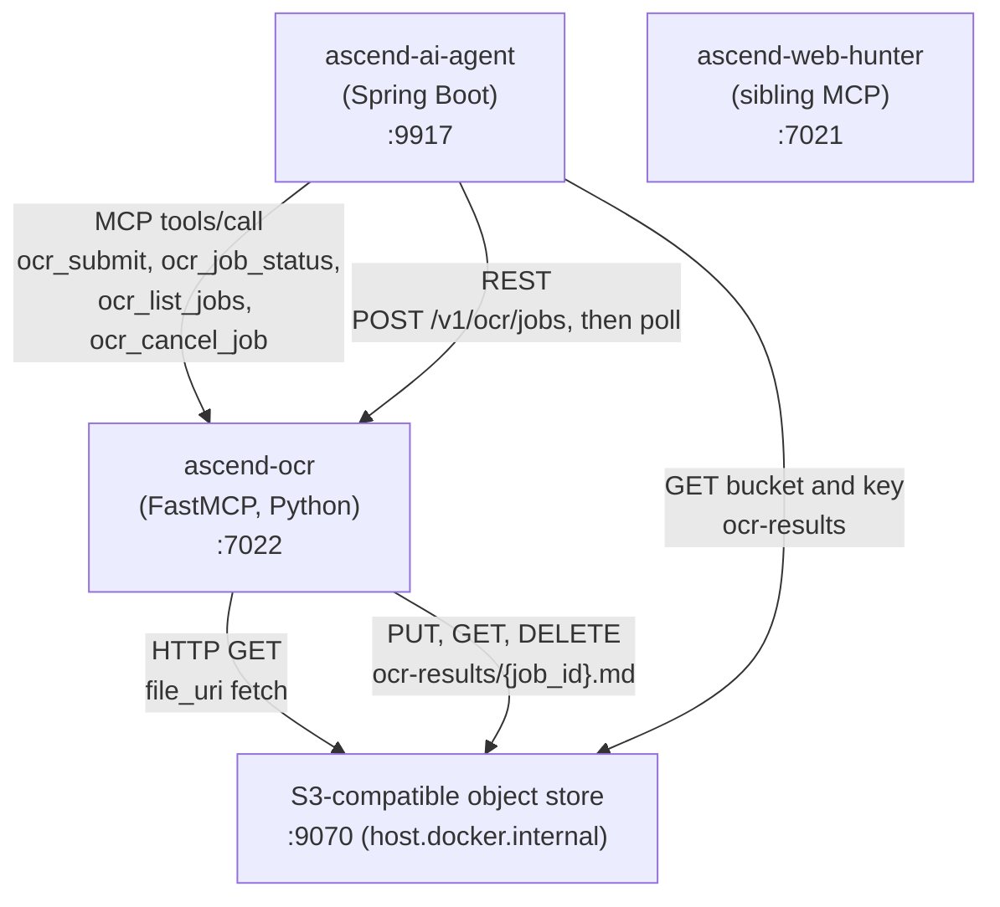

# 3. Context and Scope

---

### System context

---

### External interfaces

| System | Direction | Protocol | Notes |
| :--- | :--- | :--- | :--- |
| ascend-ai-agent | Inbound | HTTP multipart `POST /v1/ocr/jobs`, then `GET /v1/ocr/jobs/{job_id}` until terminal, then `DELETE` | Primary consumer. It reaches this module over REST and nothing else: ascend-ocr is not in the agent's MCP connection list. |
| Any caller | Inbound | MCP (Streamable HTTP) via `POST /mcp` | `ocr_submit` takes a `file_uri` pointing at the object store or another HTTP source, and `ocr_job_status`, `ocr_list_jobs` and `ocr_cancel_job` take it from there. No MCP caller of this module exists in the platform today. |
| S3-compatible object store | Outbound | HTTP GET | Used by the MCP fetch path. The `file_uri` in an `ocr_submit` call is typically `http://host.docker.internal:9070/<bucket>/<key>`, an external prerequisite reached over the host-published endpoint (locally provided by a self-hosted emulator). The SSRF guard must allowlist `host.docker.internal` via `MCP_ALLOWED_HOSTS`. |
| S3-compatible object store | Outbound | PUT, GET, DELETE on `OCR_RESULT_S3_BUCKET` | Where every successful reading's Markdown is written, and the one external service dependency this module has. The bucket is headed and created at startup, and a store that does not answer is a warning rather than a refusal to boot. See [ADR-009](../decisions/ADR-009-results-in-object-storage.md). |
| ascend-web-hunter | None | N/A | Sibling service in the same docker-compose network. No direct dependency. Mentioned as a reference for how the monorepo's Python MCP pattern is applied across services. |

---

### What ascend-ocr does NOT do

- It does not answer a submission with the document's text, on either surface, at any length.
- It does not keep a result forever. A finished record and its stored object live for `OCR_JOB_RETENTION_SECONDS`
  from the moment the work finished, and the service removes both without anyone asking.
- It does not call any LLM or AI provider. OCR is fully local, CPU-bound.
- It does not push events or call back. A caller polls, which is why every non-terminal state carries a hint saying
  when to ask again.
- It does not resume work that was in flight when it stopped. A restart fails that work with a distinct, retryable
  reason rather than feeding a document that may have been the cause back to a fresh worker.
- It does not manage users. There is no authentication at the service boundary; the docker-compose network is the
  trust boundary, and possession of a job identifier is what grants access to a result.
- It does not handle audio, web search, or any capability other than OCR.
