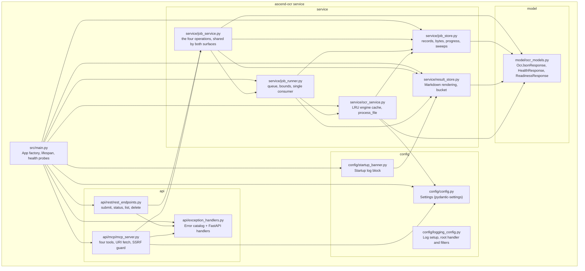

# 5. Building Block View

---

### Level 1: module map

---

### Component responsibilities

| Component | File | Responsibility |
| :--- | :--- | :--- |
| App factory | `src/main.py` | Creates the FastAPI app, starts the OCR worker process pool in lifespan, mounts the MCP ASGI sub-app, registers `/health` and `/ready`. |
| `rest_endpoints.py` | `src/api/rest/rest_endpoints.py` | `APIRouter(prefix="/v1")`. Reads the upload and hands it to `JobService`, sets the relative `Location` header on the 202, and serves the status, list and delete operations. `POST /v1/ocr` is gone and answers 404 like any unknown path. |
| `mcp_server.py` | `src/api/mcp/mcp_server.py` | FastMCP instance. Owns the `aiohttp.ClientSession` lifespan. `ocr_submit`: scheme dispatch, SSRF guard, `file://` jail, size enforcement, then the same `JobService` call the REST surface makes. `ocr_job_status`, `ocr_list_jobs` and `ocr_cancel_job` are thin wrappers over the same service, re-raising with this surface's `CODE: detail` convention. |
| `JobService` | `src/service/job_service.py` | The four operations. Applies every input guard at submission, builds the record, reserves a queue place, writes the bytes off the event loop, admits the job, and assembles every answer a caller sees, including the poll hint and the presigned result address. Also the composition root for the four singletons. |
| `JobRunner` | `src/service/job_runner.py` | The queue, its two bounds, and the single consumer that drains it. Starts a document's reading budget when it picks it up, dispatches, uploads the rendered Markdown, writes the outcome, and sweeps on its idle tick. Cancelling a running document goes through here into the pool replacement path. |
| `JobStore` | `src/service/job_store.py` | The record on disk. Identifier generation and validation, atomic writes, the submitted bytes, the progress file the worker writes between pages, the retention and maximum-lifetime sweeps, and the startup recovery pass that fails whatever was in flight. |
| `ResultStore` | `src/service/result_store.py` | The bucket. Builds its client from this service's own settings rather than from ambient AWS configuration, heads and creates the bucket at startup, renders a finished document to Markdown, uploads it with bounded retries, signs a GET URL against the public endpoint, and deletes an object. |
| `exception_handlers.py` | `src/api/exception_handlers.py` | Defines the eight domain exception classes and the `INTERNAL_ERROR` fallback. Registers one FastAPI handler per class. Every handler emits `{"code": "...", "detail": "..."}` with a generic phrase; no internal details returned. |
| `OcrService` | `src/service/ocr_service.py` | `OrderedDict`-backed LRU cache of `PaddleOCR` engines keyed by the `ModelPair` a language resolves to. `process_file` writes bytes to a tempfile, iterates pages through `engine.predict_iter`, builds `OcrJsonResponse` from the result, deletes the tempfile in a `finally` block. |
| `Settings` | `src/config/config.py` | Pydantic-settings class. Reads from env and `.env` file. Single `settings` singleton imported across the codebase. |
| `ocr_models.py` | `src/model/ocr_models.py` | Pydantic models: `OcrTextLine`, `OcrPageResult`, `OcrJsonResponse` (carries `schema_version: Literal["1"]`), the job record and its result location, the submit, status and list answers, `HealthResponse`, and `ReadinessResponse` with `jobs_queued` and `jobs_running`. |
| `startup_banner.py` | `src/config/startup_banner.py` | Emits a log block at startup listing both probe URLs, the result store and whether its bucket answered, MCP config, and all runtime tuning knobs. Warns, never refuses, when the store did not answer. |
