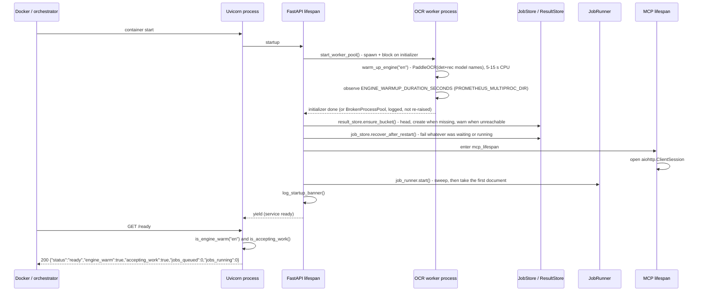
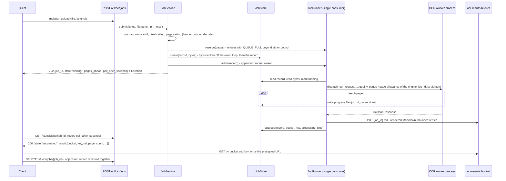
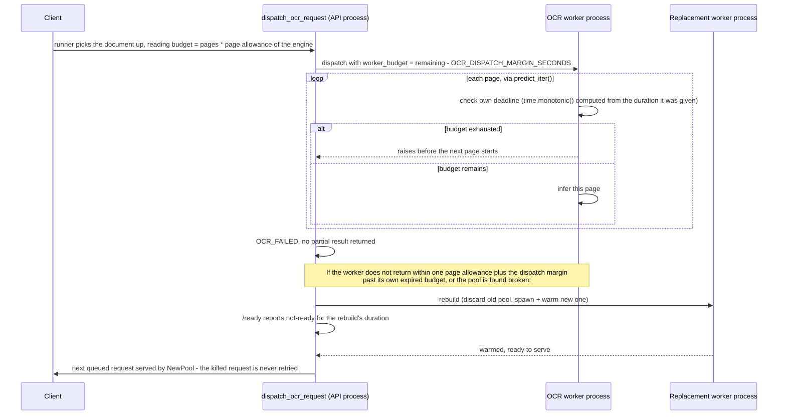
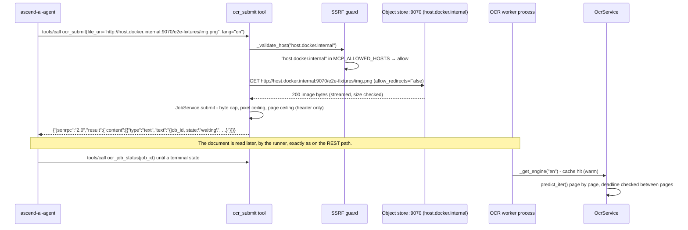

# 6. Runtime View

---

### Cold start sequence

Both the bucket check and the recovery pass run **before** the runner takes its first document. Recovery is what
stops a caller polling work that nothing will ever finish: every record found waiting or running becomes failed with
the `SERVICE_RESTARTED` reason, which is marked retryable because nothing was learned about the document. The service
deliberately does not resume that work, because it cannot know whether the document it was reading is what brought it
down.

The Docker `HEALTHCHECK` targets `/health`, which returns 200 immediately after the process starts. The readiness
probe at `/ready` returns `ready` only once the OCR worker process has recorded a successful warm-up **and** the
service is accepting work - see "Request budget, deadline stop, and worker reclamation" below for the four
conditions that make `accepting_work` false. During the warm-up window, and if the worker's pool initializer fails
outright, `/ready` returns `{"status":"not-ready", ...}` rather than crashing the container. See
[ADR-004](../decisions/ADR-004-liveness-readiness-split.md).

---

### Submit, poll, collect

The object is written **before** the terminal record, so a record never claims success with no result behind it. If
the upload cannot be made after its bounded retries, the job finishes with the `RESULT_STORE_UNAVAILABLE` reason,
which is retryable because nothing was learned about the document.

The MCP path is the same picture with `ocr_submit` in place of the REST endpoint and its own header-only guards in
front; only the source of the bytes differs (a download instead of a multipart body).

---

### Waiting, and what a caller is told

A document that arrives while another is being read waits, and is never failed for waiting. It is told how many pages
are ahead of it at submission and on every status read, and the poll hint it carries,
`clamp(pages_remaining * allowance / 10, 1 s, 30 s)`, shrinks as that work drains. `GET /v1/ocr/jobs` shows the whole
queue in submission order, with the running document first. The worst case is the queue's own page bound multiplied
by the per-page allowance, which is why the bound is expressed in pages: it converts directly into a time.

Cancelling a waiting document removes it from the queue. Cancelling a running one goes through the same pool
replacement path reclamation uses, with `cancel` as its third trigger, and kills the worker rather than draining it,
because one work item is a whole document and draining it is exactly what a cancel is asking not to happen. The
replacement runs as a background task, so the cancel answers as soon as the record reads `cancelled` rather than after
a new worker has warmed up, and `/ready` reports `not-ready` from that answer until the replacement finishes (see the
2026-09-25 amendment to [ADR-004](../decisions/ADR-004-liveness-readiness-split.md)). The runner starts each turn by
waiting for any pending replacement, so when the cancelled document finishes on its own before the kill lands, the
next document stays queued and is dispatched to the new, warm worker rather than to the one being killed. A document
the runner has taken but not yet dispatched, because it is still reading the submitted bytes, is simply left
cancelled: `JobStore.start` refuses to move a record that no longer reads `waiting`, so the document is never read
and no worker is replaced for it.

---

### Request budget, deadline stop, and worker reclamation

A worker can only be asked to stop between pages, so a worker that overruns badly inside a single page keeps
computing until that page finishes - the reclamation grace bounds the total exposure to roughly one page's worth of
extra time, not the unbounded runaway this mechanism replaces. That "roughly one page" bound is exact at
`OCR_WORKER_COUNT=1`, where the rebuild step (`Gate->>NewPool: rebuild` above) has only the one stuck worker's own
work item to wait for. At more than one worker, the rebuild tears down and rebuilds the whole pool at once, so its
own duration is bounded by whichever of the *other*, otherwise healthy, in-flight jobs takes longest to finish - the
gate's rebuild step runs off the event loop so that wait no longer blocks every other request while it happens, but
it does not shorten it. See "the overrun signal at more than one worker" in
[ADR-004](../decisions/ADR-004-liveness-readiness-split.md) for the fix and its regression tests.

See the `ocr-request-deadlines`, `ocr-service-readiness`, `ocr-input-limits`, and `ocr-memory-bounds` capability specs
under `openspec/changes/stop-ocr-getting-stuck-on-large-jobs/specs/` for the full requirement set, and the
`ocr-job-lifecycle`, `ocr-job-admission` and `ocr-job-retention` specs under
`openspec/changes/read-long-documents/specs/` for the job surface that supersedes two of its requirements.

---

### MCP happy path via the S3-compatible object store

The `host.docker.internal` hostname resolves to a private address inside the docker-compose network. Without
`MCP_ALLOWED_HOSTS=host.docker.internal`, the SSRF guard would reject it. See
[ADR-001](../decisions/ADR-001-mcp-file-transport-uri-only.md).

---

### Error catalog mapping

| Exception raised | HTTP status (REST) | MCP JSON-RPC | Code string |
| :--- | :--- | :--- | :--- |
| `OcrProcessingError` | 422 | tool error frame | `OCR_FAILED` |
| `FileSizeExceededError` | 400 | tool error frame | `FILE_TOO_LARGE` |
| `UnsupportedFileTypeError` | 400 | tool error frame | `UNSUPPORTED_FILE_TYPE` |
| `UnsafeUriError` | 400 | tool error frame | `UNSAFE_URI` |
| `DownloadFailedError` | 502 | tool error frame | `DOWNLOAD_FAILED` |
| `QueueFullError` | 503 + `Retry-After` | tool error frame | `QUEUE_FULL` |
| `JobNotFoundError` | 404 | tool error frame | `JOB_NOT_FOUND` |
| `UnsupportedLanguageError` | 400 | tool error frame, raised before the URI is fetched | `UNSUPPORTED_LANGUAGE` |
| `Exception` (unhandled) | 500 | tool error frame | `INTERNAL_ERROR` |

All handlers are registered in `register_exception_handlers` in `src/api/exception_handlers.py`. The `detail` field
carries a generic phrase; the original exception message is logged at WARNING or ERROR but never returned to the
client. The one exception is `UNSUPPORTED_LANGUAGE`, whose detail lists the supported languages from configuration
and never echoes what the caller sent.

A failure of the **reading** is not in this table, because it is not a failed request: it is a successful read of a
record whose `state` is `failed`, carrying `error_code`, `error_reason` and `retryable`. The codes a record can carry
are `OCR_FAILED`, `INTERNAL_ERROR`, and the three record-level reasons `SERVICE_RESTARTED`,
`RESULT_STORE_UNAVAILABLE` and `LIFETIME_EXCEEDED`.
