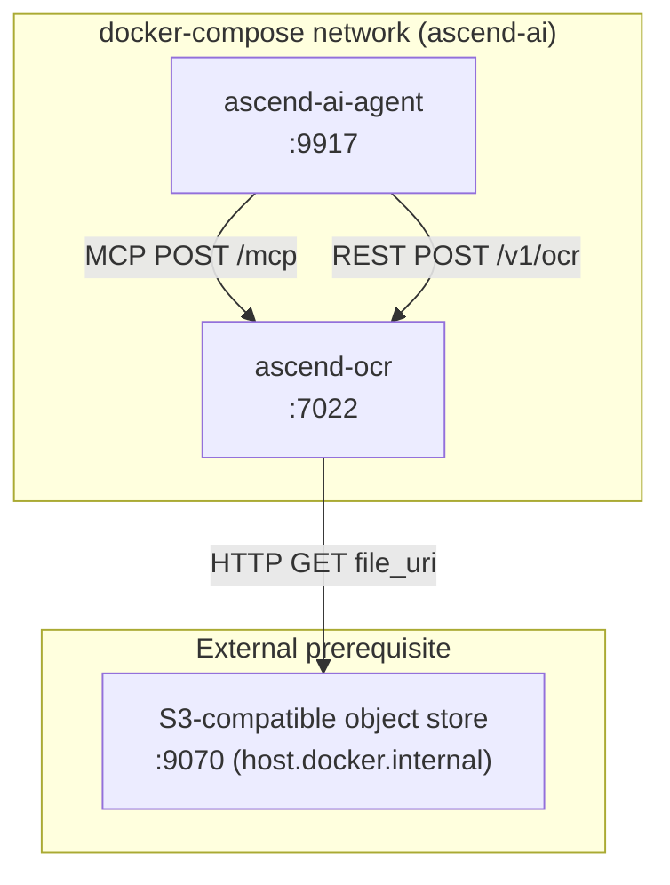

# 7. Deployment View

---

### docker-compose placement

ascend-ocr runs as the `ascend-ocr` service in `docker-compose.yaml` (root of the monorepo). It is grouped
with the other non-scraper support services — Docling Serve, Unstructured API, WeatherMCP, ascend-audio-scribe, AscendMemory.



The object store is not a compose service; it runs on the host and is reached via `host.docker.internal:9070`.
Locally it is provided by a self-hosted S3-compatible emulator.

The network alias `ascend-ocr` (and the hostname `ascend-ocr`) allows the ascend-ai-agent to reach the
service by name inside the compose network.

---

### Healthcheck wiring

The Dockerfile `HEALTHCHECK` is deliberately pointed at `/health`, not `/ready`
(`apps/ascend-ocr/Dockerfile:58` sets no explicit `HEALTHCHECK` instruction — the base image default applies, or the
compose `healthcheck` stanza should be set). The operator should configure the load balancer or Kubernetes
`readinessProbe` to poll `/ready` so traffic is held until `engine_warm=true`. See
[ADR-004](../decisions/ADR-004-liveness-readiness-split.md).

---

### Environment variables

| Variable | Default | Description |
| :--- | :--- | :--- |
| `API_HOST` | `0.0.0.0` | Bind address for Uvicorn. |
| `API_PORT` | `7022` | Listen port. |
| `LOG_LEVEL` | `INFO` | Uvicorn log level (`DEBUG`, `INFO`, `WARNING`, `ERROR`, `CRITICAL`). |
| `DEFAULT_LANGUAGE` | `en` | Language warmed up at startup; used when `lang` is absent from the request. |
| `MAX_FILE_SIZE_MB` | `50` | Cap on uploaded or fetched file size in megabytes. |
| `OCR_REQUEST_TIMEOUT` | `120` | Per-request OCR timeout in seconds (float). |
| `ENGINE_CACHE_MAX_SIZE` | `8` | Maximum number of `PaddleOCR` engines held in the LRU cache. |
| `SUPPORTED_LANGUAGES` | `en,pl,de,fr,es,it,pt,nl,ru,ch,japan,korean` | Allowlist of valid language codes. Requests for any other code are rejected. |
| `MCP_FILE_URI_ROOT` | _(unset)_ | Enables `file://` support; URIs must resolve inside this directory. Unset = `file://` disabled. |
| `MCP_ALLOWED_HOSTS` | _(empty)_ | Comma-separated hostnames exempt from the SSRF IP block. Set to `host.docker.internal` for the standard compose stack, since the S3-compatible object store is reached over the host-published endpoint. |
| `MCP_DOWNLOAD_TIMEOUT_SECONDS` | `30` | Total timeout for the `aiohttp` download session. |
| `OCR_WORKER_COUNT` | `1` | Inference workers and admission-gate permits, from one setting. See "Memory model and the single worker" below. |
| `OCR_PAGE_TIMEOUT_SECONDS` | `120` | Per-page allowance, checked between pages inside the worker. |
| `OCR_DISPATCH_MARGIN_SECONDS` | `5` | Headroom subtracted from the worker's own budget. |
| `OCR_MAX_INFERENCE_PIXELS` | `2500000` | Pixel ceiling on one inference, checked from the file header before decode. |
| `OCR_DETECTOR_MAX_SIDE` | `1536` | Bounds text detection's longest input side. See [ADR-006](../decisions/ADR-006-detector-input-bound.md). |
| `OCR_POOL_REBUILD_MAX_CONSECUTIVE` | `3` | Consecutive failed pool rebuilds before the service gives up and stays not-ready. |
| `OCR_SCRATCH_DIR` | `<system temp>/ascend-ocr-scratch` | Worker upload scratch directory, swept of stale files by every fresh worker and at startup. |

The `docker-compose.yaml` service block sets `API_PORT`, `API_HOST`, `LOG_LEVEL`, `DEFAULT_LANGUAGE`,
`MAX_FILE_SIZE_MB`, and `OCR_REQUEST_TIMEOUT` explicitly. `MCP_ALLOWED_HOSTS` is not set in the default compose
configuration and must be added manually to run the MCP e2e tests. See
[e2e/testing/6-mcp-ocr-test.md](../../../e2e/testing/6-mcp-ocr-test.md).

---

### Memory model and the single worker

The container carries a 12 GiB memory limit and a 4.0 CPU limit (`docker-compose.yaml`). Peak resident memory for
one OCR call is measured, not estimated:

```text
peak_MiB = 635 + 5302 x megapixels_of_the_largest_single_page + 11.5 x pages
```

fitted at a correlation of 0.9993 (see `openspec/changes/stop-ocr-getting-stuck-on-large-jobs/design.md`, "The
measured memory model"). Text detection is 94 percent of that transient, which is why `OCR_DETECTOR_MAX_SIDE` exists
— see [ADR-006](../decisions/ADR-006-detector-input-bound.md). An A4 page unbounded costs 11.0 GiB, 92 percent of the
container limit before the per-language engine cache is even counted.

**`OCR_WORKER_COUNT` is a memory constraint, not a throughput one.** Peak is flat across page count (a page retains
only 11.5 MiB of result), so the whole concurrency story is `service_peak_MiB ~= per_call_peak_MiB *
OCR_WORKER_COUNT`. Because one call's peak is already most of the container's memory ceiling, raising the worker
count does not make the service faster at the same memory cost — it multiplies a ceiling that a single unbounded A4
page already fills to most of its capacity. The setting deliberately governs both the `ProcessPoolExecutor`'s
`max_workers` and the admission gate's permit count, so the two cannot drift apart and the memory argument stays
true regardless of which one an operator thinks they are tuning.

The startup banner (`src/config/startup_banner.py`) prints the per-call estimate and the resulting service-wide
ceiling for the running configuration, naming the detector bound and the pixel ceiling it was computed from.

**Warn, don't refuse, when the arithmetic doesn't fit.** The same module reads this container's own cgroup memory
ceiling (`src/config/memory_limits.py`, `/sys/fs/cgroup/memory.max` on cgroup v2, falling back to
`/sys/fs/cgroup/memory/memory.limit_in_bytes` on v1) and logs a `WARNING`, distinct from the `INFO` banner block,
when the computed service-wide peak meets or exceeds it. It never refuses to start. A hard refusal was considered and
rejected: the cgroup limit reads as unlimited (`None`) on a bare host process, in this module's own test suite, and
on any deployment without a memory cgroup, so a refusal keyed on it would block every one of those outright, not only
a genuinely oversized configuration. And even a correctly-read limit is not the whole story — the incident that
produced this section's own memory model was a host-level kill with this container's own cgroup ceiling never
reached, so a refusal gated on the per-container number would not even have caught the failure this document exists
to explain. A warning an operator can act on, printed the moment the risk becomes knowable, is what this container's
own visibility can honestly support.

**More than one worker is safe today.** It was not, in three specific ways that stayed invisible until
`OCR_WORKER_COUNT` became a real runtime setting rather than a fixed constant: the readiness signal for "a job is
past its own budget" was a single shared variable that concurrent jobs silently clobbered, the pool-rebuild path
could freeze the entire event loop — not only OCR dispatch — for as long as an unrelated healthy job on a different
worker took to finish, and only the first configured worker was ever proactively warmed at startup, leaving the rest
to pay their own warm-up cost inside a live request. All three are fixed and covered by tests; the full account, with
the exact measurements that proved each one, is in the amendment titled "the overrun signal at more than one worker"
in [ADR-004](../decisions/ADR-004-liveness-readiness-split.md).

---

### Multi-stage Docker build

The Dockerfile uses a two-stage build (`apps/ascend-ocr/Dockerfile`). The builder stage installs dependencies and pre-caches
PaddleOCR models for `en` and `pl` by running a one-off `PaddleOCR(lang=...)` invocation (line 23). The runtime
stage copies site-packages, binaries, and the pre-cached `.paddlex` model directory from the builder. This means:

- Model downloads do not happen at container start.
- Cold-start warm-up in the lifespan is a model-loading step, not a download step.
- Adding a new pre-cached language requires rebuilding the image with an additional `PaddleOCR(lang='xx')` call in
  the builder RUN instruction.

The runtime container runs as a non-root user (`appuser`).
